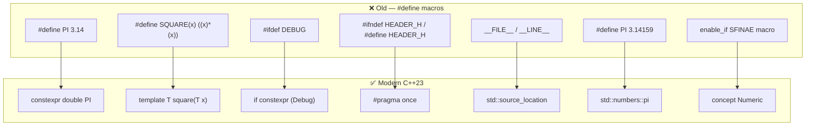

# Macros — C++ Preprocessor and Modern Alternatives

> *"Macros are evil. Use them only when there's no other option."*
> — C++ Core Guidelines

---

## What are Macros?

Macros are handled by the **C++ preprocessor** — a text substitution step
that runs **before** the compiler even sees your code. The preprocessor
replaces every occurrence of a macro name with its defined text.

```
Source code  →  Preprocessor  →  Compiler  →  Linker  →  Executable
                (macros expanded)
```

---

## Two files in this folder

| File | What it covers |
|------|---------------|
| `macros_example.cpp` | Old-style `#define` macros — all types with pitfalls |
| `macros_modern_cpp23.cpp` | Modern C++23 replacements for every macro type |

---

## Types of macros

### 1. Object-like macros — constant replacement

```cpp
// Old
#define PI         3.14159265358979
#define MAX_BUFFER 1024
#define APP_NAME   "MCXApp"

// Modern C++23 — always prefer this
constexpr double      PI         = 3.14159265358979;
constexpr int         MAX_BUFFER = 1024;
constexpr std::string_view APP_NAME = "MCXApp";
```

### 2. Function-like macros — code replacement

```cpp
// Old — dangerous! No type safety, double evaluation risk
#define SQUARE(x)        ((x) * (x))
#define MAX(a, b)        ((a) > (b) ? (a) : (b))
#define CLAMP(v, lo, hi) ((v) < (lo) ? (lo) : ((v) > (hi) ? (hi) : (v)))

// Modern C++23 — safe, typed, debuggable
template<typename T>
[[nodiscard]] constexpr T square(T x) noexcept { return x * x; }

template<typename T>
[[nodiscard]] constexpr T clamp(T v, T lo, T hi) noexcept {
    return v < lo ? lo : (v > hi ? hi : v);
}
```

### 3. Conditional compilation

```cpp
// Old — preprocessor only
#define DEBUG_MODE
#ifdef DEBUG_MODE
    std::cout << "debug\n";
#endif

// Modern — if constexpr inside functions
constexpr bool DEBUG_BUILD = true;

template<bool Debug = DEBUG_BUILD>
void logDebug(std::string_view msg) {
    if constexpr (Debug) {
        std::println("[DBG] {}", msg);
    }
    // When false: branch removed entirely by compiler
}
```

### 4. Include guards

```cpp
// Old — error-prone, name collisions possible
#ifndef MYHEADER_H
#define MYHEADER_H
// content
#endif

// Modern — single line, always prefer
#pragma once
```

### 5. Stringification and token concatenation

```cpp
// # turns argument into string literal
#define STRINGIFY(x)  #x
STRINGIFY(hello)  →  "hello"
STRINGIFY(42)     →  "42"

// ## joins two tokens
#define CONCAT(a, b)  a##b
int CONCAT(my, Var) = 42;   // creates: int myVar = 42;
```

### 6. Variadic macros

```cpp
// Takes variable number of arguments
#define LOG(fmt, ...)  printf("[LOG] " fmt "\n", ##__VA_ARGS__)

LOG("started");
LOG("session %s on port %d", "SES-001", 5060);
```

### 7. Predefined macros

```cpp
__FILE__   // current source filename
__LINE__   // current line number
__DATE__   // compilation date "Apr 19 2026"
__TIME__   // compilation time "12:34:56"
__func__   // current function name (C++11)

// Modern replacement — std::source_location (C++20)
void log(std::string_view msg,
         const std::source_location& loc = std::source_location::current())
{
    std::println("[{}:{}] {}", loc.file_name(), loc.line(), msg);
}
// Automatically captures file, line, function — no macro needed
```

---

## Full comparison table



---

## Why #define is dangerous

### Problem 1 — No parentheses = wrong result

```cpp
#define DOUBLE(x)  x * 2

DOUBLE(3 + 4)
// expands to: 3 + 4 * 2 = 11   NOT 14!
// Fix: #define DOUBLE(x) ((x) * 2)
```

### Problem 2 — Double evaluation

```cpp
#define MAX(a, b)  ((a) > (b) ? (a) : (b))

int i = 5, j = 3;
MAX(i++, j++)
// expands to: ((i++) > (j++) ? (i++) : (j++))
// i is incremented TWICE — undefined behavior!

// Template function: argument evaluated once — safe
```

### Problem 3 — No type safety

```cpp
#define PI 3.14
int x = PI;       // silently truncates to 3 — no warning
std::string s = PI;  // might compile depending on context

// constexpr double PI:
int x = PI;       // compiler warning or error
```

### Problem 4 — No scope

```cpp
#define MAX 100   // pollutes entire translation unit
// Clashes with: std::max, class MAX, variable max, anything named MAX
```

### Problem 5 — Invisible to debugger

```cpp
#define SQUARE(x) ((x) * (x))
// Debugger shows: ((5) * (5))
// Not: "calling SQUARE with x=5"
```

---

## std::numbers — built-in constants (C++20)

```cpp
#include <numbers>

std::numbers::pi      // 3.14159265358979...
std::numbers::e       // 2.71828182845905...
std::numbers::sqrt2   // 1.41421356237310...
std::numbers::phi     // 1.61803398874989... (golden ratio)
std::numbers::ln2     // 0.69314718055994...

// Available for any floating point type
std::numbers::pi_v<float>        // float precision
std::numbers::pi_v<double>       // double precision
std::numbers::pi_v<long double>  // long double precision
```

---

## consteval vs constexpr

```cpp
// constexpr — CAN be evaluated at compile time
constexpr int factorial(int n) {
    return n <= 1 ? 1 : n * factorial(n-1);
}
constexpr int a = factorial(6);   // compile time ✅
int b = factorial(someRuntimeValue);  // runtime — also allowed

// consteval — MUST be evaluated at compile time
consteval int factorial(int n) { ... }
constexpr int a = factorial(6);   // compile time ✅
int b = factorial(someRuntimeValue);  // ERROR — not compile time!
```

Use `consteval` when you want to **guarantee** something is always computed
at compile time — no accidental runtime calls.

---

## When #define is still acceptable

Even in modern C++23, some macros remain:

```cpp
// 1. Platform detection — no alternative
#if defined(__linux__)
    // Linux-specific code
#elif defined(_WIN32)
    // Windows-specific code
#endif

// 2. Include guards — #pragma once not in ISO standard
//    (but supported everywhere — prefer #pragma once)
#ifndef MYHEADER_H
#define MYHEADER_H
#endif

// 3. C interoperability — C doesn't have constexpr
#define C_COMPATIBLE_CONSTANT 42

// 4. Disabling warnings in specific sections
#pragma GCC diagnostic push
#pragma GCC diagnostic ignored "-Wdeprecated"
// ... use deprecated API ...
#pragma GCC diagnostic pop
```

---

## Further pragma usages

`#pragma` is a *different* preprocessor mechanism from `#define` — instead
of text substitution, each `#pragma` is a direct instruction to the
compiler itself (change struct layout, silence a warning, mark a region).
Almost all of them are **implementation-defined**, not ISO C++ — including
`#pragma once` — except the two `#pragma STDC` ones below, which are
actually standardized (inherited from C99/C++).

| Pragma | What it does |
|---|---|
| `#pragma once` | Include guard — file included at most once per translation unit. Non-standard, but supported by every compiler in real-world use (already covered above as the modern alternative to `#ifndef`/`#define`/`#endif`). |
| `#pragma pack(push, n)` / `#pragma pack(pop)` | Changes struct/class member alignment to `n` bytes instead of the compiler's default — used when a struct's binary layout has to match an external spec exactly (network protocol headers, file formats, hardware registers). |
| `#pragma GCC diagnostic push/pop/ignored/warning/error` | GCC/Clang warning control, scoped with push/pop (already covered above). |
| `#pragma GCC optimize("...")` / `#pragma GCC push_options` / `pop_options` | Per-function or per-region optimization/target flags — e.g. forcing `-O3` or a CPU feature like `avx2` for just one hot function, without changing the whole file's build flags. |
| `#pragma message("text")` | Emits a compiler note at compile time — useful for confirming which `#ifdef` branch got taken, or flagging "compiling the legacy path here." |
| `#pragma omp ...` | OpenMP directives (e.g. `#pragma omp parallel for`) — auto-parallelizes a loop across threads when compiled with `-fopenmp`. Common in numeric/scientific code. |
| `#pragma STDC FP_CONTRACT ON/OFF` | **Standardized.** Controls whether the compiler may fuse `a*b+c` into a single fused-multiply-add instruction, which can change floating-point rounding results. |
| `#pragma STDC FENV_ACCESS ON/OFF` | **Standardized.** Tells the compiler the code reads/writes the floating-point environment (rounding mode, exception flags via `<cfenv>`), so it must not reorder/optimize around those reads. |
| `#pragma comment(lib, "...")` | **MSVC-only** — embeds a library-linking instruction directly in source instead of the linker command line. Not portable to GCC/Clang. |
| `#pragma region` / `#pragma endregion` | **Editor/IDE-only**, purely cosmetic — creates a collapsible code-folding region. Zero effect on compilation. |
| `_Pragma("...")` (C++11) | The **operator form** of `#pragma` — usable inside a macro expansion, since a bare `#pragma` can't appear inside a `#define`. |

### Example — `#pragma pack` changing struct layout

```cpp
#include <cstdio>
#include <cstdint>

struct Default {
    uint8_t  a;
    uint32_t b;
    uint8_t  c;
};

#pragma pack(push, 1)
struct Packed {
    uint8_t  a;
    uint32_t b;
    uint8_t  c;
};
#pragma pack(pop)

int main() {
    std::printf("sizeof(Default) = %zu\n", sizeof(Default));  // padded, e.g. 12
    std::printf("sizeof(Packed)  = %zu\n", sizeof(Packed));   // no padding, 6
}
```

Without `#pragma pack`, the compiler inserts padding bytes so `b` starts
at a 4-byte-aligned offset (faster access, more memory). With
`pack(push, 1)`, every member is packed with no padding — smaller, but
slower/misaligned access on some architectures. This matters whenever a
struct's exact byte layout has to match something external, like a wire
protocol.

### Example — `_Pragma` wrapped inside a macro

```cpp
#define SILENCE_UNUSED_WARNING \
    _Pragma("GCC diagnostic push") \
    _Pragma("GCC diagnostic ignored \"-Wunused-variable\"")

#define RESTORE_WARNINGS \
    _Pragma("GCC diagnostic pop")

void f() {
    SILENCE_UNUSED_WARNING
    int unused = 42;   // no warning here
    RESTORE_WARNINGS
}
```

A plain `#pragma GCC diagnostic ignored "..."` can't be written *inside*
a `#define` body — the preprocessor doesn't allow `#` directives there.
`_Pragma("...")` is the operator form of the same instruction, so it
*can* be used inside a macro, which is the only reason to reach for it
over a plain `#pragma`.

---

## Compile commands

```bash
# Old macros example
g++ -std=c++23 -O2 macros_example.cpp -o macros_old && ./macros_old

# Modern C++23 example
g++ -std=c++23 -O2 macros_modern_cpp23.cpp -lbenchmark -lpthread -o macros_modern && ./macros_modern

# With GCC 14 (for <print>, <source_location>, std::numbers)
/usr/local/gcc-14.1.0/bin/g++-14.1.0 -std=c++23 -O2 macros_modern_cpp23.cpp -lstdc++exp -o macros_modern
```

---

## Summary

| | `#define` | Modern C++23 |
|--|-----------|-------------|
| Type safety | ❌ None | ✅ Fully typed |
| Scope | ❌ Global | ✅ Namespace/function |
| Debugger | ❌ Invisible | ✅ Named symbol |
| Overloadable | ❌ No | ✅ Templates |
| Side effects | ❌ Double eval | ✅ Single eval |
| Compile-time | ✅ Always | ✅ constexpr/consteval |
| Still needed | Platform detect, C interop | Everything else |
