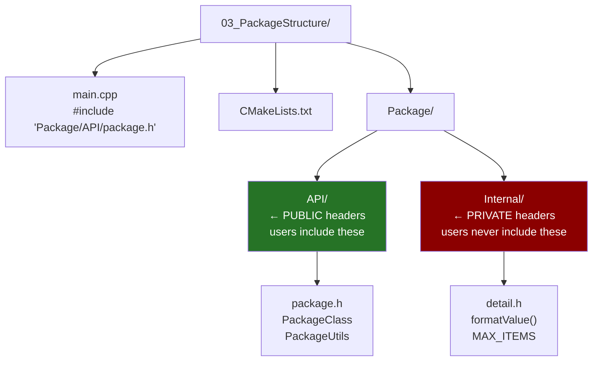
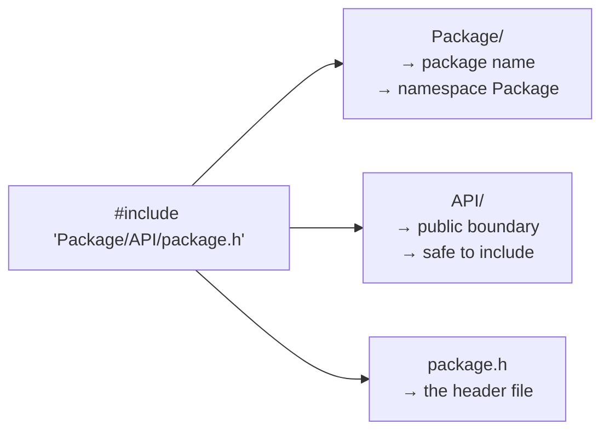
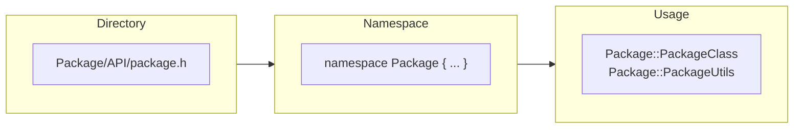
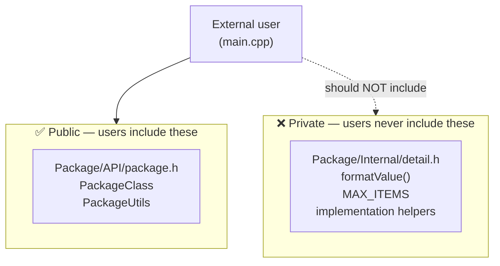
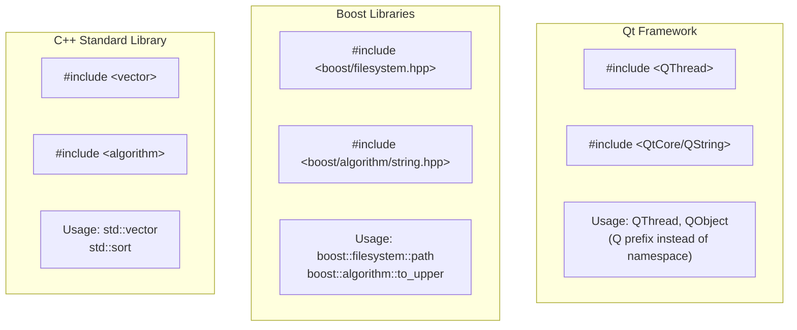

# Package Structure — Organizing Headers into Directories

## What is this?

Organizing your header files into **subdirectories** creates a logical
package structure. The include path becomes part of the API — it tells
users where a symbol comes from and groups related headers together.

---

## Project structure



---

## Include path = package location

```cpp
// The path tells you everything:
#include "Package/API/package.h"
//        ↑        ↑   ↑
//        package  API public header
```



---

## Namespace mirrors directory



Convention: **directory name = namespace name**. This makes the code
self-documenting — you always know where a symbol comes from.

---

## Public API vs Internal headers



---

## Key code

```cpp
// package.h — organized in a directory
namespace Package {

    class PackageClass {
    public:
        int         first;
        std::string second;

        PackageClass(int one, const std::string& two)
            : first(one), second(two) {}

        void display() const {
            std::cout << first << " | " << second << '\n';
        }
    };

    class PackageUtils {
    public:
        static int  add(int a, int b) { return a + b; }
        static std::string version()  { return "1.0.0"; }
    };
}
```

```cpp
// main.cpp
#include "Package/API/package.h"   // include via path

Package::PackageClass pk1(23, "amazing");
Package::PackageClass pk2(13, "awaiting");
pk1.display();
pk2.display();
```

---

## CMake — include path setup

```cmake
target_include_directories(03_PackageStructure PRIVATE
    ${CMAKE_CURRENT_SOURCE_DIR}   # project root = include search root
)
```

With `main.cpp` in the root and `Package/API/package.h` in a subdirectory,
setting the root as the include path lets `#include "Package/API/package.h"`
resolve correctly.

---

## How real libraries do this



---

## Old style vs package structure

```cpp
// OLD — flat directory, no organization
#include "PackageClass.h"      // where does this come from?
#include "Utils.h"             // which Utils? name collision risk!
PackageClass obj;              // no namespace — global pollution

// MODERN — organized structure
#include "Package/API/package.h"   // clear origin
Package::PackageClass obj;         // namespaced — no collision
```

---

## When to use this pattern

✅ Project has multiple logical components
✅ Distributing a library — clear public API boundary
✅ Preventing name collisions between components
✅ Following real-world library conventions (Qt, Boost)

❌ Single-file toy programs — overkill
❌ Very small projects with 2–3 headers total
