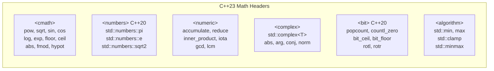
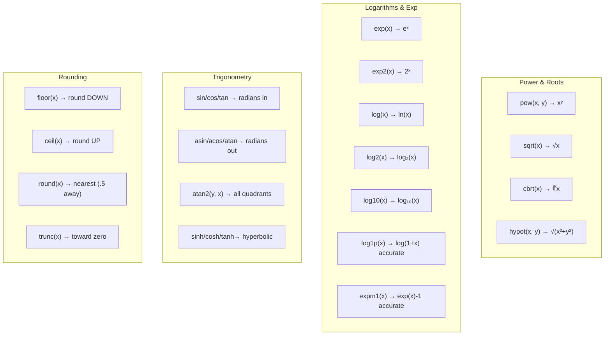
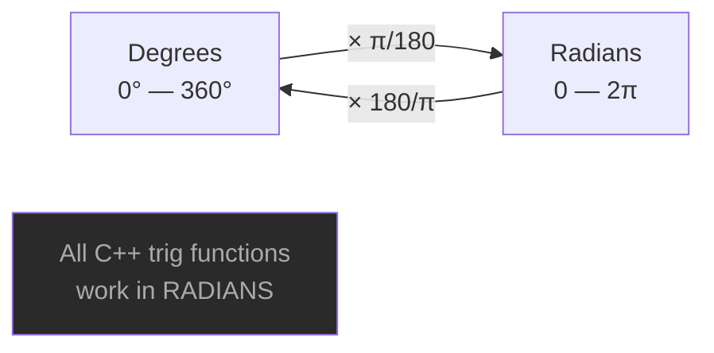
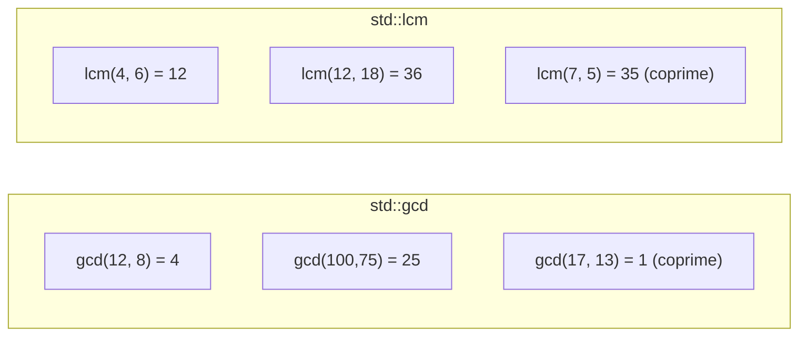
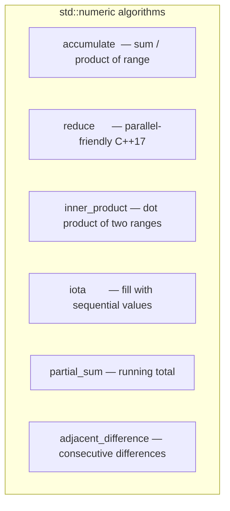
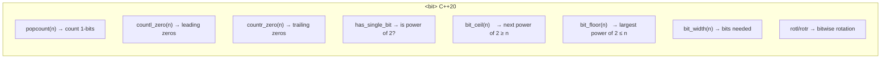

# Maths — C++23

## Headers overview



---

## 1. std::numbers — complete list (C++20)

```cpp
#include <numbers>

std::numbers::e           // 2.71828182845905...  Euler's number
std::numbers::log2e       // log₂(e)
std::numbers::log10e      // log₁₀(e)
std::numbers::pi          // 3.14159265358979...
std::numbers::inv_pi      // 1/π
std::numbers::inv_sqrtpi  // 1/√π
std::numbers::ln2         // ln(2)
std::numbers::ln10        // ln(10)
std::numbers::sqrt2       // √2
std::numbers::sqrt3       // √3
std::numbers::inv_sqrt3   // 1/√3
std::numbers::phi         // 1.61803398874989... golden ratio
std::numbers::egamma      // Euler–Mascheroni constant

// Type-specific precision via _v<T>
std::numbers::pi_v<float>        // float
std::numbers::pi_v<double>       // double (default)
std::numbers::pi_v<long double>  // max precision
```

> **Note:** `inv_sqrt2` does NOT exist — use `inv_sqrt3` or `1.0/std::numbers::sqrt2`.

---

## 2. `<cmath>` — core math functions



---

## 3. Trigonometry — degrees vs radians



```cpp
auto toRad = [](double deg) { return deg * std::numbers::pi / 180.0; };
auto toDeg = [](double rad) { return rad * 180.0 / std::numbers::pi; };

std::sin(toRad(30))  // 0.5
std::cos(toRad(60))  // 0.5
std::tan(toRad(45))  // 1.0

// atan2 — correct angle for all four quadrants
std::atan2(y, x)     // returns angle in radians [-π, π]
```

---

## 4. Rounding comparison

| Function | 3.2 | 3.5 | 3.7 | -3.2 | -3.7 |
|----------|:---:|:---:|:---:|:----:|:----:|
| `floor` | 3 | 3 | 3 | -4 | -4 |
| `ceil` | 4 | 4 | 4 | -3 | -3 |
| `round` | 3 | 4 | 4 | -3 | -4 |
| `trunc` | 3 | 3 | 3 | -3 | -3 |

---

## 5. Min / Max / Clamp

```cpp
std::min(3, 7)              // 3
std::max(3, 7)              // 7
std::clamp(150, 0, 100)     // 100  — clamped to hi
std::clamp(-5,  0, 100)     //   0  — clamped to lo
std::clamp(50,  0, 100)     //  50  — within range

std::min({3, 1, 4, 1, 5})   // 1  — initializer list
std::max({3, 1, 4, 1, 5})   // 5

auto [lo, hi] = std::minmax(42, 17);   // lo=17, hi=42
```

---

## 6. GCD and LCM (C++17)



---

## 7. std::complex

```cpp
#include <complex>
using namespace std::complex_literals;

std::complex<double> z1 = {3.0, 4.0};  // 3 + 4i
std::complex<double> z2 = 2.0 + 3.0i; // literal syntax

std::abs(z1)    // magnitude = √(3²+4²) = 5
std::arg(z1)    // angle in radians
std::conj(z1)   // conjugate: 3 - 4i
std::norm(z1)   // |z|² = 25
```

---

## 8. `<numeric>` algorithms



```cpp
std::accumulate(v.begin(), v.end(), 0)          // sum
std::accumulate(v.begin(), v.end(), 1,
    std::multiplies<int>())                      // product
std::reduce(v.begin(), v.end(), 0)              // parallel sum
std::inner_product(a.begin(),a.end(),b.begin(),0) // dot product
std::iota(seq.begin(), seq.end(), 1)            // {1,2,3,...}
```

---

## 9. Bit operations (C++20)



---

## Quick reference table

| Need | Function | Header |
|------|----------|--------|
| π, e, √2, φ | `std::numbers::pi` etc. | `<numbers>` |
| Power xʸ | `std::pow(x, y)` | `<cmath>` |
| Square root | `std::sqrt(x)` | `<cmath>` |
| Cube root | `std::cbrt(x)` | `<cmath>` |
| Hypotenuse | `std::hypot(x, y)` | `<cmath>` |
| sin/cos/tan | `std::sin/cos/tan(rad)` | `<cmath>` |
| Angle from point | `std::atan2(y, x)` | `<cmath>` |
| Natural log | `std::log(x)` | `<cmath>` |
| Log base 2 | `std::log2(x)` | `<cmath>` |
| Round down | `std::floor(x)` | `<cmath>` |
| Round up | `std::ceil(x)` | `<cmath>` |
| Round nearest | `std::round(x)` | `<cmath>` |
| Min/Max | `std::min/max(a, b)` | `<algorithm>` |
| Clamp | `std::clamp(v, lo, hi)` | `<algorithm>` |
| GCD | `std::gcd(a, b)` | `<numeric>` |
| LCM | `std::lcm(a, b)` | `<numeric>` |
| Sum of range | `std::accumulate` | `<numeric>` |
| Dot product | `std::inner_product` | `<numeric>` |
| Fill sequential | `std::iota` | `<numeric>` |
| Complex numbers | `std::complex<T>` | `<complex>` |
| Count 1-bits | `std::popcount` | `<bit>` |
| Power of 2? | `std::has_single_bit` | `<bit>` |
