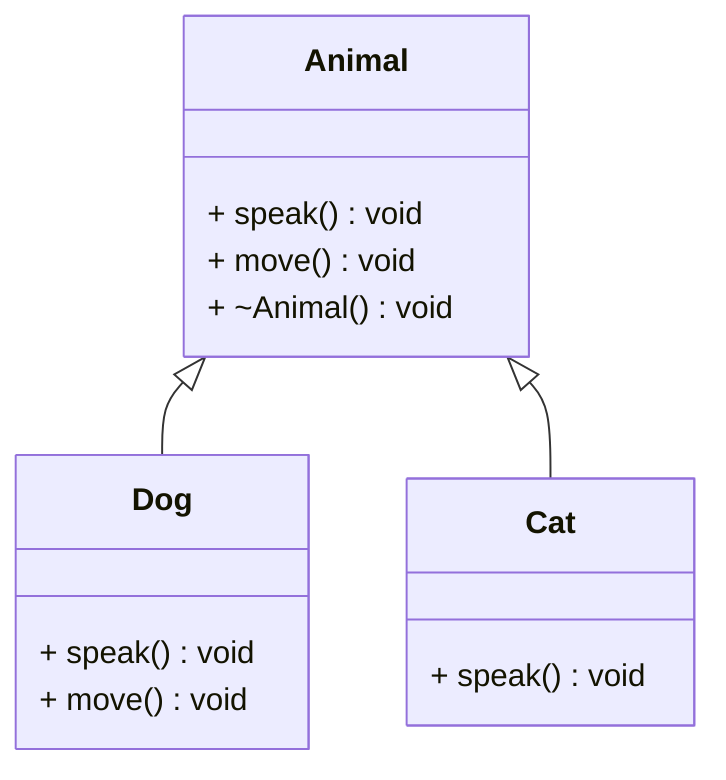
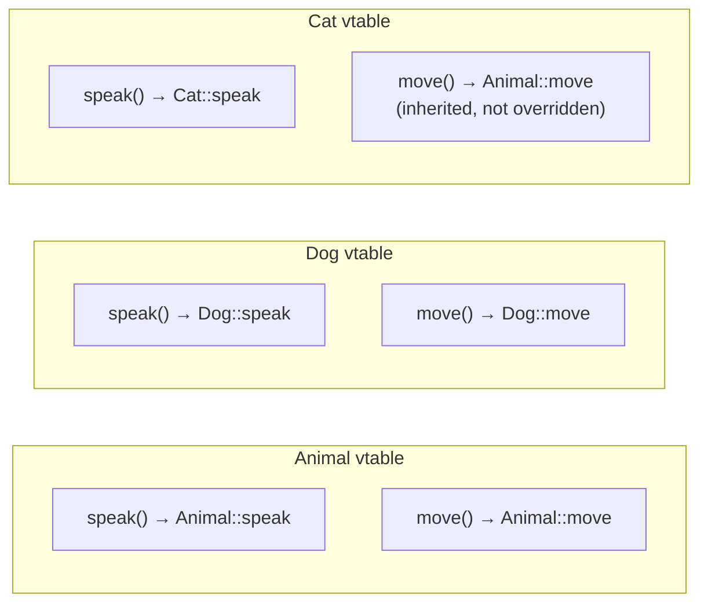
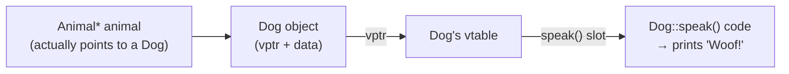
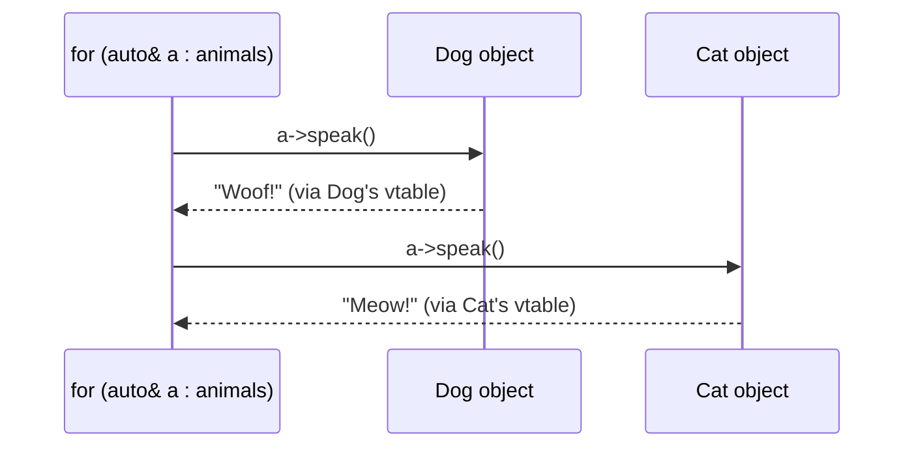
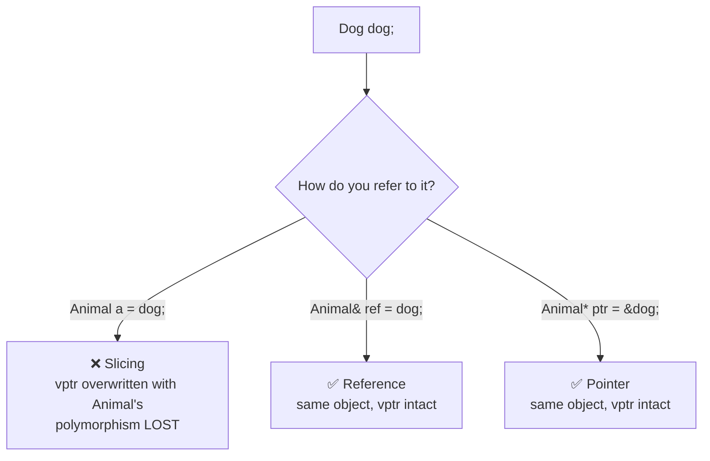
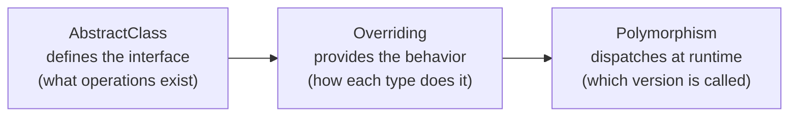
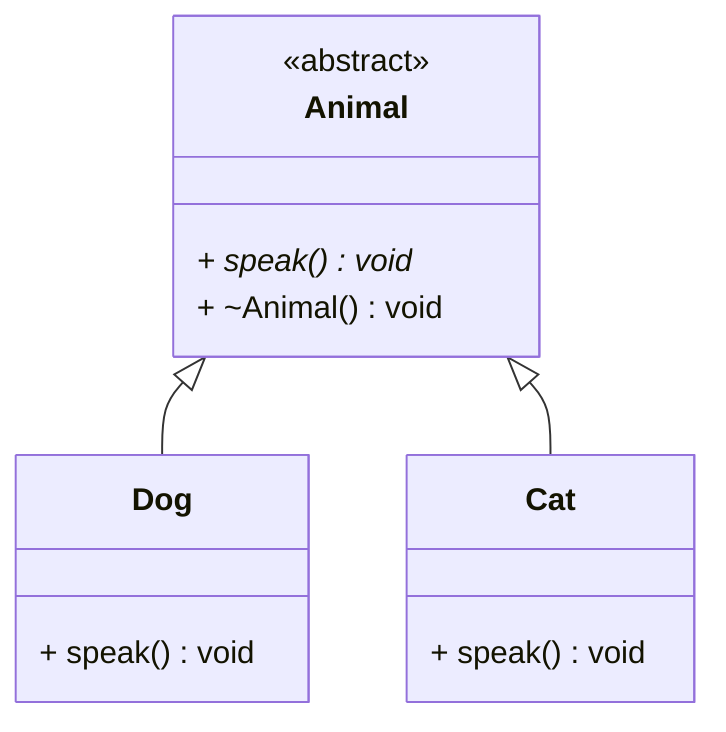

# Polymorphism in C++

## What is Polymorphism?

**Polymorphism** means "many forms" — the ability of different objects to respond differently to the same function call, based on their actual type at runtime (or at compile time).

It is the mechanism that lets you write code that works on a **base type** and automatically does the right thing for every derived type, without needing to know which concrete type you are dealing with.

> **See also:** `14_VirtualFunctions` covers the mechanics behind this
> folder in depth (static vs. dynamic binding, `override`/`final`, object
> slicing), and `09_ObjectRelationships/07_MemberNotation` covers the UML
> notation used in the diagrams below.

---

## Two Types

### 1. Compile-Time (Static) Polymorphism
Resolved entirely by the compiler. Zero runtime cost.

| Mechanism | Example |
|---|---|
| Function overloading | `print(int)` vs `print(double)` |
| Operator overloading | `v1 + v2` calling your `operator+` |
| Templates | `maxOf<T>(a, b)` works for any type |

### 2. Runtime (Dynamic) Polymorphism
Resolved at runtime via the **vtable**. Tiny overhead (one pointer lookup per call).

| Mechanism | Requirement |
|---|---|
| Virtual functions | `virtual` keyword in base class |
| Pointer or reference | Must use `Base*` or `Base&`, never a copy |
| `override` keyword | Marks derived class implementations |

---

## How the Vtable Works

Every class with at least one virtual function gets a **vtable** — a table of function pointers. Every *object* of that class carries one extra hidden pointer, the **vptr**, pointing to its class's vtable.

### The classes

```cpp
class Animal {
public:
    virtual void speak() const {
        std::cout << "Some generic animal sound\n";
    }
    virtual void move() const {
        std::cout << "Animal moves\n";
    }
    virtual ~Animal() = default;
};

class Dog : public Animal {
public:
    void speak() const override {
        std::cout << "Woof!\n";
    }
    void move() const override {
        std::cout << "Dog runs\n";
    }
};

class Cat : public Animal {
public:
    void speak() const override {
        std::cout << "Meow!\n";
    }
    // move() NOT overridden — inherits Animal's version
};
```



### The vtables this generates



*Notice `Cat`'s vtable — since `Cat` never overrode `move()`, its vtable
slot for `move()` still points to `Animal::move`. This is exactly why a
`Cat` object correctly falls back to the generic animal movement without
any extra code on your part.*

### What happens when you call `animal->speak()`



1. Follow `vptr` to the vtable — **the object's actual type decides which
   vtable**, not the pointer's declared type
2. Look up the `speak` slot
3. Call whatever function pointer is stored there

The compiler does not need to know the concrete type at the call site —
the object carries that information itself, via its `vptr`.

### Worked example — a mixed collection

```cpp
std::vector<std::unique_ptr<Animal>> animals;
animals.push_back(std::make_unique<Dog>());
animals.push_back(std::make_unique<Cat>());

for (const auto& a : animals) {
    a->speak();   // Dog's vptr → "Woof!"  |  Cat's vptr → "Meow!"
    a->move();    // Dog's vptr → "Dog runs"  |  Cat's vptr → "Animal moves" (inherited)
}
```



Same line of code (`a->speak()`), two different outcomes — decided purely
by which vtable each object's `vptr` points to at that moment. No
`if`/`switch` on type anywhere in the loop.

---

## The Critical Rule: Never Copy for Polymorphism

```cpp
Animal a = dog;     // ❌ Object slicing — Dog part is cut off
                    //    vptr is overwritten with Animal's vtable
                    //    polymorphism is destroyed

Animal& ref = dog;  // ✅ Reference — original object, vptr intact
Animal* ptr = &dog; // ✅ Pointer  — original object, vptr intact
```



---

## Examples in This File

| Example | Demonstrates |
|---|---|
| 1 — Animal sound dispatcher | Core runtime dispatch, mixed vector |
| 2 — Vtable walkthrough | How dispatch works, object slicing danger |
| 3 — Compile-time polymorphism | Overloading, operators, templates |
| 4 — Payment system | Real-world design, Open/Closed Principle |
| 5 — Polymorphism vs type-checking | Anti-pattern comparison |
| 6 — Covariant return types | Override returning derived type |

---

## Relationship to Other Topics



These three topics work together. You cannot have meaningful runtime
polymorphism without all three.

---

## When to Use

**Use runtime polymorphism when:**
- You have a collection of related but different types
- You want to add new types without changing existing code
- You are building a plugin or driver system
- The concrete type is not known until runtime

**Prefer compile-time polymorphism (templates) when:**
- All types are known at compile time
- Performance is critical (inner loops, real-time systems)
- You want type safety without virtual call overhead

---

## Quick Reference

```cpp
// Base class — defines interface
class Animal {
public:
    virtual void speak() const = 0;   // pure virtual
    virtual ~Animal() = default;      // always virtual destructor
};

// Derived class — provides behavior
class Dog : public Animal {
public:
    void speak() const override {     // override keyword
        cout << "Woof!\n";
    }
};

// Usage — polymorphism in action
void makeNoise(const Animal& a) {
    a.speak();                        // correct version called automatically
}

Dog dog;
makeNoise(dog);                       // prints: Woof!

// Mixed collection
vector<unique_ptr<Animal>> animals;
animals.push_back(make_unique<Dog>());
animals.push_back(make_unique<Cat>());

for (const auto& a : animals) {
    a->speak();                       // each calls its own version
}
```



---

## Common Mistakes

| Mistake | Fix |
|---|---|
| Forgetting `virtual` on destructor | Always `virtual ~Base() = default` |
| Copying instead of pointing | Use `Base*` or `Base&` |
| Forgetting `override` keyword | Add `override` — catches typos at compile time |
| Using `dynamic_cast` frequently | Redesign: frequent casting means missing virtual function |

---

## Build

```bash
mkdir build && cd build
cmake ..
cmake --build .
./Polymorphism
```

**Requirements:** GCC 14+, C++23, CMake 3.16+
