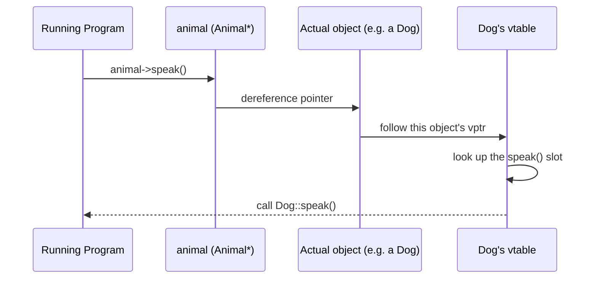
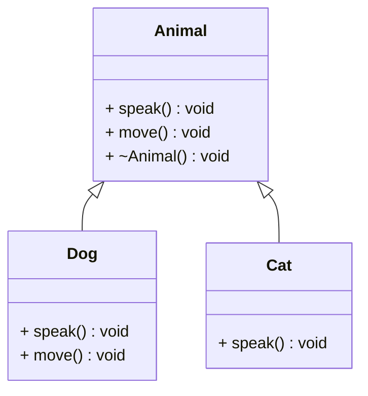
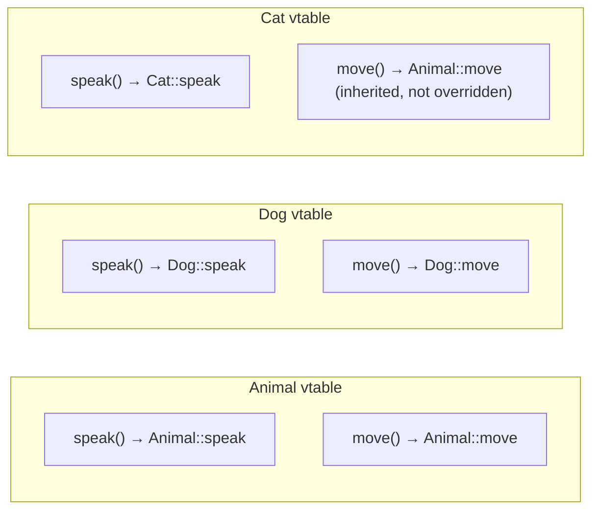
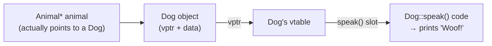
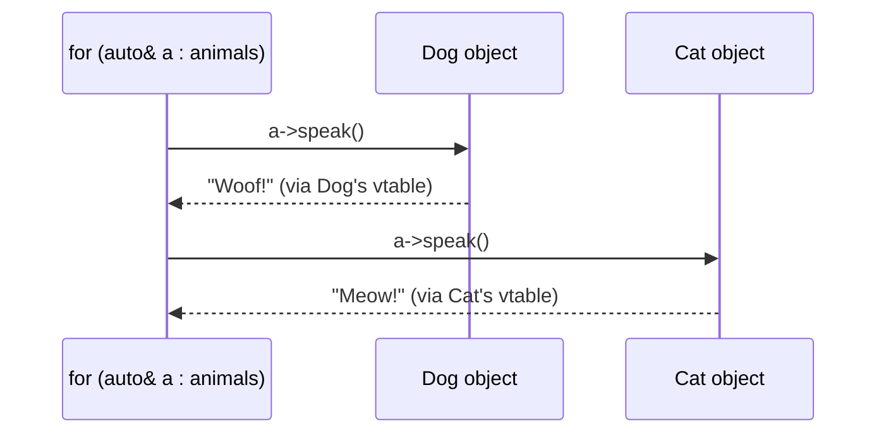
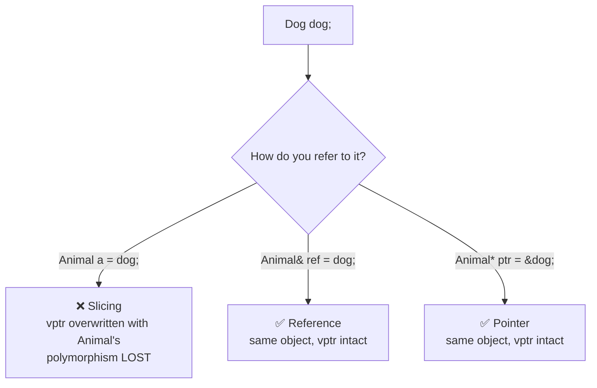
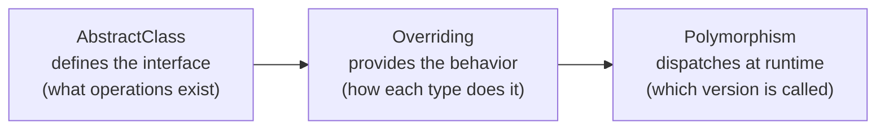
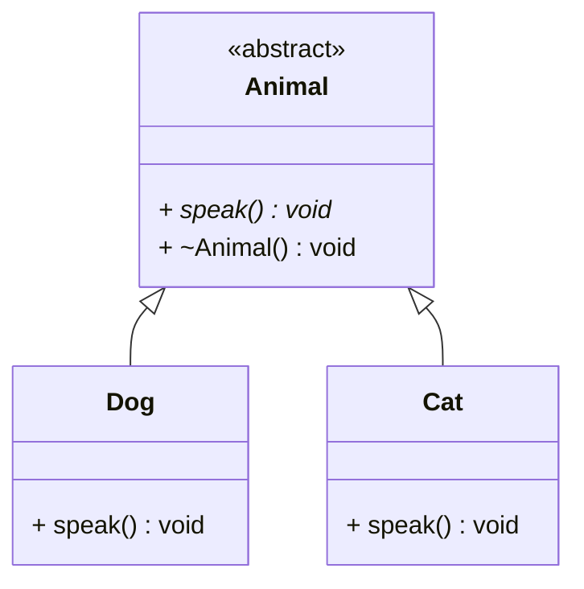

# Polymorphism in C++

## What is Polymorphism?

**Polymorphism** means "many forms" — the ability of different objects to respond differently to the same function call, based on their actual type at runtime (or at compile time).

It is the mechanism that lets you write code that works on a **base type** and automatically does the right thing for every derived type, without needing to know which concrete type you are dealing with.

> **See also:** `14_VirtualFunctions` covers the mechanics behind this
> folder in depth (static vs. dynamic binding, `override`/`final`, object
> slicing), and `09_ObjectRelationships/07_MemberNotation` covers the UML
> notation used in the diagrams below.

---

## Two Types

### 1. Compile-Time (Static) Polymorphism
Resolved entirely by the compiler. Zero runtime cost.

| Mechanism | Example |
|---|---|
| Function overloading | `print(int)` vs `print(double)` |
| Operator overloading | `v1 + v2` calling your `operator+` |
| Templates | `maxOf<T>(a, b)` works for any type |

### 2. Runtime (Dynamic) Polymorphism
Resolved at runtime via the **vtable**. Tiny overhead (one pointer lookup per call).

| Mechanism | Requirement |
|---|---|
| Virtual functions | `virtual` keyword in base class |
| Pointer or reference | Must use `Base*` or `Base&`, never a copy |
| `override` keyword | Marks derived class implementations |

---

## How Runtime Polymorphism Actually Works — Step by Step

This is the part that's easy to gloss over: **"resolved at runtime" means
the decision of which function to call happens while the program is
executing, not while it's being compiled.** Here's the exact sequence,
tied to the timeline of when each step happens.

### At compile time — before the program ever runs

The compiler sees this line:

```cpp
Animal* animal = /* ... */;
animal->speak();
```

It looks at the **declared type of the pointer** (`Animal*`) and checks:
*does `Animal` have a `speak()` method, and is it `virtual`?* If yes, the
compiler does **not** hard-code a call to `Animal::speak()`. Instead, it
generates code that says, in effect: *"at runtime, go find out what this
pointer's vtable says the `speak()` slot points to, and call that."* This
generated lookup instruction is fixed at compile time — but *which
function it ends up calling* is not decided yet.

### At runtime — every time this line actually executes



1. **The program reaches the call** `animal->speak()`.
2. **It dereferences `animal`** to get the actual object in memory — this
   could be a `Dog`, a `Cat`, or any other `Animal` subclass; the pointer
   itself doesn't carry that information, only an address.
3. **It reads that object's `vptr`** — a hidden pointer every polymorphic
   object carries, set automatically by the constructor, pointing at the
   vtable of the object's *actual* class (not the pointer's declared type).
4. **It follows the `vptr` to the vtable** and looks up the `speak()`
   slot in it.
5. **It calls whatever function address is stored in that slot** — for a
   `Dog` object, that's `Dog::speak()`; for a `Cat` object, it's
   `Cat::speak()`, even though both calls came from the exact same line
   of source code (`animal->speak()`).

### C++ example — tracing all 5 steps

This example prints something at each conceptual step so you can watch
the sequence happen, run after run, with different objects behind the
same pointer:

```cpp
#include <iostream>
#include <memory>
#include <vector>

class Animal {
public:
    // step 3/4 setup: this being `virtual` is what makes the compiler
    // generate a vtable lookup instead of a direct call
    virtual void speak() const {
        std::cout << "  -> ran Animal::speak()\n";
    }
    virtual ~Animal() = default;
};

class Dog : public Animal {
public:
    void speak() const override {
        std::cout << "  -> ran Dog::speak() => Woof!\n";
    }
};

class Cat : public Animal {
public:
    void speak() const override {
        std::cout << "  -> ran Cat::speak() => Meow!\n";
    }
};

// step 1: the compiler only ever sees "Animal*" here — it has NO idea,
// while compiling this function, whether it will run Dog::speak(),
// Cat::speak(), or Animal::speak(). It just emits a vtable-lookup call.
void makeItSpeak(const Animal* animal) {
    std::cout << "step 1: compiled call site reached (animal->speak())\n";
    animal->speak();   // steps 2-5 happen HERE, at this exact moment
}

int main() {
    Dog dog;
    Cat cat;

    std::cout << "--- Calling with a Dog* ---\n";
    makeItSpeak(&dog);   // step 2: dereferences to the Dog object
                          // step 3: reads Dog's vptr
                          // step 4: follows it to Dog's vtable
                          // step 5: calls Dog::speak()

    std::cout << "--- SAME function, now called with a Cat* ---\n";
    makeItSpeak(&cat);   // step 2: dereferences to the Cat object
                          // step 3: reads Cat's vptr
                          // step 4: follows it to Cat's vtable
                          // step 5: calls Cat::speak()

    std::cout << "--- Mixed collection: steps 2-5 repeat for EACH element ---\n";
    std::vector<std::unique_ptr<Animal>> animals;
    animals.push_back(std::make_unique<Dog>());
    animals.push_back(std::make_unique<Cat>());
    animals.push_back(std::make_unique<Dog>());

    for (const auto& a : animals) {
        makeItSpeak(a.get());   // re-resolved fresh, every single iteration
    }
}
```

**Output:**
```
--- Calling with a Dog* ---
step 1: compiled call site reached (animal->speak())
  -> ran Dog::speak() => Woof!
--- SAME function, now called with a Cat* ---
step 1: compiled call site reached (animal->speak())
  -> ran Cat::speak() => Meow!
--- Mixed collection: steps 2-5 repeat for EACH element ---
step 1: compiled call site reached (animal->speak())
  -> ran Dog::speak() => Woof!
step 1: compiled call site reached (animal->speak())
  -> ran Cat::speak() => Meow!
step 1: compiled call site reached (animal->speak())
  -> ran Dog::speak() => Woof!
```

**What to notice:** `makeItSpeak()` is compiled exactly **once**. The
`animal->speak()` line inside it never changes. Yet it produces three
different outputs across the loop — proof that steps 2 through 5 are
genuinely happening again at runtime, for every call, rather than being
baked in when the function was compiled.

### The key insight

**The same compiled instruction produces a different function call every
time, depending only on which object's address happens to be in the
pointer at that moment.** Nothing about the *code* changes between calls
— what changes is *which object the pointer refers to*, and each object
carries its own vptr pointing to its own class's vtable. That's the
entire mechanism: the object, not the pointer, decides which version
runs — and it decides it fresh, at the moment of the call, not in advance.

```cpp
Dog dog;
Cat cat;

Animal* animal = &dog;
animal->speak();     // runtime: follows dog's vptr → "Woof!"

animal = &cat;        // SAME pointer, now pointing at a different object
animal->speak();     // runtime: follows cat's vptr → "Meow!"
                       // Notice: same variable, same line of code,
                       // different result — because the OBJECT changed,
                       // and that's checked again at each call.
```

This is also why it's called **dynamic** binding — the binding between
the call `animal->speak()` and the actual function that runs isn't fixed
once; it's re-evaluated dynamically, every single time that line executes.

---

## How the Vtable Works

Every class with at least one virtual function gets a **vtable** — a table of function pointers. Every *object* of that class carries one extra hidden pointer, the **vptr**, pointing to its class's vtable.

### The classes

```cpp
class Animal {
public:
    virtual void speak() const {
        std::cout << "Some generic animal sound\n";
    }
    virtual void move() const {
        std::cout << "Animal moves\n";
    }
    virtual ~Animal() = default;
};

class Dog : public Animal {
public:
    void speak() const override {
        std::cout << "Woof!\n";
    }
    void move() const override {
        std::cout << "Dog runs\n";
    }
};

class Cat : public Animal {
public:
    void speak() const override {
        std::cout << "Meow!\n";
    }
    // move() NOT overridden — inherits Animal's version
};
```



### The vtables this generates



*Notice `Cat`'s vtable — since `Cat` never overrode `move()`, its vtable
slot for `move()` still points to `Animal::move`. This is exactly why a
`Cat` object correctly falls back to the generic animal movement without
any extra code on your part.*

### What happens when you call `animal->speak()`



1. Follow `vptr` to the vtable — **the object's actual type decides which
   vtable**, not the pointer's declared type
2. Look up the `speak` slot
3. Call whatever function pointer is stored there

The compiler does not need to know the concrete type at the call site —
the object carries that information itself, via its `vptr`.

### Worked example — a mixed collection

```cpp
std::vector<std::unique_ptr<Animal>> animals;
animals.push_back(std::make_unique<Dog>());
animals.push_back(std::make_unique<Cat>());

for (const auto& a : animals) {
    a->speak();   // Dog's vptr → "Woof!"  |  Cat's vptr → "Meow!"
    a->move();    // Dog's vptr → "Dog runs"  |  Cat's vptr → "Animal moves" (inherited)
}
```



Same line of code (`a->speak()`), two different outcomes — decided purely
by which vtable each object's `vptr` points to at that moment. No
`if`/`switch` on type anywhere in the loop.

---

## The Critical Rule: Never Copy for Polymorphism

```cpp
Animal a = dog;     // ❌ Object slicing — Dog part is cut off
                    //    vptr is overwritten with Animal's vtable
                    //    polymorphism is destroyed

Animal& ref = dog;  // ✅ Reference — original object, vptr intact
Animal* ptr = &dog; // ✅ Pointer  — original object, vptr intact
```



---

## Examples in This File

| Example | Demonstrates |
|---|---|
| 1 — Animal sound dispatcher | Core runtime dispatch, mixed vector |
| 2 — Vtable walkthrough | How dispatch works, object slicing danger |
| 3 — Compile-time polymorphism | Overloading, operators, templates |
| 4 — Payment system | Real-world design, Open/Closed Principle |
| 5 — Polymorphism vs type-checking | Anti-pattern comparison |
| 6 — Covariant return types | Override returning derived type |

---

## Relationship to Other Topics



These three topics work together. You cannot have meaningful runtime
polymorphism without all three.

---

## When to Use

**Use runtime polymorphism when:**
- You have a collection of related but different types
- You want to add new types without changing existing code
- You are building a plugin or driver system
- The concrete type is not known until runtime

**Prefer compile-time polymorphism (templates) when:**
- All types are known at compile time
- Performance is critical (inner loops, real-time systems)
- You want type safety without virtual call overhead

---

## Quick Reference

```cpp
// Base class — defines interface
class Animal {
public:
    virtual void speak() const = 0;   // pure virtual
    virtual ~Animal() = default;      // always virtual destructor
};

// Derived class — provides behavior
class Dog : public Animal {
public:
    void speak() const override {     // override keyword
        cout << "Woof!\n";
    }
};

// Usage — polymorphism in action
void makeNoise(const Animal& a) {
    a.speak();                        // correct version called automatically
}

Dog dog;
makeNoise(dog);                       // prints: Woof!

// Mixed collection
vector<unique_ptr<Animal>> animals;
animals.push_back(make_unique<Dog>());
animals.push_back(make_unique<Cat>());

for (const auto& a : animals) {
    a->speak();                       // each calls its own version
}
```



---

## Common Mistakes

| Mistake | Fix |
|---|---|
| Forgetting `virtual` on destructor | Always `virtual ~Base() = default` |
| Copying instead of pointing | Use `Base*` or `Base&` |
| Forgetting `override` keyword | Add `override` — catches typos at compile time |
| Using `dynamic_cast` frequently | Redesign: frequent casting means missing virtual function |

---

## Build

```bash
mkdir build && cd build
cmake ..
cmake --build .
./Polymorphism
```

**Requirements:** GCC 14+, C++23, CMake 3.16+
