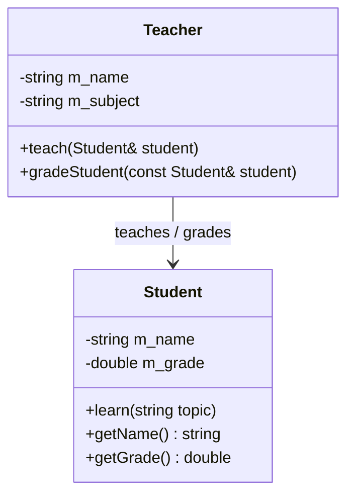
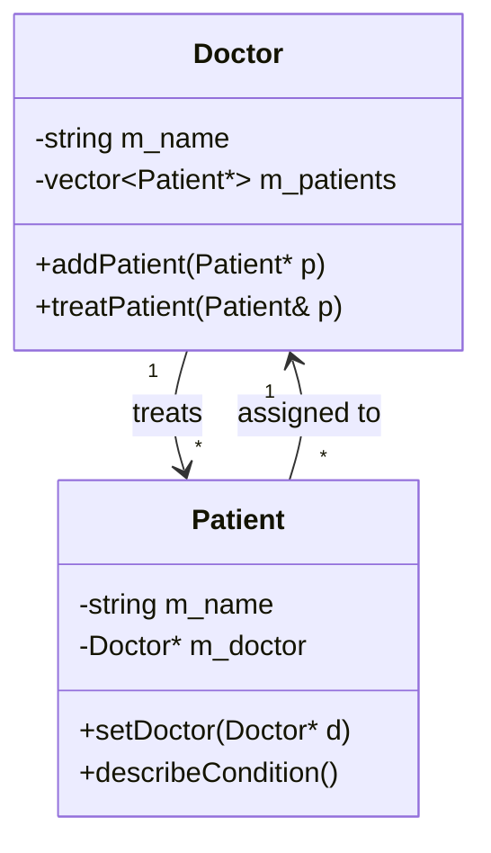
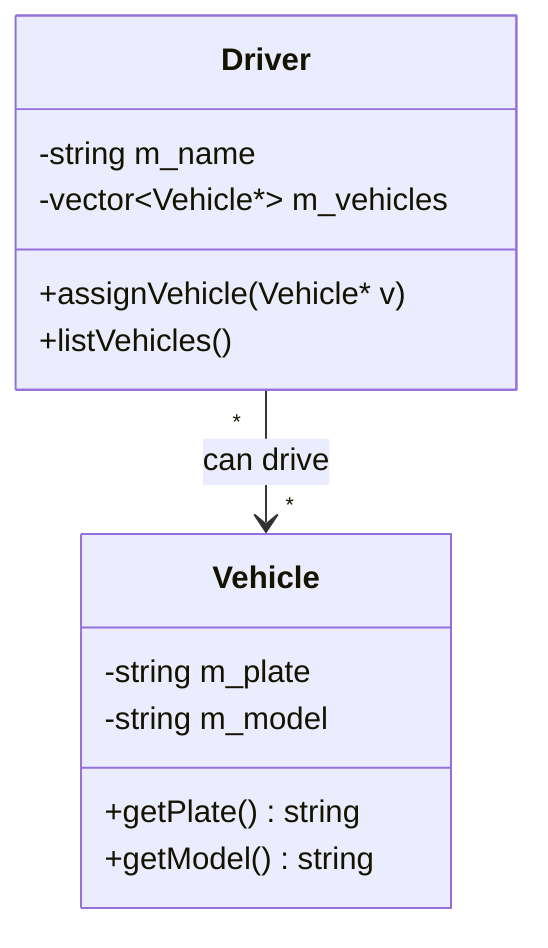
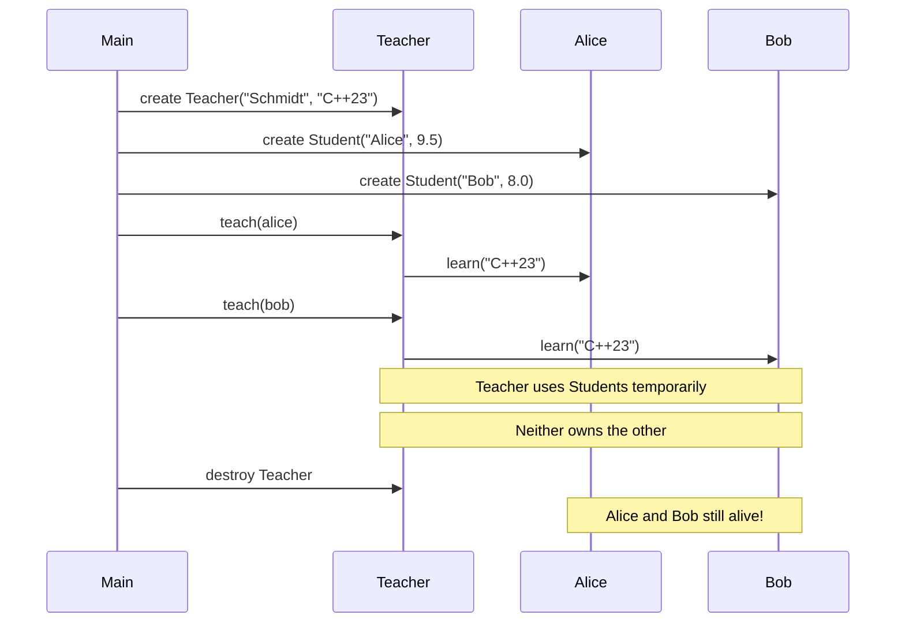
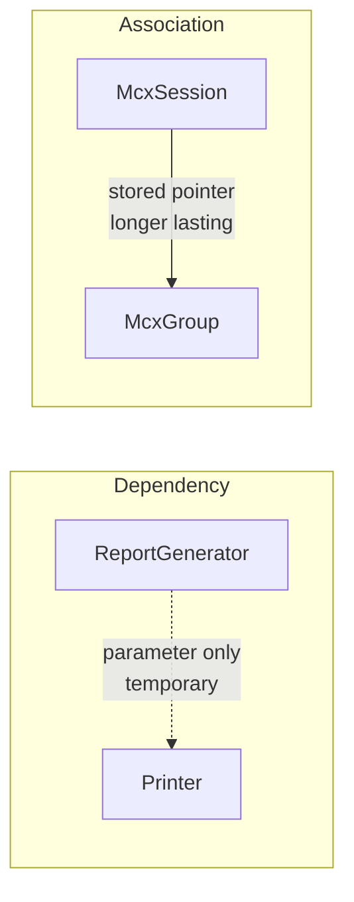

# Association — C++

## What is Association?

A **uses-a** relationship where two classes know about each other but
**neither owns the other**. Both objects exist independently and have
their own lifetimes.

---

## Class diagram



---

## Bidirectional association



---

## Many-to-many association



---

## Lifetime diagram



---

## Key characteristics

- No ownership — neither object creates or destroys the other
- Both can exist without the other
- One object is passed in from outside (parameter or pointer)
- Can be unidirectional or bidirectional
- Can be one-to-one, one-to-many, or many-to-many

---

## Code pattern

```cpp
class Teacher {
public:
    // Association — Student passed from outside, Teacher does NOT own it
    void teach(Student& student) {
        student.learn(m_subject);
    }
};

// Both exist independently
Teacher teacher("Mr. Schmidt", "C++23");
Student alice("Alice", 9.5);

teacher.teach(alice);   // Teacher uses Student temporarily
// Both still alive after this call
```

---

## Examples in this file

| # | Classes | Direction |
|---|---------|-----------|
| 1 | Teacher ↔ Student | unidirectional |
| 2 | Doctor ↔ Patient | bidirectional |
| 3 | Driver ↔ Vehicle | many-to-many |
| 4 | McxSession ↔ McxGroup | domain example |

---

## Association vs Dependency

Both are "uses-a" but differ in duration:



---

## When to use Association

✅ Objects need to collaborate but have independent lifetimes
✅ One object needs to call methods on another
✅ Many-to-many relationships (drivers and vehicles)
✅ Bidirectional knowledge (doctor knows patients, patients know doctor)

❌ If one object creates and owns the other → use **Composition**
❌ If one object contains the other but doesn't own it → use **Aggregation**
❌ If the relationship is only temporary (method parameter) → use **Dependency**

---

## Summary

| Property | Value |
|----------|-------|
| Type | uses-a |
| Ownership | None |
| Lifetime | Independent |
| Storage | Pointer or reference passed from outside |
| UML | `A ————————> B` solid line, open arrow |
