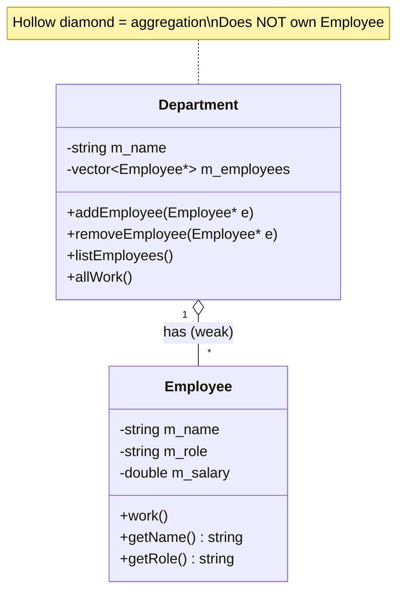
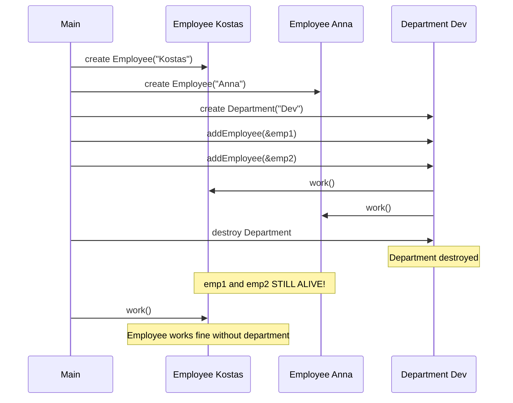
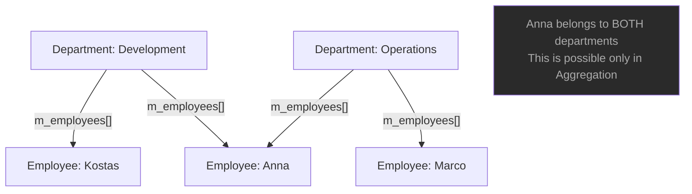
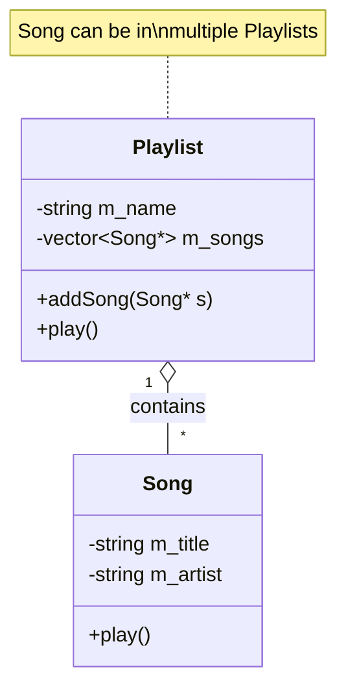
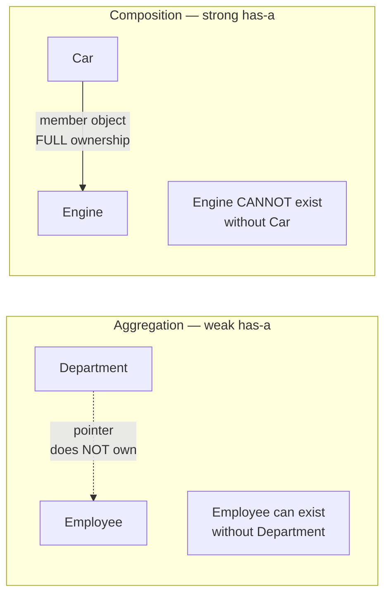

# Aggregation — C++

## What is Aggregation?

A **has-a** relationship where the whole **contains** parts, but the parts
can **exist independently** of the whole. The whole does **not** own the
lifetime of the parts.

---

## Class diagram



---

## Lifetime diagram — parts outlive the whole



---

## Part sharing diagram — same part in multiple wholes



---

## Playlist example



---

## Key characteristics

- Whole contains parts — but does NOT create or destroy them
- Parts are created outside and passed in
- Parts can outlive the whole
- The same part can belong to multiple wholes simultaneously
- Destructor of the whole does NOT delete the parts

---

## Code pattern

```cpp
class Department {
    std::vector<Employee*> m_employees;   // stores pointers — does NOT own

public:
    void addEmployee(Employee* e) { m_employees.push_back(e); }

    ~Department() {
        // Do NOT delete employees — they exist independently!
    }
};

// Employee created outside — exists independently
Employee emp("Kostas", "Dev", 75000);
Department dev("Development");

dev.addEmployee(&emp);    // emp passed in from outside

// Department destroyed — emp still alive
```

---

## Aggregation vs Composition



| | Aggregation | Composition |
|--|------------|-------------|
| Storage | `Part*` pointer | `Part` member object |
| Ownership | None | Full |
| Part lifetime | Independent | Tied to whole |
| Destructor | Does NOT delete | Automatic delete |
| Part sharing | Can be shared | Cannot be shared |

---

## When to use Aggregation

✅ The part has a meaningful existence outside the whole
✅ The part can belong to multiple wholes at the same time
✅ The whole doesn't control when parts are created/destroyed
✅ Parts are passed in from outside (constructor or setter)

❌ If you create the part inside the whole → use **Composition**
❌ If neither object contains the other → use **Association**

---

## Common mistake — accidental deletion

```cpp
// WRONG — deleting parts in destructor = double-delete crash!
~Department() {
    for (auto* e : m_employees) delete e;   // WRONG for aggregation!
}

// CORRECT — do not delete
~Department() { }   // parts managed elsewhere
```

---

## Summary

| Property | Value |
|----------|-------|
| Type | has-a (weak) |
| Ownership | None |
| Lifetime | Parts exist independently |
| Storage | Pointer to externally created object |
| Part sharing | Yes — same part in multiple wholes |
| UML | `A <>————————B` hollow diamond at A |
