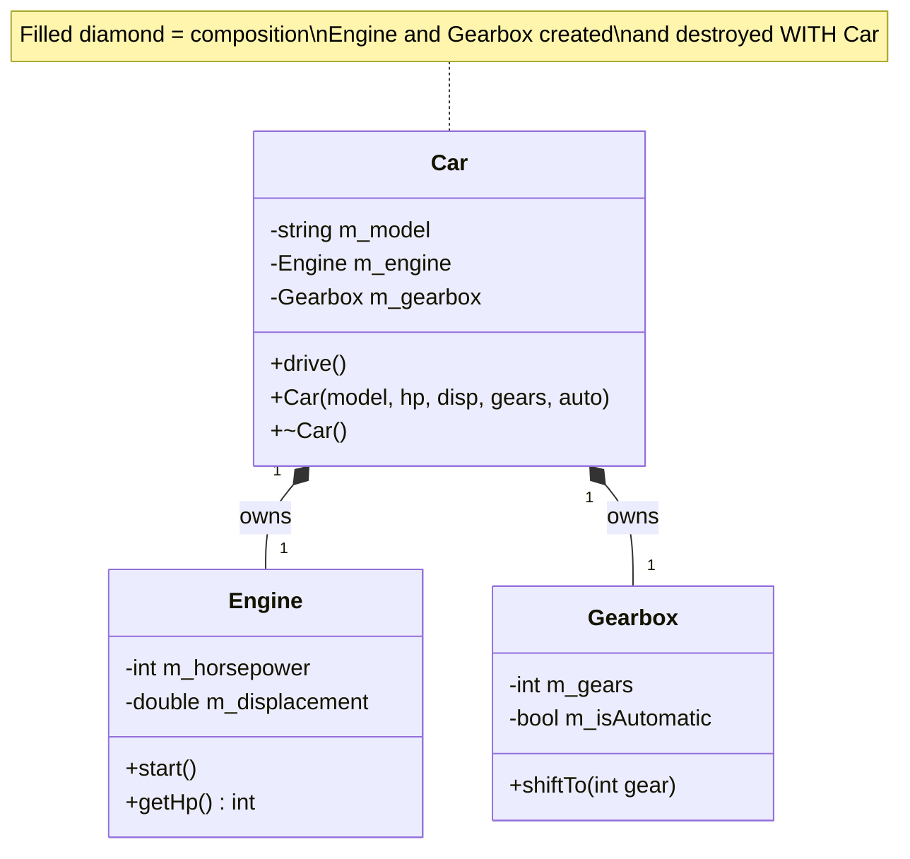
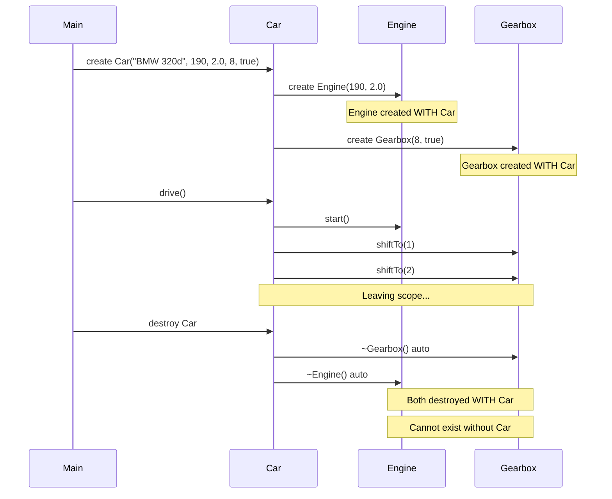
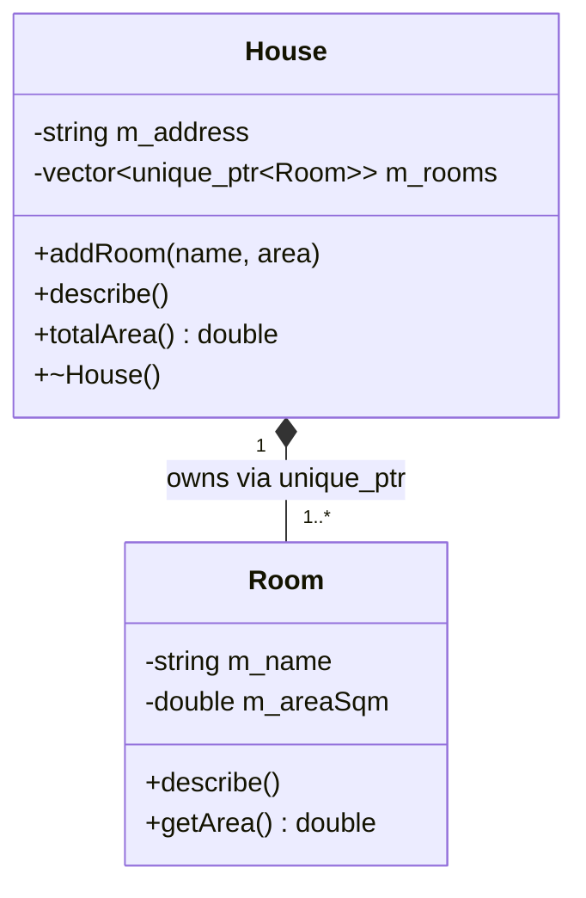
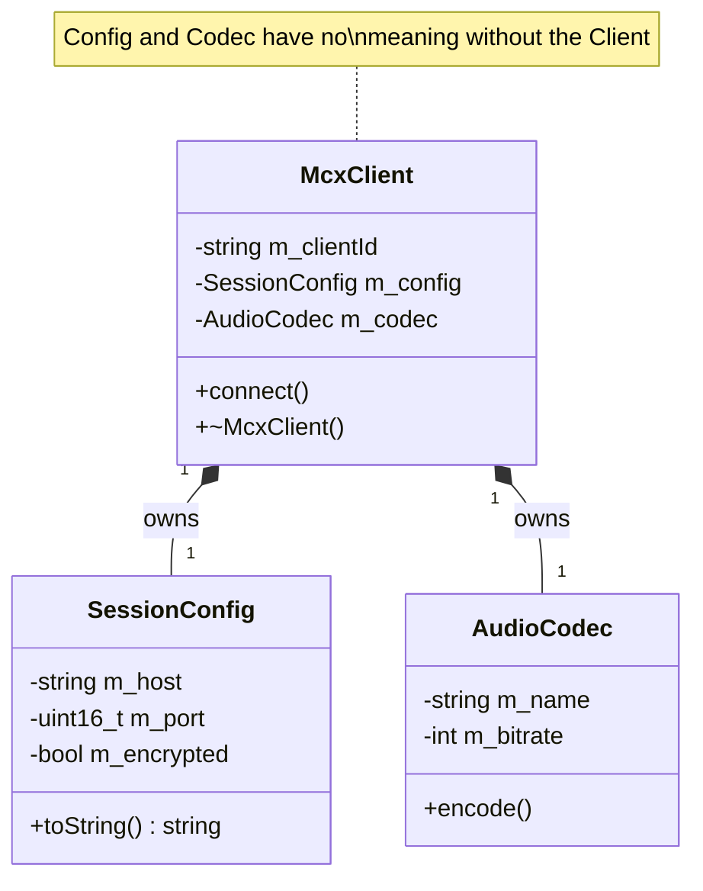
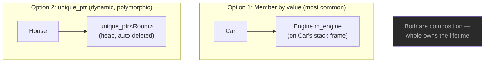
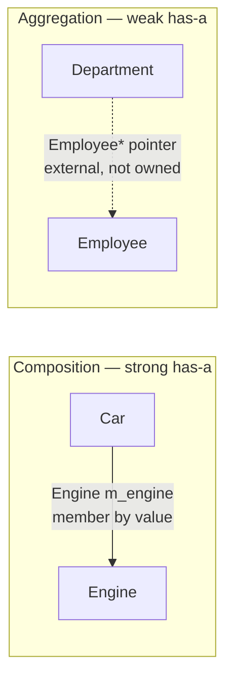

# Composition — C++

## What is Composition?

The strongest **has-a** relationship. The whole **owns** its parts completely —
it creates them, manages them, and destroys them. Parts **cannot exist**
without the whole and have no independent meaning outside it.

---

## Class diagram



---

## Lifetime diagram — parts tied to whole



---

## House — Room composition with unique_ptr



---

## MCX client composition



---

## Storage options



---

## Key characteristics

- Whole creates the parts (in constructor or member initialization)
- Parts are destroyed when the whole is destroyed
- Parts cannot be shared with other wholes
- Part lifetime is completely controlled by the whole
- Usually stored as member objects (by value) or `unique_ptr`

---

## Code pattern

```cpp
class Car {
private:
    Engine  m_engine;    // composition — owned by Car
    Gearbox m_gearbox;   // composition — owned by Car

public:
    Car() : m_engine(190, 2.0), m_gearbox(8, true) {}
    // Engine and Gearbox created WITH the Car

    ~Car() { }
    // Engine and Gearbox destroyed AUTOMATICALLY with the Car
};

{
    Car bmw("BMW 320d", 190, 2.0, 8, true);
    bmw.drive();
}   // bmw destroyed → engine and gearbox destroyed too
```

---

## Composition vs Aggregation



---

## When to use Composition

✅ The part has no meaning without the whole (engine without a car)
✅ The part should always exist as long as the whole exists
✅ You want RAII — automatic cleanup when the whole goes out of scope
✅ The part should not be shared with other objects

❌ If the part can exist independently → use **Aggregation**
❌ If neither contains the other → use **Association**

---

## Summary

| Property | Value |
|----------|-------|
| Type | has-a (strong) |
| Ownership | Full — whole owns and manages parts |
| Lifetime | Parts tied to whole |
| Storage | Member object by value, or `unique_ptr` |
| Part sharing | Not possible |
| UML | `A <♦>———————B` filled diamond at A |
