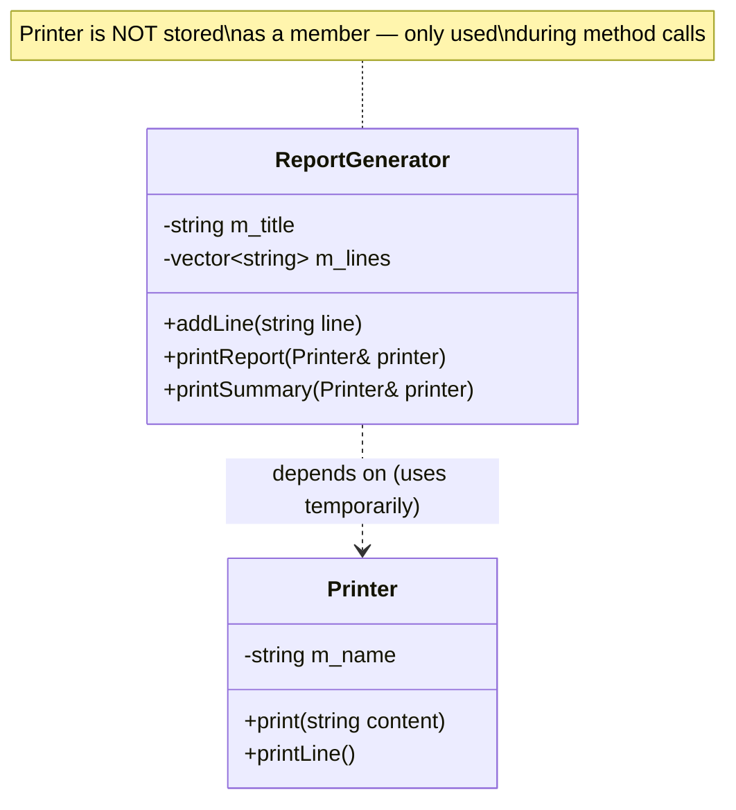
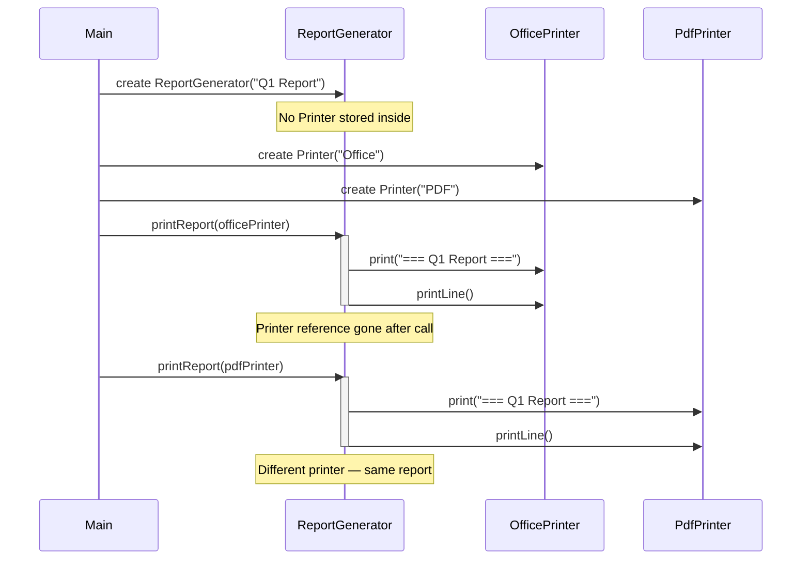
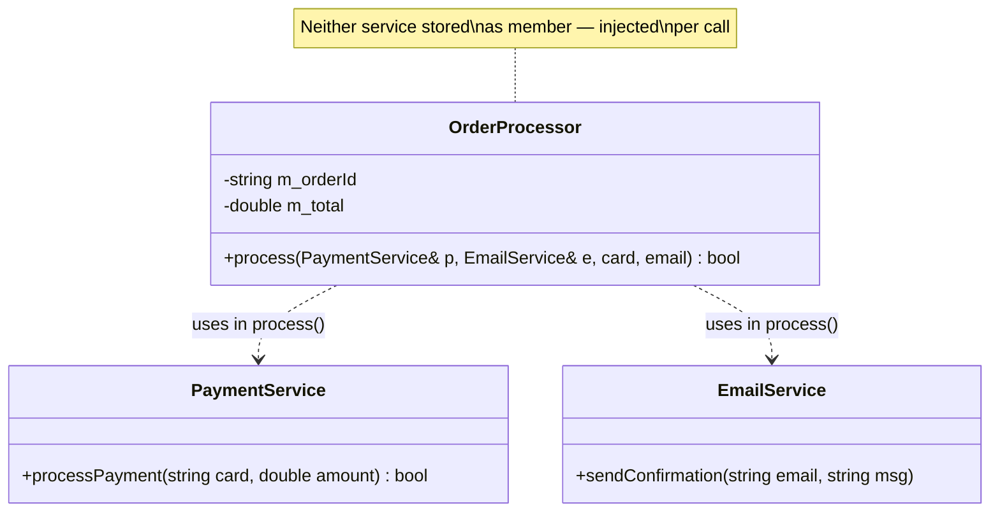
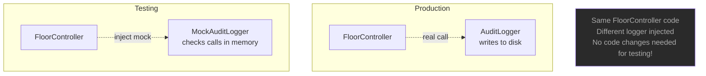
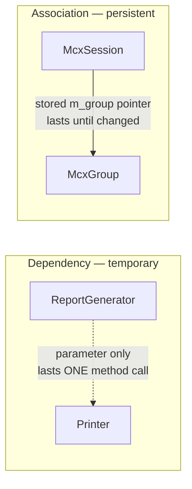

# Dependency — C++

## What is Dependency?

The **weakest** relationship. Class A depends on class B only **temporarily** —
during a single method call. B appears as a parameter, local variable, or
return type — never stored as a member of A.

---

## Class diagram



---

## Sequence diagram — temporary use only



---

## OrderProcessor dependency injection



---

## Why dependency enables testability



---

## Dependency vs Association



| | Dependency | Association |
|--|-----------|------------|
| Duration | Method call only | Longer term |
| Storage | Parameter/local | Member pointer/reference |
| Connection | Temporary | Persistent |

---

## Key characteristics

- No persistent connection — relationship lasts only during a method call
- B is passed in from outside (parameter) — not created or stored by A
- A does not know about B between calls
- Different B objects can be passed on different calls
- Makes code highly testable — easy to inject mocks

---

## Code pattern

```cpp
class ReportGenerator {
    // No Printer member — dependency only

public:
    // Printer appears ONLY as a parameter — not stored
    void printReport(Printer& printer) const {
        printer.print("=== " + m_title + " ===");
        for (const auto& line : m_lines)
            printer.print(line);
    }
};

// Different printer each time
report.printReport(officePrinter);   // use office printer
report.printReport(pdfPrinter);      // use pdf printer
```

---

## When to use Dependency

✅ The external class is only needed temporarily for one operation
✅ You want to swap implementations (testing, mocking, strategy)
✅ The class doesn't need to remember the dependency between calls
✅ Reducing coupling — A should know as little about B as possible

❌ If A needs to remember B between calls → use **Association**
❌ If A contains B as a part → use **Aggregation** or **Composition**

---

## Summary

| Property | Value |
|----------|-------|
| Type | uses-a (temporary) |
| Ownership | None |
| Duration | Method call only |
| Storage | Parameter or local variable — never a member |
| Key benefit | Swappable, mockable, loosely coupled |
| UML | `A - - - - -> B` dashed line, open arrow |
