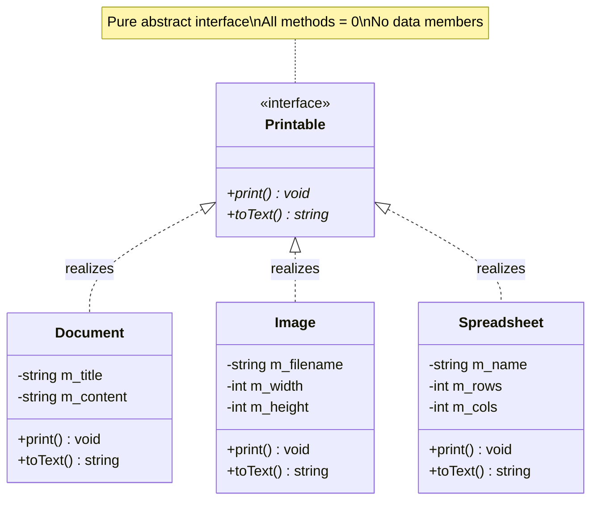
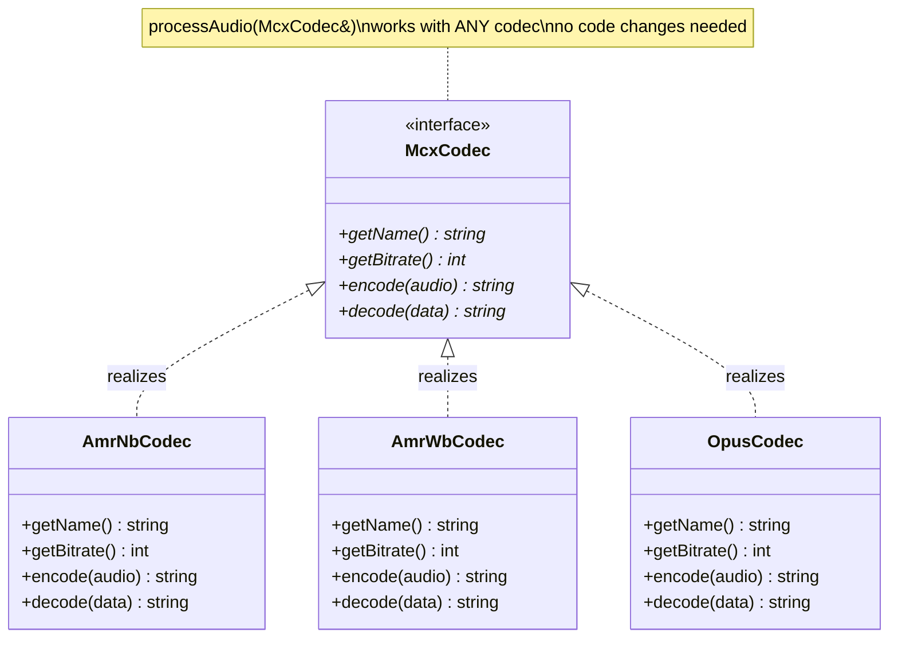
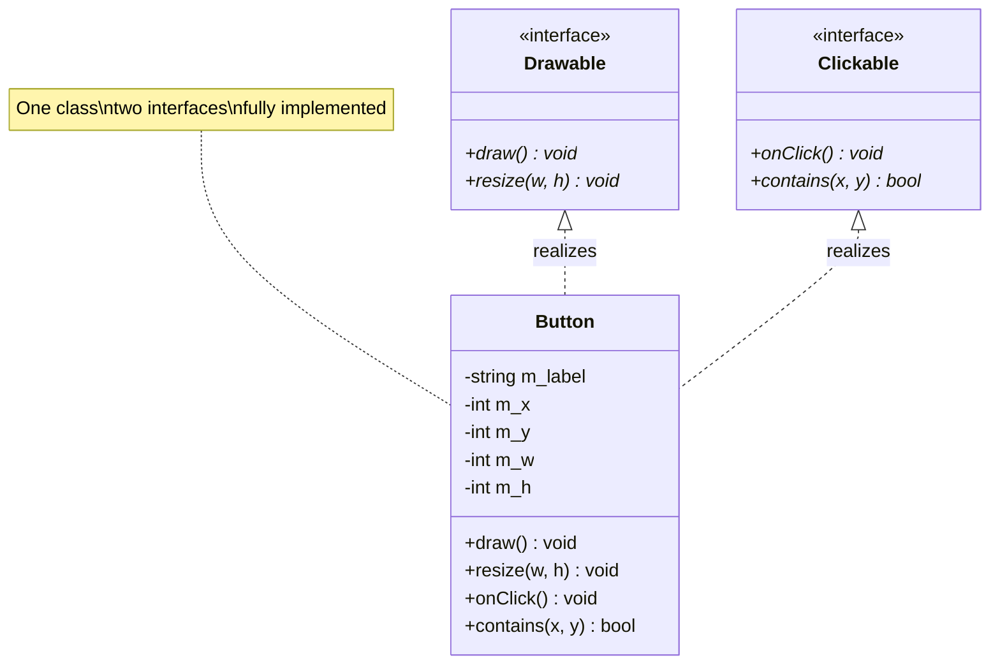
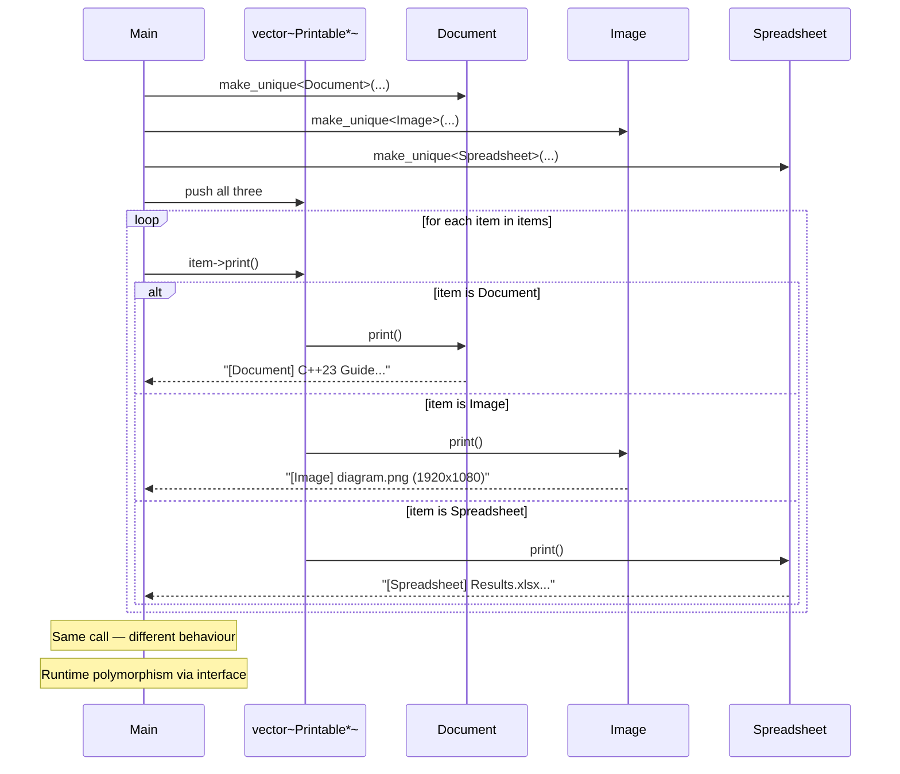
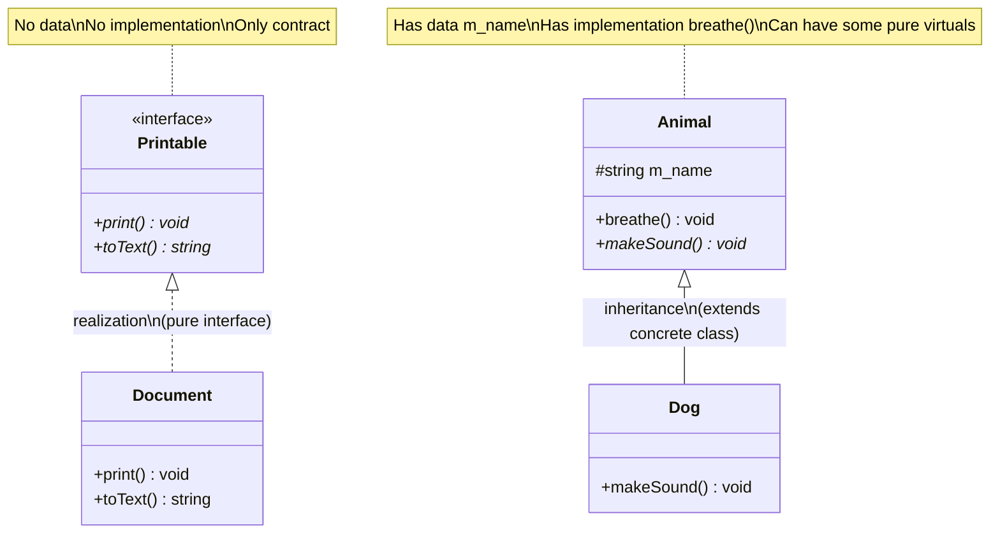

# Realization — C++

## What is Realization?

A class **realizes** (implements) an abstract interface — it fulfills the
contract defined by the interface. Every pure virtual method must be
overridden in the concrete class.

---

## Class diagram — Printable interface



---

## MCX Codec interface



---

## Multiple interfaces — Button



---

## Sequence — polymorphic dispatch through interface



---

## Realization vs Inheritance



---

## Key characteristics

- The base class is **purely abstract** — no data members, all methods `= 0`
- The concrete class must implement **all** pure virtual methods
- A class can realize multiple interfaces simultaneously
- Client code works through the interface — independent of concrete type
- Makes implementations interchangeable

---

## Code pattern

```cpp
// Interface — pure abstract, defines the CONTRACT
class McxCodec {
public:
    virtual std::string encode(const std::string& audio) const = 0;
    virtual std::string decode(const std::string& data)  const = 0;
    virtual ~McxCodec() = default;
};

// Realization — concrete class fulfills the contract
class AmrWbCodec : public McxCodec {
public:
    std::string encode(const std::string& audio) const override { ... }
    std::string decode(const std::string& data)  const override { ... }
};

// Client uses the interface — works with ANY realization
void processAudio(const McxCodec& codec, const std::string& audio) {
    auto encoded = codec.encode(audio);
}
```

---

## When to use Realization

✅ Define a contract that multiple classes must fulfill
✅ Interchangeable implementations (codecs, serializers, printers)
✅ Depend on abstractions not concretions (Dependency Inversion)
✅ Multiple inheritance without the diamond problem

❌ If you want to share code between classes → use **Inheritance**
❌ If the relationship is not "is-a" → use Association/Aggregation/Composition

---

## Summary

| Property | Value |
|----------|-------|
| Type | is-a (contract fulfillment) |
| Base class | Pure abstract — all `= 0`, no data |
| Derived class | Must implement all pure virtuals |
| Multiple | One class can realize many interfaces |
| Benefit | Interchangeable, testable, loosely coupled |
| UML | `A <— — — — —B` dashed line, hollow triangle |
