# 06_Multiplicity (Cardinality)

Part of `09_ObjectRelationships/`.

## What is Multiplicity?

**Multiplicity** describes **how many instances of one class can be
connected to how many instances of another class** through a given
relationship. It's a constraint on the *quantity* of objects involved on
each side of a link — not on what the link means.

It answers a different question than relationship *type*:

| Question | Answered by |
|---|---|
| **What kind** of connection is it? (uses, owns, contains...) | Relationship type (Association, Aggregation, Composition, ...) |
| **How many** instances are involved on each side? | **Multiplicity** ← this file |

They're independent — any relationship type can carry any multiplicity.

---

## Why is it also called "Cardinality"?

**Cardinality** is a term borrowed from **mathematics/set theory**, where
it means *the number of elements in a set*. UML inherited it from an older
modeling discipline — **Entity-Relationship (ER) diagrams**, used in
database design (Chen notation, Crow's Foot notation) — which predates UML
and used "cardinality" to describe exactly the same idea: how many rows in
one table can relate to how many rows in another (1:1, 1:N, N:M).

When UML was standardized in the 1990s, it adopted the ER concept but
renamed it **multiplicity**, mainly to broaden the meaning slightly:

| Term | Origin | Strict meaning | Common usage today |
|---|---|---|---|
| **Cardinality** | Set theory / ER diagrams (databases) | The *exact count* — "how many" | Often used loosely to mean the same as multiplicity |
| **Multiplicity** | UML specification | A *range or constraint* on count (e.g. `0..*`, `2..5`) — allows open-ended bounds, not just a fixed number | The official UML term |

In practice, **the two terms are used interchangeably** by most developers
and in most UML tooling — you'll see both in textbooks, diagram tools, and
casual conversation. If you're being precise in an academic/UML-spec
context, **multiplicity** is the correct term. If you're talking to a
database person, they'll likely say **cardinality**. Since your background
touches both software design and DB-adjacent systems work, it's worth
recognizing both so you're not thrown off when a source uses one or the
other.

---

## Notation

Written as a number or range **next to the class it describes**, at the end
of the connecting line closest to that class.

| Notation | Meaning |
|---|---|
| `1` | exactly one |
| `0..1` | zero or one (optional) |
| `*` or `0..*` | zero or many (unbounded) |
| `1..*` | one or many (at least one, unbounded) |
| `m..n` | a specific range, e.g. `2..5` |
| `n` | exactly n, e.g. `4` |

---

## How to read the notation on a diagram

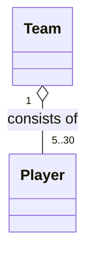

Read it from **each end toward the other class**:

- Look at the number **next to `Player`** (`5..30`) → that tells you
  **how many `Player`s one `Team` has**.
- Look at the number **next to `Team`** (`1`) → that tells you
  **how many `Team`s one `Player` belongs to**.

So: *"One Team consists of 5 to 30 Players. Each Player belongs to exactly 1 Team."*

---

## How to determine it — the two questions

For any relationship `A —— B`, ask both directions separately:

1. **From A's side:** *How many B's can one A have?* → write that number **next to B**.
2. **From B's side:** *How many A's can one B belong to?* → write that number **next to A**.

The two numbers are almost always different — that's the whole point of
writing both.

---

## Worked examples (all six relationship types)

### 1. One-to-one

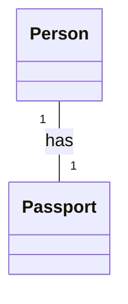

*One Person has exactly one Passport. One Passport belongs to exactly one Person.*

### 2. One-to-many

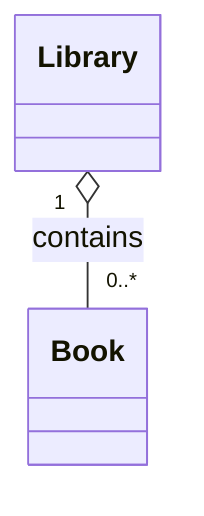

*One Library contains zero or more Books. Each Book belongs to exactly one Library.*

### 3. Many-to-many

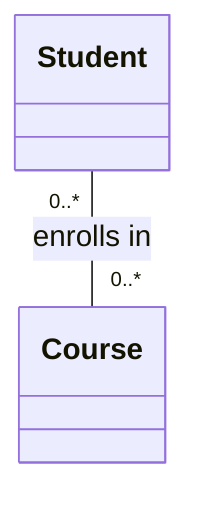

*A Student can enroll in zero or more Courses. A Course can have zero or more Students.*
(Many-to-many relationships like this are usually implemented in C++ with
`std::vector` on both sides, or a join/association class if the link itself
needs data — e.g. an `Enrollment` class holding a grade.)

### 4. Composition with an exact number

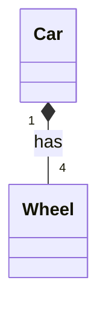

*One Car has exactly 4 Wheels. Each Wheel belongs to exactly 1 Car (and is destroyed with it — composition).*

### 5. Optional relationship

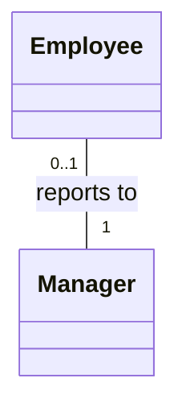

*An Employee reports to exactly 1 Manager. A Manager can have zero or one... wait — let's flip it correctly:*

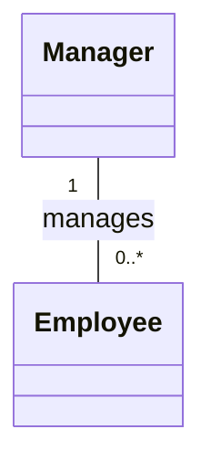

*One Manager manages zero or more Employees. Each Employee has exactly 1 Manager.*
(This is the corrected, more realistic version — read multiplicities
carefully, it's easy to put them on the wrong side!)

### 6. Self-association (a class related to itself)

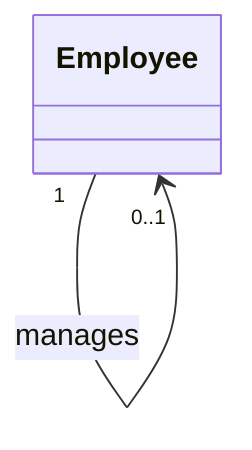

*One Employee (the manager) supervises zero or one other Employee directly
above them... more precisely:* one `Employee` can optionally have one
`Employee` as their manager, and one `Employee` can manage many others.

---

## Multiplicity across your relationship types

| Relationship | Typical multiplicity pattern | Example |
|---|---|---|
| **Association** | often `*` to `*`, or `1` to `*` | `Student "0..*" -- "0..*" Course` |
| **Aggregation** | often `1` to `*` | `Team "1" o-- "0..*" Player` |
| **Composition** | often `1` to a fixed/exact number, or `1` | `Car "1" *-- "4" Wheel` |
| **Dependency** | usually not annotated (too transient) | `Printer ..> Document : prints` |
| **Realization** | usually not annotated (it's a contract, not a count) | `Shape <|.. Circle` |
| **Inheritance** | never annotated (not a "how many" relationship) | `Animal <|-- Dog` |

Multiplicity mainly matters for **Association, Aggregation, and Composition** —
these are the relationships where "how many objects are connected" is a
meaningful design decision. Dependency, Realization, and Inheritance describe
*structure*, not *counts*, so they're typically left unlabeled.

---

## Multiplicity for Enums

Enums are a special case because they're **types**, not object instances —
so "how many" depends on *what* you're modeling.

### 1. An attribute typed as an enum (most common case)

An object normally holds **exactly one** enum value at a time, so
multiplicity is **implicit `1`** and usually **not written at all**:

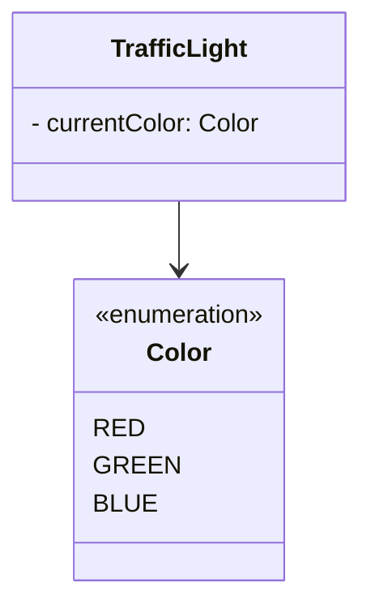

*A `TrafficLight` has exactly one `Color` at a time — multiplicity `1` is
the default assumption, so it's omitted.*

### 2. An attribute holding multiple enum values

If a class can hold **more than one** value of the same enum (e.g. a set
of allowed states, tags, or flags), show it with **attribute-level
multiplicity** — square brackets right after the type, inside the
attribute list itself (not on a connecting line):

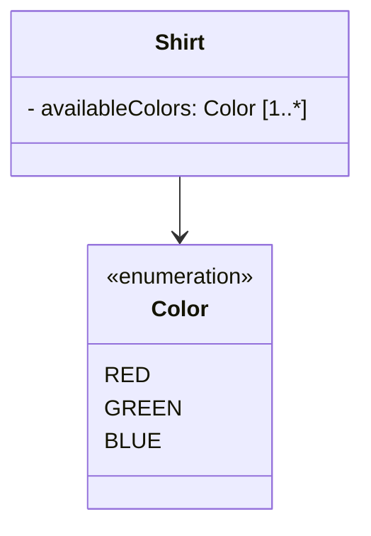

*A `Shirt` has 1 or more available `Color`s → maps to `std::vector<Color>`.*

```cpp
class Shirt {
private:
    std::vector<Color> availableColors; // [1..*]
};
```

### 3. Explicit multiplicity on the association line

You can also put it on the connecting arrow itself, same as any other
class relationship — more common when the enum is drawn as a separate box
rather than just listed as an attribute:

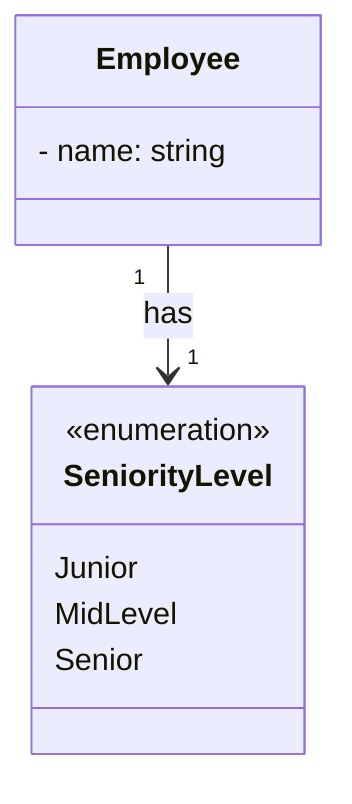

*One `Employee` has exactly one `SeniorityLevel` — shown explicitly here
for clarity, though in practice `1..1` is usually left off since it's the
default.*

### Summary

| Scenario | Multiplicity shown? | Notation | C++ mapping |
|---|---|---|---|
| Single enum value per object (typical) | No — implicit `1` | *(nothing)* | `Color currentColor;` |
| Multiple enum values allowed | Yes — attribute bracket | `[0..*]`, `[1..*]`, etc. | `std::vector<Color>` |
| Enum shown as separate class, being explicit | Yes — on the arrow | `"1" --> "1"` | same as single value |

The key question is the same one used for object relationships:
*"can this object have more than one of this enum value at once?"* If no
(a traffic light is only ever one color), write nothing. If yes (a shirt
comes in several colors), show it as `[1..*]` on the attribute.

---

## Why this matters for your C++ code

Multiplicity tells you which **container/storage type** to use:

| Multiplicity | C++ representation |
|---|---|
| `1` (mandatory, single) | value member, or reference |
| `0..1` (optional, single) | `std::optional<T>`, or nullable pointer |
| `0..*` / `1..*` (many, unbounded) | `std::vector<T>` |
| `n` (fixed exact count) | `std::array<T, n>` |
| `m..n` (bounded range) | `std::vector<T>` + validation logic (constructor/setter enforces the range) |

### Example: `Car "1" *-- "4" Wheel`

```cpp
class Car {
private:
    std::array<Wheel, 4> wheels; // exact count → std::array, not vector
};
```

### Example: `Team "1" o-- "5..30" Player`

```cpp
class Team {
private:
    std::vector<Player*> players; // unbounded + shared ownership → vector of pointers

public:
    void addPlayer(Player* p) {
        if (players.size() >= 30) {
            throw std::logic_error("Team is full");
        }
        players.push_back(p);
    }
};
```

### Example: `Manager "1" -- "0..1" Employee : reports to` (from Employee's side)

```cpp
class Employee {
private:
    Manager* manager = nullptr; // 0..1 → nullable pointer, or std::optional<Manager*>
};
```

---

## Common mistake to watch for

The number **always sits next to the class it counts**, not next to the
class doing the counting. It's easy to flip these by accident:


When updating a diagram, always re-ask the two questions from the
["How to determine it"](#how-to-determine-it--the-two-questions) section
above rather than guessing — it's the one part of UML relationship diagrams
that's genuinely easy to get backwards.

---

## Summary

- Multiplicity = **how many**, relationship type = **what kind**. They're independent.
- "Cardinality" is the older, database/ER-diagram term for the same idea; "multiplicity" is the official UML term. Used interchangeably in practice.
- Numbers go **next to the class being counted**, read from the *other* class's perspective.
- Matters most for **Association, Aggregation, Composition** — less relevant for Dependency, Realization, Inheritance.
- Directly informs your **C++ storage choice**: `T`, `T*`/`std::optional<T>`, `std::vector<T>`, or `std::array<T, n>`.
