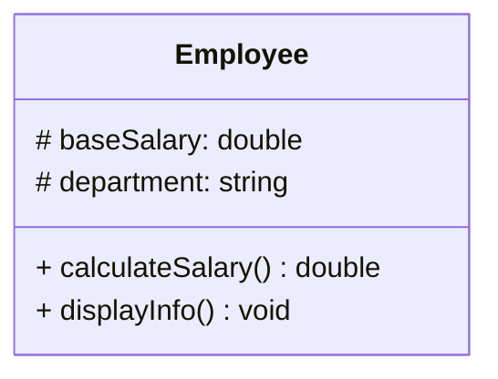
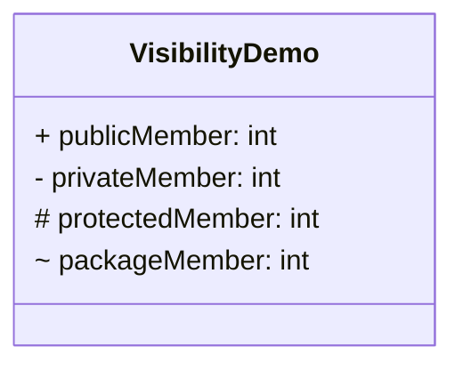
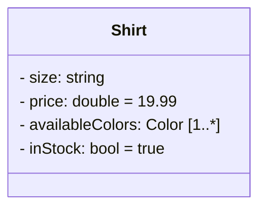
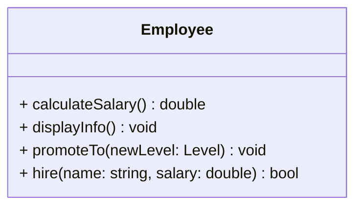
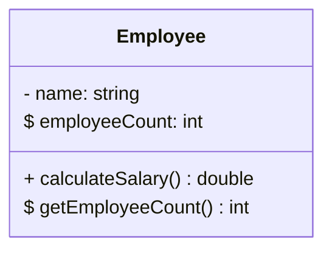
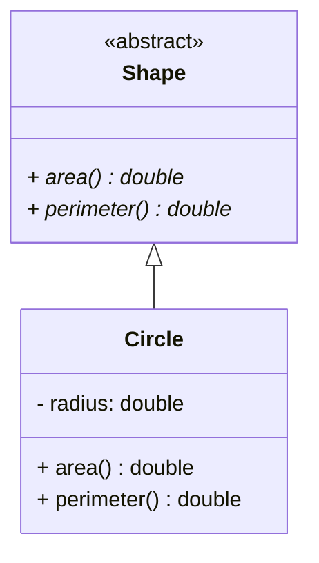
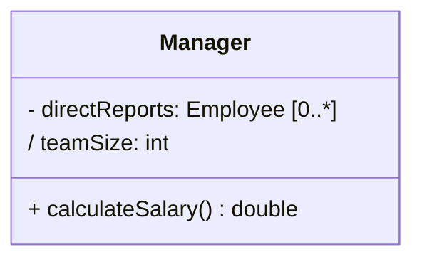
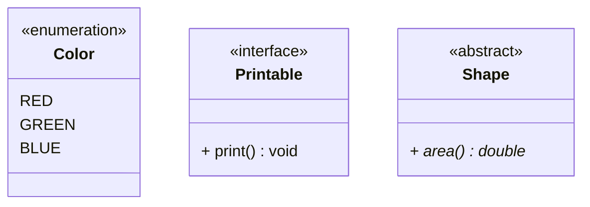
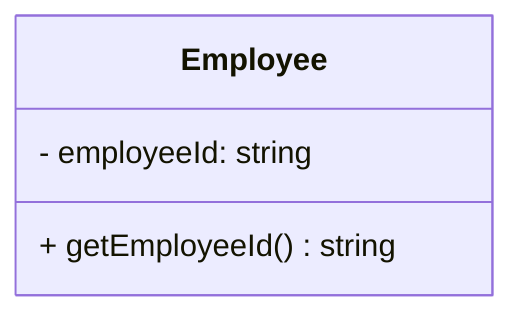
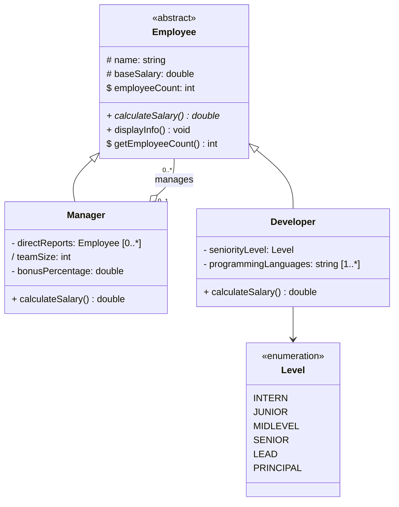

# 07_MemberNotation

Part of `09_ObjectRelationships/`.

How to correctly write **attributes** (data members) and **methods**
(member functions) inside a UML class box — visibility, types, parameters,
return types, and the special markers for static, abstract, and derived
members.

---

## The class box, three compartments



| Compartment | Contains |
|---|---|
| Top | Class name |
| Middle | Attributes (data members) |
| Bottom | Methods (member functions) |

---

## 1. Visibility markers

Every attribute and method starts with a visibility symbol:



| Symbol | Meaning | C++ equivalent |
|---|---|---|
| `+` | public | `public:` |
| `-` | private | `private:` |
| `#` | protected | `protected:` |
| `~` | package | no direct equivalent — closest is `friend` or namespace-level access |

---

## 2. Attribute notation

**Full syntax:**

```
visibility name : type [multiplicity] = defaultValue
```

Only `visibility` and `name` are mandatory — everything else is optional
and added only when it's useful information.



| Part | Example | When to include it |
|---|---|---|
| Type | `: string`, `: double` | Almost always — helps readers know what's stored |
| Multiplicity | `[1..*]` | Only when the attribute holds more than one value (see `06_Multiplicity`) |
| Default value | `= 19.99` | When a sensible default exists and is worth documenting |

### Attribute ↔ C++ mapping

```cpp
class Shirt {
private:
    std::string size;
    double price = 19.99;
    std::vector<Color> availableColors;
    bool inStock = true;
};
```

---

## 3. Method notation

**Full syntax:**

```
visibility name(paramName: paramType, ...) : returnType
```



| Part | Example | Notes |
|---|---|---|
| Parameters | `(newLevel: Level)` | `paramName: paramType`, comma-separated for multiple |
| Return type | `double`, `void` | Written **after** the parentheses, no colon in Mermaid's syntax (some UML tools use `: double` — Mermaid omits the colon here) |
| No parameters | `displayInfo() void` | Empty parentheses, same as C++ |

### Method ↔ C++ mapping

```cpp
class Employee {
public:
    double calculateSalary();
    void displayInfo();
    void promoteTo(Level newLevel);
    bool hire(std::string name, double salary);
};
```

---

## 4. Static members — underlined

A `static` attribute or method (belongs to the **class**, not to any one
instance) is shown **underlined**.



Mermaid's text syntax uses a `$` prefix (rendered as an underline) instead
of literal underline formatting, since underlining specific characters in
plain text isn't practical — the `$` is Mermaid's way of marking a member
`static`.

```cpp
class Employee {
private:
    std::string name;
    static inline int employeeCount = 0;   // shared across ALL Employee instances

public:
    static int getEmployeeCount() { return employeeCount; }
};
```

---

## 5. Abstract / virtual methods — italicized

A pure virtual (abstract) method is shown in *italics*. Since plain-text
italics are hard to render reliably, Mermaid commonly uses a `*` suffix
instead, and the class itself gets the `<<abstract>>` stereotype:



```cpp
class Shape {
public:
    virtual double area() const = 0;       // pure virtual → italicized in UML
    virtual double perimeter() const = 0;
    virtual ~Shape() = default;
};
```

This is the same convention used for a true `<<interface>>` — see the
Realization section (`05_Realization`) for the full interface example.

---

## 6. Derived attributes — preceded by `/`

A **derived attribute** is one that's *computed* from other attributes
rather than stored directly. It's marked with a leading `/`:



*`teamSize` isn't its own independent field — it's always
`directReports.size()`.* Marking it `/` documents that fact directly in
the diagram, so nobody wonders why there are seemingly two separate,
possibly-inconsistent sources of truth for team size.

```cpp
class Manager : public Employee {
private:
    std::vector<Employee*> directReports;

public:
    int teamSize() const {          // derived — computed, not stored
        return directReports.size();
    }
};
```

This connects directly back to the `Manager`/`Employee` example in the main
`09_ObjectRelationships/README.md` — the earlier version stored `teamSize`
as an independent `int`, which risked it silently drifting out of sync with
the actual `directReports` list. Marking it `/` (and computing it on demand
in code) removes that risk entirely.

---

## 7. Class-level stereotypes

Written above the class name, in `<<double angle brackets>>`:



| Stereotype | Meaning |
|---|---|
| `<<enumeration>>` | A fixed set of named values (see `06_Multiplicity` for enum-specific multiplicity rules) |
| `<<interface>>` | Pure abstract contract — no data, only method signatures |
| `<<abstract>>` | A class with at least one pure virtual method, mixed with possibly concrete methods too |

---

## 8. Read-only / const attributes

Not all UML tools agree on one symbol for this, but the common convention
Mermaid supports is appending `{readOnly}` as a property string after the
attribute:



In practice, most diagrams (including your own so far) just express
"read-only" implicitly — a `private` field with only a `getter` and no
`setter` — rather than annotating it explicitly. That's a perfectly valid
and common simplification; use the explicit `{readOnly}` tag only when it
adds real clarity.

```cpp
class Employee {
private:
    const std::string employeeId;   // set once, in the constructor, never changed

public:
    std::string getEmployeeId() const { return employeeId; }
    // no setEmployeeId() — read-only by omission
};
```

---

## Full worked example — tying it all together



This single diagram now demonstrates: visibility markers, an `<<abstract>>`
base class with an italicized pure-virtual method, a `static` counter
(`$`), a derived attribute (`/teamSize`), a multi-value attribute
(`[1..*]`), an enum association, inheritance, and the self-referencing
Aggregation pattern from the main README — every notation rule in this
file, in one place.

---

## Summary — quick reference

| Notation | Meaning |
|---|---|
| `+` / `-` / `#` / `~` | public / private / protected / package |
| `name: type` | attribute with its type |
| `name: type = value` | attribute with a default value |
| `name: type [m..n]` | attribute holding multiple values (multiplicity) |
| `name(param: type): returnType` | method signature |
| `$name` | static member (underlined) |
| `name()*` | abstract/pure virtual method (italicized) |
| `/name` | derived (computed) attribute |
| `<<stereotype>>` | class-level marker: `<<interface>>`, `<<enumeration>>`, `<<abstract>>` |
| `{readOnly}` | explicit read-only tag (optional — omission + getter-only is also common) |
