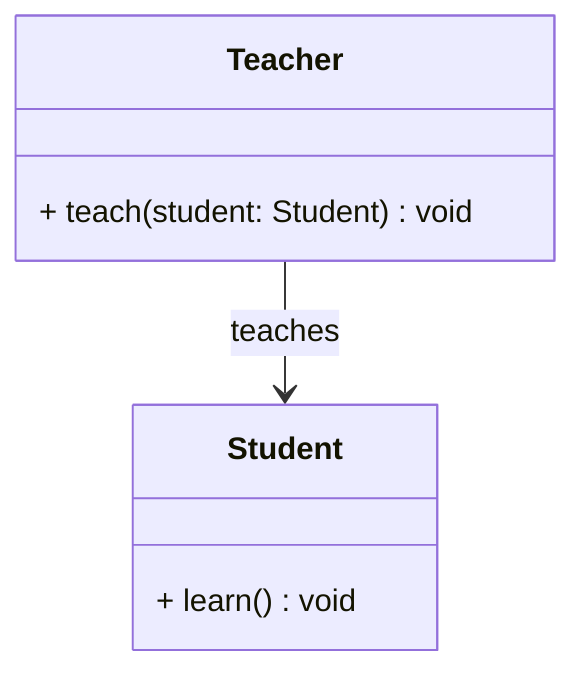
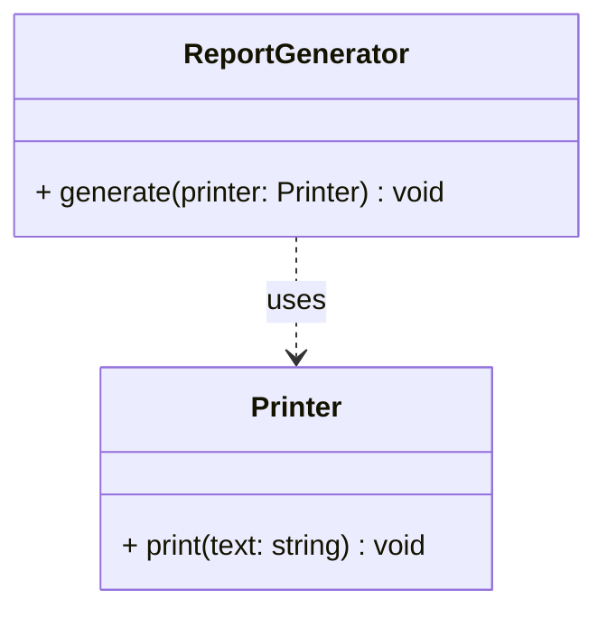
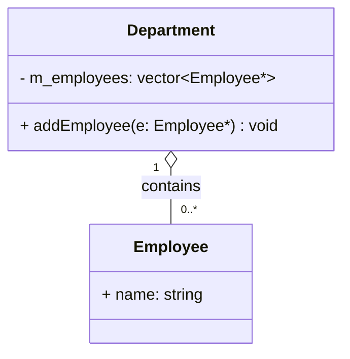
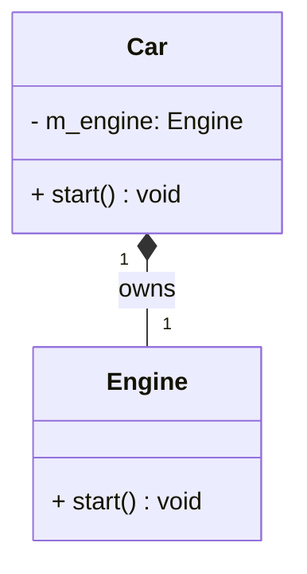
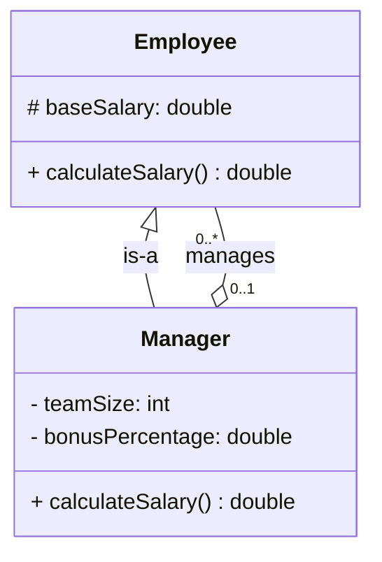
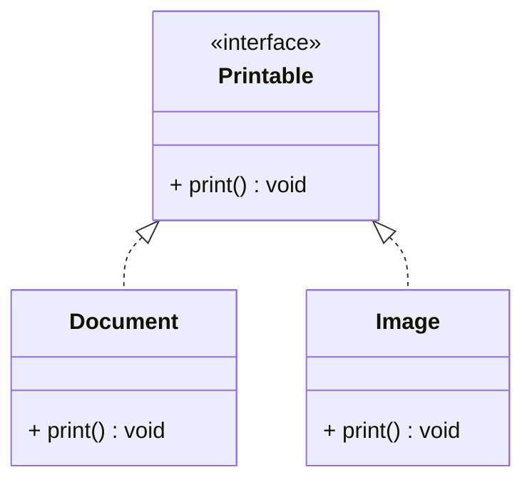
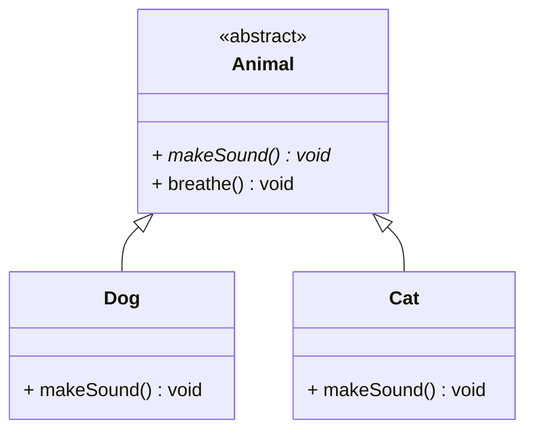
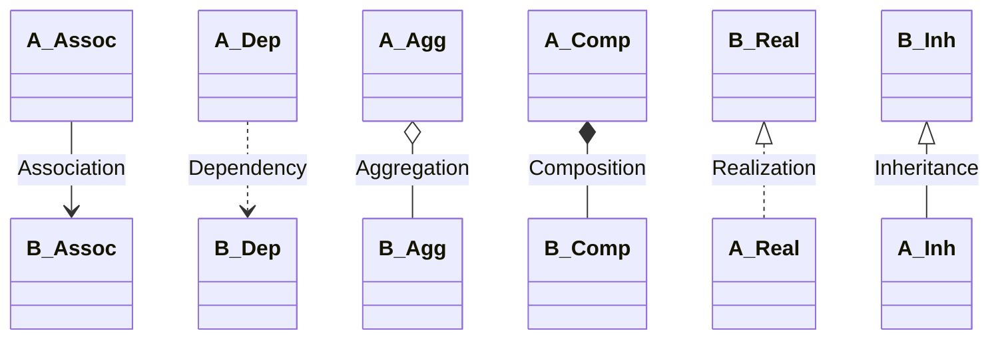
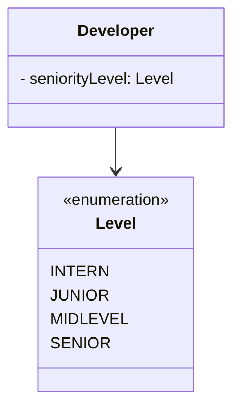
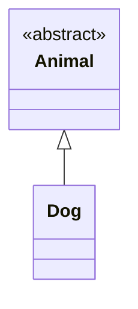

# Object Relationships — C++

In OOP, classes and objects don't exist in isolation — they relate to each
other in well-defined ways. Understanding these relationships is essential
for designing clean, maintainable architectures.

There are **6 object relationships** in OOP, split into two groups:

---

## Overview

| # | Relationship | Type | Keyword | Strength |
|---|-------------|------|---------|----------|
| 1 | Association | uses-a | none | weakest |
| 2 | Dependency | uses-a | none | weak |
| 3 | Aggregation | has-a | member pointer/ref | medium |
| 4 | Composition | has-a | member object | strong |
| 5 | Realization | is-a | virtual / interface | strong |
| 6 | Inheritance | is-a | `: public` | strongest |

---

## 1. Association — uses-a (loosest)

Two classes know about each other but neither owns the other.
Both can exist independently and have their own lifetimes.

```cpp
class Teacher {
public:
    void teach(Student& student) {   // knows about Student
        student.learn();
    }
};

class Student {
public:
    void learn() { }
};

// Neither owns the other — both exist independently
Teacher teacher;
Student student;
teacher.teach(student);
```



**Real world:** A teacher teaches students. When the teacher leaves, students
still exist. When a student graduates, the teacher still exists.

---

## 2. Dependency — uses-a (temporary)

One class uses another temporarily — typically as a function parameter,
local variable, or return type. The weakest form of relationship.

```cpp
class ReportGenerator {
public:
    // Depends on Printer temporarily — only during this call
    void generate(Printer& printer) {
        printer.print("Report content");
    }
};

class Printer {
public:
    void print(const std::string& text) { }
};
```



**Difference from Association:** Dependency is temporary (method parameter),
Association is more permanent (stored reference or pointer).

### Association vs. Dependency — a closer look

The line between these two is the one that's easiest to blur, so it's worth
a dedicated side-by-side.

**The one real test: is it stored, or does it just pass through?**

- **Association** — the other class is baked into your class's
  **structure**, as a **member variable**. You could look at the class
  definition alone (ignore every method body) and already know the
  relationship exists.
- **Dependency** — the other class only shows up **inside a method's
  body/signature** — a parameter, local variable, or return type. Delete
  that one method, and the relationship vanishes entirely. Nothing about
  it is stored anywhere.

```cpp
// ASSOCIATION — Teacher holds a reference, permanently
class Teacher {
private:
    Student& favoriteStudent;   // member variable — exists for Teacher's whole lifetime

public:
    Teacher(Student& s) : favoriteStudent(s) {}

    void praise() {
        favoriteStudent.learn();   // uses the SAME student every time
    }
};
```

```cpp
// DEPENDENCY — ReportGenerator doesn't hold anything
class ReportGenerator {
public:
    // No Printer member variable anywhere in this class!
    void generate(Printer& printer) {   // only exists as a parameter
        printer.print("Report content");
    }
    // Once generate() returns, this ReportGenerator has
    // zero memory of Printer ever existing.
};

// Proof: you could call generate() with a DIFFERENT printer every single time
ReportGenerator rg;
Printer officePrinter;
Printer homePrinter;
rg.generate(officePrinter);   // uses one
rg.generate(homePrinter);     // uses a totally different one — rg doesn't care
```

| | Association | Dependency |
|---|---|---|
| Lifetime of the relationship | As long as the object exists | Just one function call |
| Where you'd find it in code | Class header / member list | Buried inside a method's `.cpp` |
| Can it change between calls? | No — fixed at construction | Yes — a different object every call |
| Coupling | Stronger — the class *always* needs that type | Weaker — only *this one method* needs it |
| Refactoring impact | Changing/removing the related class breaks the whole class | Changing it only affects that one method |

**Quick gut-check for your own diagrams:** *"If I comment out every method
body and just look at the member variable list, is this relationship still
visible?"*
- **Yes** → Association (or Aggregation/Composition, depending on ownership)
- **No, it only appeared inside a method** → Dependency

---

## 3. Aggregation — has-a (part exists independently)

A "whole" contains "parts", but the parts can exist without the whole.
The whole does **not** own the lifetime of the parts.

```cpp
class Department {
private:
    std::vector<Employee*> m_employees;   // pointer — does not own

public:
    void addEmployee(Employee* e) {
        m_employees.push_back(e);
    }
};

// Employee exists independently of Department
Employee* emp = new Employee("Kostas");
Department dept;
dept.addEmployee(emp);

// Department destroyed — Employee still exists
// Employee can belong to multiple departments
```



**Real world:** A department has employees. If the department is dissolved,
the employees still exist and can join other departments.

**Key signal:** The "part" is stored as a **pointer or reference** — it was
created outside and passed in.

---

## 4. Composition — has-a (part cannot exist without whole)

The strongest form of has-a. The whole **owns** the parts — it creates them
and destroys them. The part's lifetime is tied to the whole.

```cpp
class Engine {
public:
    void start() { std::cout << "Engine started\n"; }
};

class Car {
private:
    Engine m_engine;   // member object — owned, created with Car

public:
    Car() { }          // Engine created automatically
    ~Car() { }         // Engine destroyed automatically with Car

    void start() { m_engine.start(); }
};

// Engine cannot exist outside a Car in this design
Car car;
car.start();
// When car is destroyed, engine is destroyed too
```



**Real world:** A car has an engine. If the car is destroyed (scrapped),
the engine is destroyed with it. The engine has no meaning without the car.

**Key signal:** The "part" is stored as a **member object** (not pointer) —
created in the constructor, destroyed in the destructor.

### Aggregation vs. Composition — a closer look

The one question that decides which one you're looking at:

> **When the "whole" object is destroyed, does the "part" get destroyed too?**

- **Yes** → **Composition** — the whole *owns* the part; they live and die together.
- **No** → **Aggregation** — the whole just *references* the part; the part has its own independent lifetime.

Everything else (pointer vs. value, single object vs. `vector`) is a
side-effect of that one fact, not a separate rule to remember.

| | Composition | Aggregation |
|---|---|---|
| Owns the part's lifetime? | **Yes** | **No** |
| How it's stored | member **object** (by value) | member **pointer/reference** |
| Who creates it | the owning class itself, usually in its constructor | someone else, outside the class, then handed in |
| Who destroys it | automatically, when the owner is destroyed | not the owner — it survives |
| Can the part be shared with other owners? | No — one part, one owner | Yes — the same object could be referenced by more than one owner |
| UML symbol | filled diamond ◆ | hollow diamond ◇ |
| Real-world example | Car → Engine (scrap the car, the engine's gone with it) | Department → Employee (dissolve the department, employees still exist and can join another) |

#### Composition — code

```cpp
class Engine {
public:
    Engine() { std::cout << "Engine created\n"; }
    ~Engine() { std::cout << "Engine destroyed\n"; }
    void start() { std::cout << "Engine started\n"; }
};

class Car {
private:
    Engine m_engine;   // member OBJECT, by value — no pointer, no `new`

public:
    Car() {
        // Nothing to do — m_engine is ALREADY created automatically,
        // before Car's constructor body even runs
    }
    // No custom destructor needed either — m_engine is destroyed
    // automatically when Car is destroyed

    void start() { m_engine.start(); }
};

int main() {
    Car car;              // prints "Engine created" — Car built its own Engine
    car.start();
} // car goes out of scope here
  // prints "Engine destroyed" — automatic, no code needed
```

**Key code signals:** no `new`, no pointer, no manual `delete`. The
compiler handles construction/destruction ordering for you.

#### Aggregation — code

```cpp
class Employee {
public:
    Employee(std::string n) : name(n) {}
    std::string name;
};

class Department {
private:
    std::vector<Employee*> m_employees;   // pointers, NOT owned objects

public:
    void addEmployee(Employee* e) {
        m_employees.push_back(e);   // just storing an address, not creating anything
    }
    // No destructor needed to clean up employees — Department
    // never created them, so it's not Department's job to delete them
};

int main() {
    Employee* emp = new Employee("Kostas");   // created OUTSIDE Department, by someone else

    Department dept;
    dept.addEmployee(emp);   // Department just borrows a reference to it

}   // dept goes out of scope here
    // emp is NOT destroyed — it's still alive, still valid, still usable

// emp must be cleaned up separately, by whoever owns it — e.g.:
delete emp;
```

**Key code signals:** the object is created with `new` **outside** the
owning class, then handed in via a setter/`add...()` method/constructor
parameter. The owning class never calls `delete` on it.

#### Direct diff, same shape of class

| | Composition (`Car`) | Aggregation (`Department`) |
|---|---|---|
| Member declaration | `Engine m_engine;` | `Employee* m_employee;` (or `vector<Employee*>`) |
| Where it's created | Inside `Car`'s constructor (implicitly) | Outside, by someone else (`new Employee(...)`) |
| How it gets into the class | Built automatically as part of the object | Passed in via constructor param / setter |
| Destructor code | None needed — automatic | None needed — because you must **not** delete it |
| What happens if the owner is destroyed | Part is destroyed too (automatic) | Part survives, completely untouched |

The single line that flips everything is `Engine m_engine;` vs
`Employee* m_employee;` — value member vs. pointer member is the concrete
code expression of "do I own this or not."

**Modern C++ note:** raw pointers work for teaching, but idiomatically:
- **Composition** → `std::unique_ptr<T>` (or plain member-by-value, as above) enforces exclusive ownership at compile time
- **Aggregation** → a raw non-owning pointer (as above), a reference `T&` if it can never be null, or `std::weak_ptr<T>` if ownership is shared elsewhere via `shared_ptr` and you want to explicitly signal "I don't own this, and I acknowledge it might be destroyed"

### Self-referencing relationships — Inheritance + Aggregation on the same type

A class can be related to **another class of the same type** through two
completely different relationships at once — this isn't a contradiction,
it's two separate true facts that happen to point at the same class name.

**Example: `Manager` and `Employee`**

1. `Manager` **is an** `Employee` → Inheritance
2. `Manager` **has** `Employee`s (their direct reports) → Aggregation



Applying the ownership question from Aggregation vs. Composition: if a
`Manager` is removed, do their direct reports get destroyed too? No — they
keep working, just report to someone else. So it's Aggregation, not
Composition, for the "manages" relationship.

Applying the two multiplicity questions:
- *How many `Employee`s does one `Manager` manage?* → could be **zero**
  (a newly promoted manager with no team yet) up to **many** → `0..*`,
  written next to `Employee`.
- *How many `Manager`s does one `Employee` have?* → could be **zero**
  (top of the org chart — a CEO/owner has no manager) or **exactly one**
  → `0..1`, written next to `Manager`.

```cpp
class Employee {
protected:
    Manager* manager = nullptr;   // 0..1 — nullable, top-level roles have none
};

class Manager : public Employee {
private:
    std::vector<Employee*> directReports;   // 0..* — could be empty right after promotion
};
```

**How to tell a valid double relationship from a contradiction** (this is
the exact mistake from the earlier `Cashier`/`Employee` "belongs to" case —
see the case study README): ask whether the has-a relationship points at
the **same instance** the is-a relationship already describes, or at
**different instances** of that type.

| | Invalid (earlier mistake) | Valid (this case) |
|---|---|---|
| What inheritance says | Cashier is-a Employee | Manager is-a Employee |
| What the second line says | Cashier has-a reference to *the same* Employee it inherits from | Manager has-a reference to *other, different* Employee instances |
| Same object? | Yes — contradiction (an object can't "belong to" itself) | No — different objects |
| Valid? | ❌ | ✅ |

This pattern has a name — a **self-referencing / recursive association** —
and shows up constantly: org charts, tree structures (`TreeNode` aggregating
child `TreeNode`s), an `Employee.mentor` field pointing at another
`Employee`, or the Composite design pattern (`CompositeShape : public Shape`
that also holds a `vector<Shape*>` of child shapes).

---

## 5. Realization — is-a (implements interface)

A class implements an abstract interface or pure virtual class.
The class "realizes" the contract defined by the interface.

```cpp
class Printable {                        // interface (abstract class)
public:
    virtual void print() const = 0;     // pure virtual — must implement
    virtual ~Printable() = default;
};

class Document : public Printable {     // realizes Printable
public:
    void print() const override {
        std::cout << "Printing document\n";
    }
};

class Image : public Printable {        // also realizes Printable
public:
    void print() const override {
        std::cout << "Printing image\n";
    }
};

// Use through the interface
Printable* p = new Document();
p->print();
```



**Real world:** A Document and an Image both implement the Printable
interface — they "realize" the printing contract in their own way.

**Difference from Inheritance:** Realization implements a pure interface
(no data, no implementation). Inheritance extends a concrete class.

> **Arrow direction:** the hollow triangle always sits at the **interface**
> (the general contract), and the dashed line runs from the **implementing
> class** toward it — `Printable <|.. Document` reads as "Document realizes
> Printable," same direction logic as Inheritance below.

---

## 6. Inheritance — is-a (extends base class)

A class inherits the properties and behaviour of another class,
extending or overriding them. The strongest and most well-known relationship.

```cpp
class Animal {
public:
    virtual void makeSound() const = 0;
    void breathe() { std::cout << "Breathing\n"; }
};

class Dog : public Animal {        // Dog IS-A Animal
public:
    void makeSound() const override {
        std::cout << "Woof!\n";
    }
};

class Cat : public Animal {        // Cat IS-A Animal
public:
    void makeSound() const override {
        std::cout << "Meow!\n";
    }
};

Animal* a = new Dog();
a->makeSound();   // Woof! — runtime polymorphism
```



> **Arrow direction:** the hollow triangle sits at the **base class**
> (`Animal`), and the solid line runs from the **derived class** toward it —
> `Animal <|-- Dog` reads as "Dog inherits from Animal." The triangle always
> points toward the more general class, no matter which side of the line you
> write it on. **No multiplicity** is written on inheritance/realization
> arrows — "how many" doesn't apply to an is-a relationship.

> **Full coverage in `../04_Inheritance/`** which includes:
> - `01_Inheritance` — single inheritance, access specifiers, overriding
> - `02_MultiInheritance` — multiple base classes, diamond problem
> - `03_VirtualInheritance` — solving the diamond problem

---

## Comparison — when to use which

```
Does B use A temporarily (parameter/local)?
  YES → Dependency

Does B know about A but neither owns the other?
  YES → Association

Does B contain A, but A can exist without B?
  YES → Aggregation    (store as pointer/reference)

Does B contain A, and A cannot exist without B?
  YES → Composition    (store as member object)

Does B implement A's pure interface?
  YES → Realization    (abstract class / interface)

Does B extend A's behaviour and data?
  YES → Inheritance    (: public A)
```

---

## Relationship strength — memory ownership

```
Dependency   →  no ownership, temporary use
Association  →  no ownership, longer-term knowledge
Aggregation  →  no ownership, stores pointer/reference
Composition  →  full ownership, stores by value
Realization  →  no ownership, contract fulfillment
Inheritance  →  full ownership of base sub-object
```

---

## UML notation (for reference)

All six relationships, side by side, using consistent placeholder classes
`A` and `B`. Pay attention to **which end the arrowhead/diamond sits on** —
that's the part that's easiest to get backwards.



| Relationship | Line style | Arrowhead / symbol | Which end it's on |
|---|---|---|---|
| **Association** | solid | open arrow → | points at the class being used/known |
| **Dependency** | dashed | open arrow → | points at the class being temporarily used |
| **Aggregation** | solid | hollow diamond ◇ | sits at the **whole** (owner side), not the part |
| **Composition** | solid | filled diamond ◆ | sits at the **whole** (owner side), not the part |
| **Realization** | dashed | hollow triangle ▷ | sits at the **interface**, line runs from implementer |
| **Inheritance** | solid | hollow triangle ▷ | sits at the **base class**, line runs from derived class |
| **Enum** *(not one of the 6)* | solid | open arrow → | same as Association — points from the class holding it, to the enum |

### Enum notation

An enum isn't one of the 6 object relationships (it's a type, not an
object), but it comes up constantly in practice, so it's worth pinning down
here too: **it uses Association notation** — solid line, open arrow, no
diamond, no triangle.



The deciding factor is the same **stored vs. temporary** question used to
tell Association apart from Dependency:

| Case | Notation | Why |
|---|---|---|
| Enum stored as an attribute (`- seniorityLevel: Level`) | solid, **Association** | Part of the object's persistent state |
| Enum only used as a method parameter (`promoteTo(newLevel: Level)`) | dashed, **Dependency** | Used briefly, not stored |

Other enum-specific rules (covered in full in `06_Multiplicity/README.md`):
- `<<enumeration>>` stereotype above the enum's name, values listed with no visibility marker
- **No multiplicity** if the attribute holds a single value (the typical case — implicit `1`)
- `[1..*]` inside the attribute bracket if a class can hold multiple values of that enum at once

### Why Realization and Inheritance are the easy ones to get wrong

For Association, Dependency, Aggregation, and Composition, the arrow/diamond
points **from the user toward the used, or from the whole toward the part**
— i.e., roughly "in the direction you'd read the sentence" (`Car *-- Engine`
— *Car* has an *Engine*).

Realization and Inheritance flip that intuition: the triangle points
**backwards**, from the specific class toward the general one — child to
parent, implementer to interface — **regardless of which class you consider
the "main" one** in the relationship:



*Read as: "Dog inherits from Animal" — but the triangle sits at `Animal`
(the parent), not at `Dog` (the one actually "doing" the inheriting).* This
is the opposite of Composition, where the diamond sits at the class doing
the "owning" (`Car`), not the thing being owned (`Engine`).

---

## This folder

```
09_ObjectRelationships/
├── 01_Association
├── 02_Aggregation
├── 03_Composition
├── 04_Dependency
├── 05_Realization
├── 06_Multiplicity        ← degree/cardinality of each relationship
├── 07_MemberNotation      ← visibility, attribute/method syntax, static/abstract/derived markers
└── README.md               ← this file

Note: Inheritance examples → ../04_Inheritance/
```
