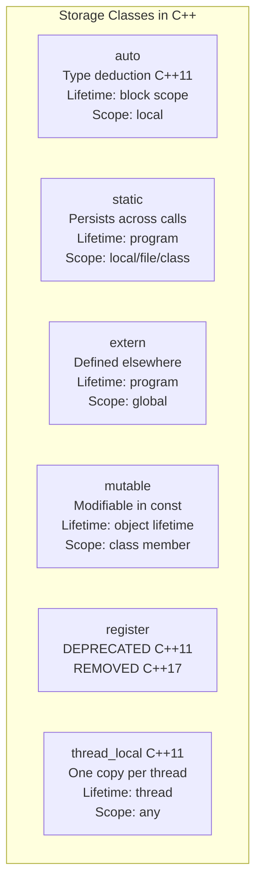
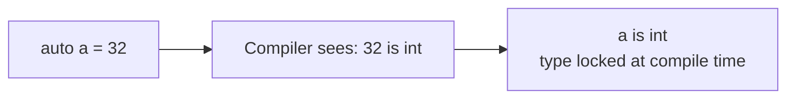
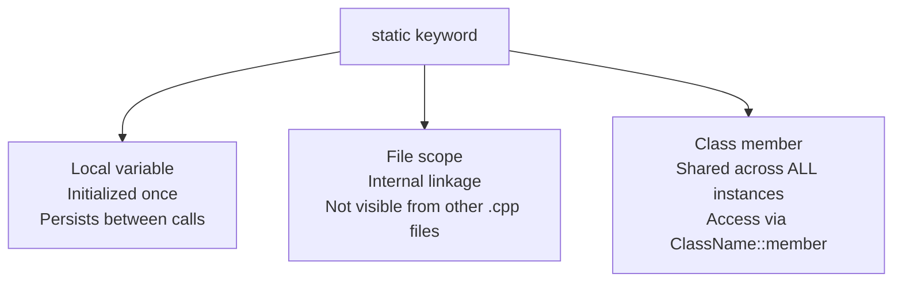
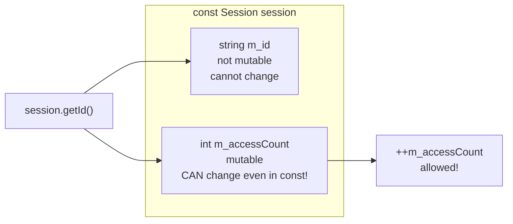
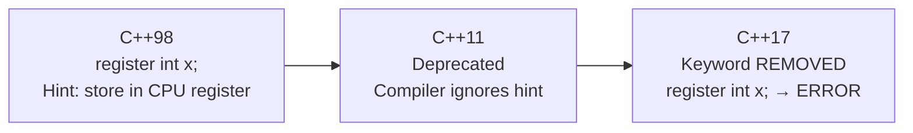
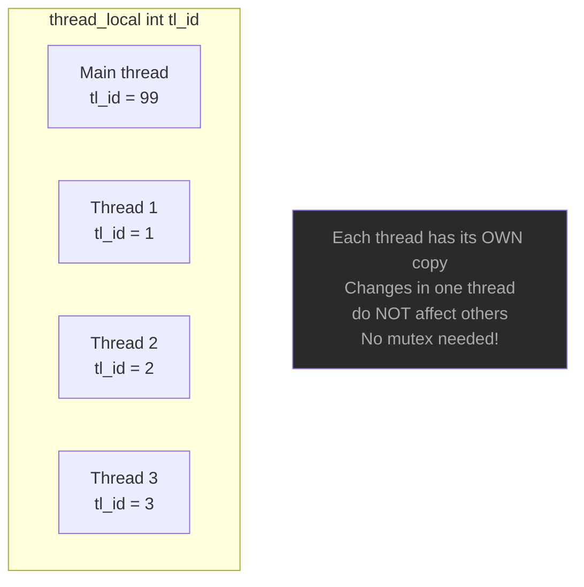
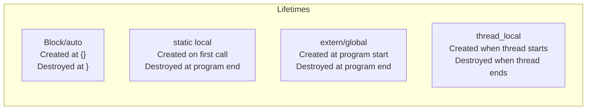

# Storage Classes — C++

## What is a Storage Class?

A storage class defines three things for a variable or function:
- **Lifetime** — how long it exists in memory
- **Scope** — where it is visible/accessible
- **Linkage** — whether it is accessible from other translation units

---

## Overview



---

## 1. auto — type deduction (C++11)

```cpp
auto a = 32;             // int
auto b = 3.2;            // double
auto c = "Konstantinos"; // const char*
auto d = 'I';            // char
auto e = true;           // bool
```

The compiler deduces the type from the initializer — you never write the type.



> **Historical note:** In C++98 `auto` meant "automatic storage duration"
> (the default for local variables). This was removed in C++11 when the
> keyword was repurposed for type deduction.

**Common uses:**
```cpp
auto it = myMap.begin();          // iterator — long type
for (const auto& item : vec) { } // range-based for
auto result = computeHeavy();     // return type may change
```

---

## 2. static — persists across calls

Three different contexts — same keyword, different meanings:



### static local variable

```cpp
int generateId() {
    static int s_nextId = 1000;  // initialized ONCE on first call
    return s_nextId++;
}

generateId();  // 1000
generateId();  // 1001
generateId();  // 1002  — value persists!
```

### static class member

```cpp
class Counter {
public:
    static int s_count;  // ONE copy shared by ALL instances
};
Counter::s_count = 0;   // must define outside class

Counter a, b, c;
// Counter::s_count == 3 — all three instances share it
```

### static at file scope (internal linkage)

```cpp
static int fileOnlyVar = 42;  // only visible in this .cpp file
// Other .cpp files cannot access this — no name collision risk
```

---

## 3. extern — defined in another translation unit

```mermaid
sequenceDiagram
    participant header as config.h
    participant cpp1 as config.cpp
    participant cpp2 as main.cpp

    header->>cpp2: extern int g_port;\nextern string g_host;
    cpp1->>cpp1: int g_port = 5060;\nstring g_host = "localhost";
    cpp2->>cpp2: uses g_port, g_host
    Note over cpp1,cpp2: Linker connects declaration → definition
```

```cpp
// config.h — declaration (tell compiler it exists)
extern int         g_port;
extern std::string g_host;

// config.cpp — definition (actual memory allocated here)
int         g_port = 5060;
std::string g_host = "localhost";

// main.cpp — just include config.h and use
#include "config.h"
std::cout << g_port;   // works — linker resolves it
```

**Rule:** `extern` → declare in `.h`, define in exactly ONE `.cpp`.

---

## 4. mutable — modify in const context



```cpp
class Session {
    std::string m_id;
    mutable int m_accessCount = 0;  // mutable!

public:
    std::string getId() const {
        ++m_accessCount;   // OK — mutable bypasses const
        return m_id;
    }
};

const Session s("SES-001");
s.getId();  // allowed — const method
s.getId();  // allowed
// s.m_id = "X"  // ERROR — not mutable
```

**When to use mutable:**
- Lazy-evaluated caches inside const getters
- Access counters / audit logging in const methods
- `std::mutex` inside a const thread-safe class

---

## 5. register — removed in C++17



```cpp
// C++98 — valid but useless hint
register int x = 5;

// C++17+ — compile error!
// register int x = 5;  ← ERROR: 'register' storage class removed

// Modern: trust the compiler optimizer
// It does register allocation better than manual hints
int x = 5;   // compiler decides where to store it
```

---

## 6. thread_local — one copy per thread (C++11)



```cpp
thread_local int tl_sessionId = 0;  // separate per thread

void worker(int id) {
    tl_sessionId = id;   // only affects THIS thread's copy
    std::cout << tl_sessionId;
}

std::thread t1(worker, 1);
std::thread t2(worker, 2);
// t1 and t2 each have their own tl_sessionId — no race condition
```

**Common uses:**
- Per-thread random number generators (`std::mt19937`)
- `errno` — is thread_local in POSIX
- Per-thread logging context or session ID
- Avoid mutex overhead for thread-specific data

---

## Lifetime comparison



---

## Summary table

| Keyword | Lifetime | Scope | Linkage | C++ status |
|---------|---------|-------|---------|------------|
| `auto` | Block | Local | None | ✅ Type deduction C++11 |
| `static` (local) | Program | Local | None | ✅ Persists between calls |
| `static` (file) | Program | File | Internal | ✅ Not visible outside `.cpp` |
| `static` (class) | Program | Class | External | ✅ Shared across instances |
| `extern` | Program | Global | External | ✅ Defined elsewhere |
| `mutable` | Object | Class member | N/A | ✅ Bypass const |
| `register` | Block | Local | None | ❌ Removed C++17 |
| `thread_local` | Thread | Any | Any | ✅ C++11 |
