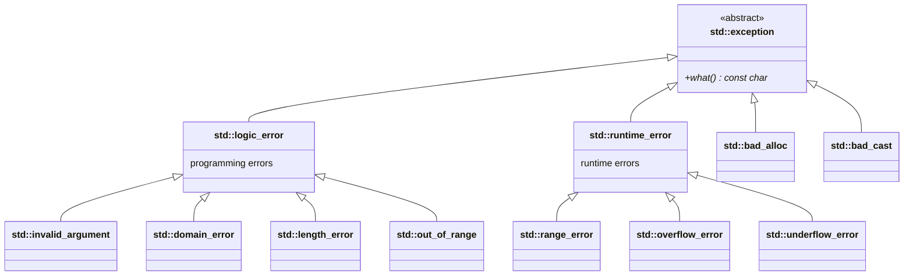
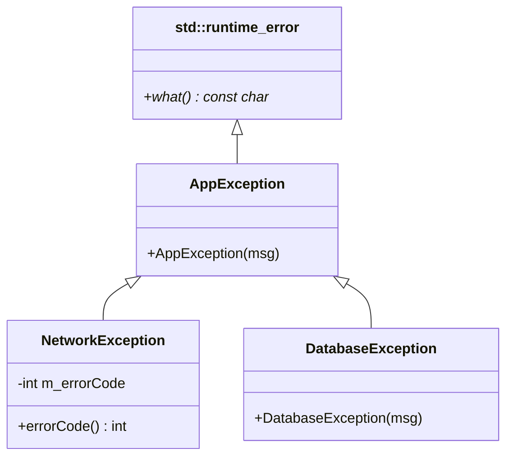
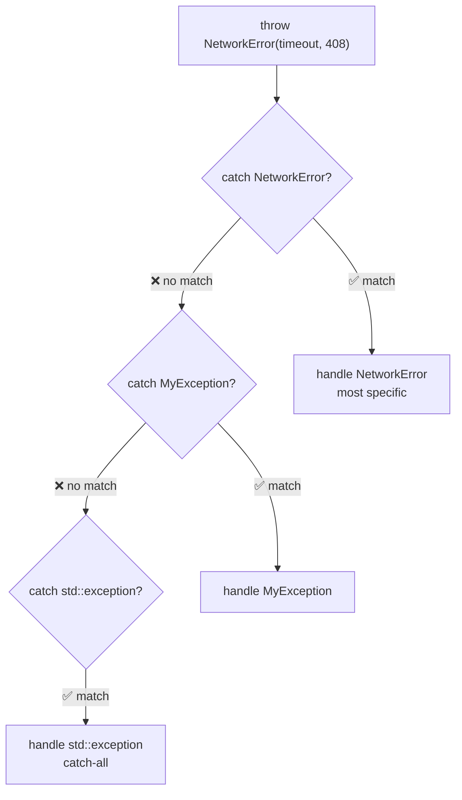
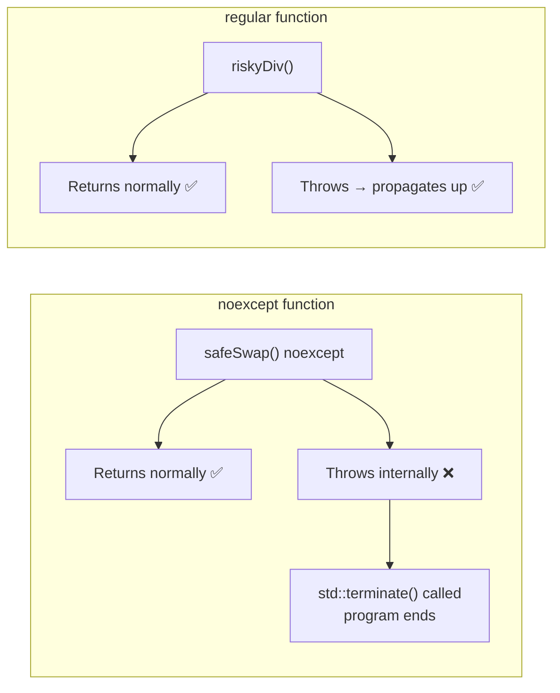
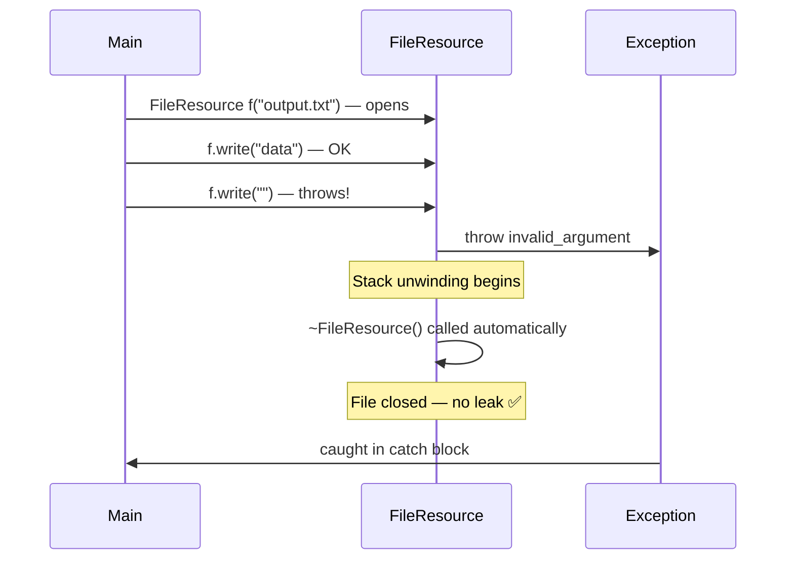
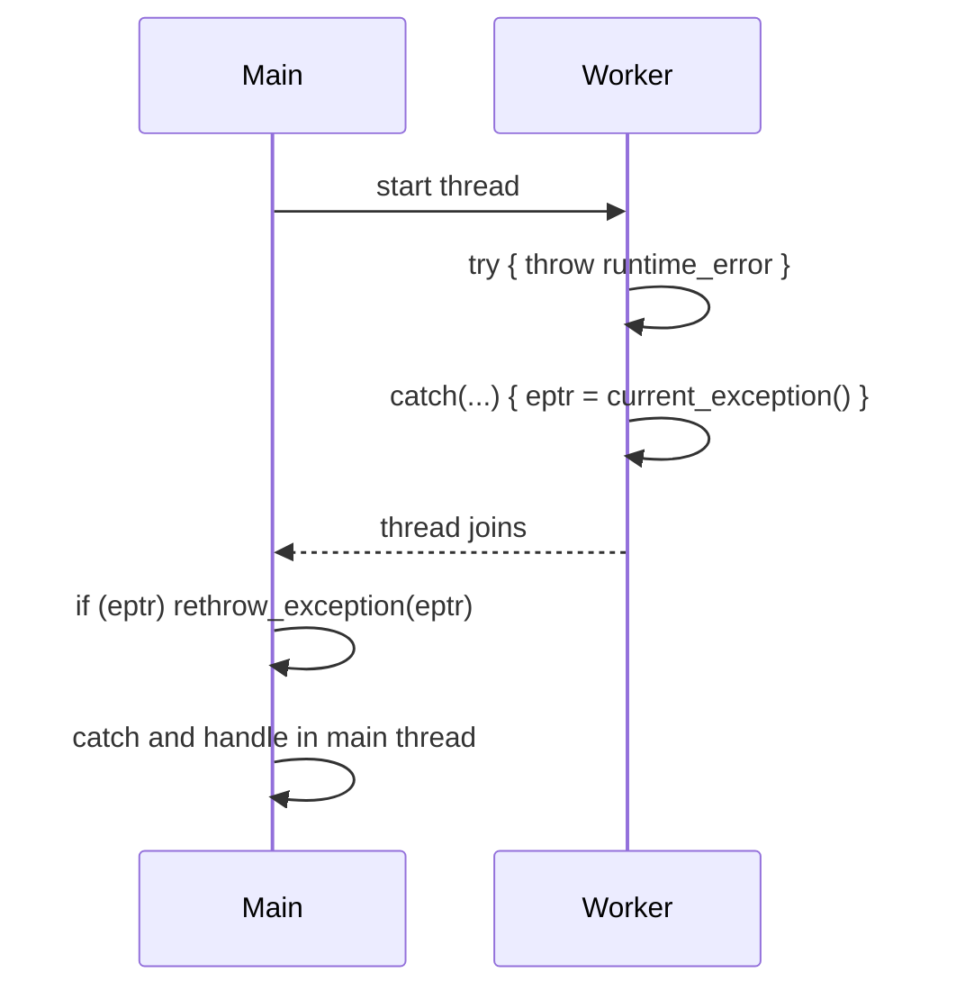
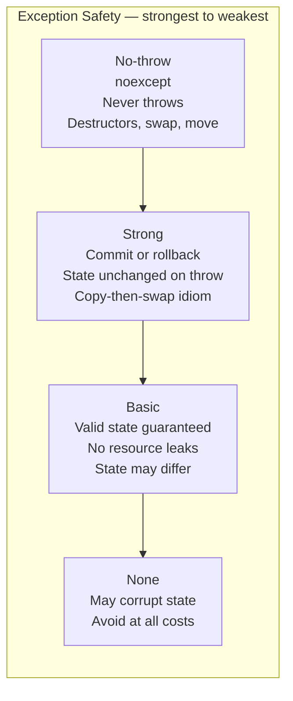

# StdexceptSTL — Exception Handling in C++23

C++ exceptions provide a structured way to handle errors without littering code
with error-code checks. RAII ensures resources are always cleaned up.

---

## Header

```cpp
#include <stdexcept>   // standard exception classes
#include <exception>   // std::exception base, exception_ptr
```

---

## Exception hierarchy



---

## Custom exception hierarchy (from this file)



---

## try / catch flow

```mermaid
flowchart TD
    A["Code in try block runs"]
    B{Exception thrown?}
    C["Match catch blocks\nin order (most derived first)"]
    D["Matching catch found?"]
    E["Execute catch block\nstack unwinding begins\ndestructors called"]
    F["catch(...)\ncatch everything"]
    G["Exception propagates\nup call stack"]
    H["Normal execution continues\nafter try-catch block"]

    A --> B
    B -->|No| H
    B -->|Yes| C
    C --> D
    D -->|Yes| E
    E --> H
    D -->|No catch matches| F
    F -->|No catch(...)| G
```

---

## Basic try/catch/throw

```cpp
try {
    throw std::runtime_error("something failed");
}
catch (const std::runtime_error& e) {
    std::cout << e.what();   // "something failed"
}
catch (const std::exception& e) {
    // catches anything derived from std::exception
}
catch (...) {
    // catches absolutely everything
}
```

**Always catch by `const` reference** — avoids slicing and copies.

---

## Standard exception types

```cpp
throw std::invalid_argument("negative size");       // logic error
throw std::out_of_range("index 100 out of [0,10)"); // logic error
throw std::runtime_error("disk full");              // runtime error
throw std::overflow_error("integer overflow");      // runtime error
throw std::bad_alloc();                             // heap allocation failed
```

---

## Custom exceptions

```cpp
class MyException : public std::runtime_error {
public:
    explicit MyException(const std::string& msg)
        : std::runtime_error("MyException: " + msg) {}
};

class NetworkError : public MyException {
    int m_code;
public:
    NetworkError(const std::string& msg, int code)
        : MyException(msg), m_code(code) {}
    int code() const { return m_code; }
};
```

Always derive from `std::exception` or its children so callers can use
`catch (const std::exception& e)` as a catch-all.

---

## Catch order — most derived first



```cpp
try { throw NetworkError("timeout", 408); }
catch (const NetworkError& e)   { /* most specific */ }
catch (const MyException& e)    { /* less specific */ }
catch (const std::exception& e) { /* catch-all     */ }
```

---

## Rethrowing

```cpp
try {
    riskyOperation();
} catch (const std::exception& e) {
    log(e.what());
    throw;    // rethrow same exception — preserves type!
    // NOT: throw e;  — this re-throws as std::exception (slicing)
}
```

---

## noexcept



```cpp
int safeSwap(int& a, int& b) noexcept { std::swap(a, b); }
```

- Tells compiler and callers the function never throws
- Enables move optimization (move constructors should be `noexcept`)
- If a `noexcept` function throws → `std::terminate()` is called
- Check: `noexcept(expr)` returns `true`/`false`

---

## RAII — exception-safe resources



```cpp
class FileHandle {
public:
    FileHandle(const std::string& path) { open(path); }
    ~FileHandle() { close(); }  // always runs — even on exception
};
```

---

## std::exception_ptr — transfer across threads



```cpp
std::exception_ptr eptr;

std::thread t([&eptr]() {
    try { throw std::runtime_error("worker error"); }
    catch (...) { eptr = std::current_exception(); }
});
t.join();

if (eptr) {
    try { std::rethrow_exception(eptr); }
    catch (const std::exception& e) { std::cout << e.what(); }
}
```

---

## Exception safety levels



| Level | Guarantee |
|-------|-----------|
| **No-throw** | Never throws — `noexcept` |
| **Strong** | If throws, state unchanged (commit-or-rollback) |
| **Basic** | If throws, object in valid state, no leaks |
| **None** | May corrupt state (avoid!) |

---

## Best practices

```cpp
// DO
throw MyException("message");             // throw by value
catch (const std::exception& e) { }       // catch by const ref
throw;                                    // rethrow without argument
noexcept                                  // on destructors, swap, move

// DON'T
catch (std::exception e) { }             // by value — slices derived type
throw e;                                  // in catch — loses derived type
throw new MyException();                  // raw pointer — memory leak risk
```

---

## When to use exceptions

✅ Constructor failures (no return value to signal error)
✅ Propagating errors up multiple call levels
✅ Errors that are truly exceptional (not expected in normal flow)

❌ Normal control flow — use `if`/`else` or `std::optional`
❌ Performance-critical tight loops
❌ Cross-language boundaries (C APIs)
❌ Embedded systems with exceptions disabled
