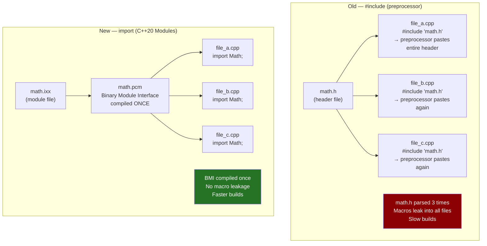
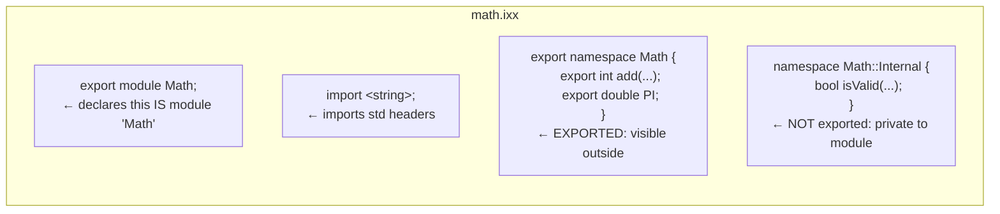
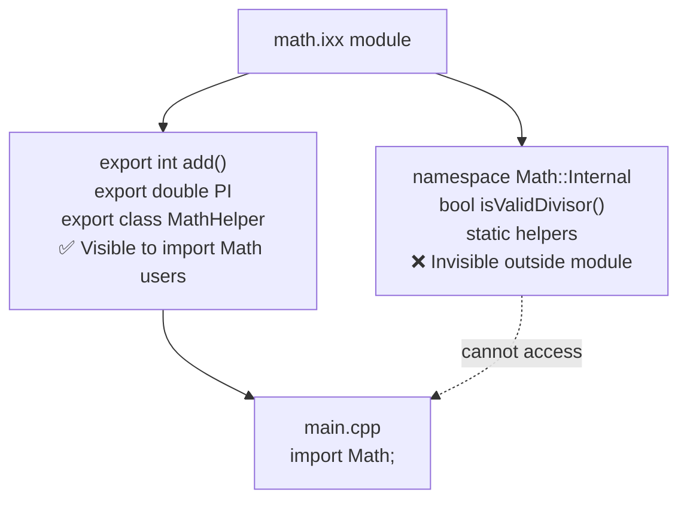
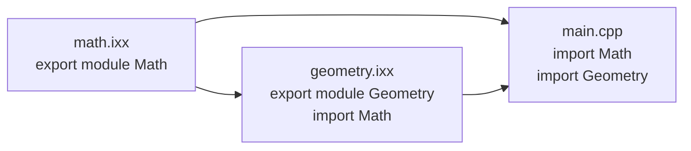
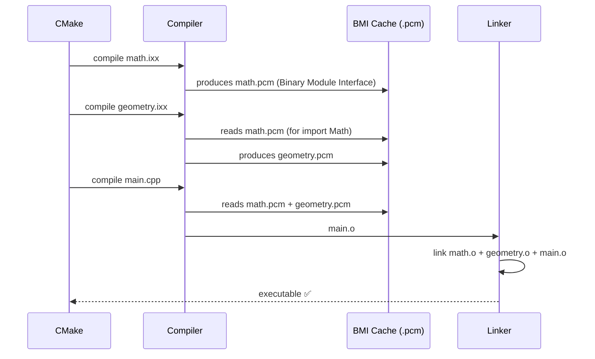
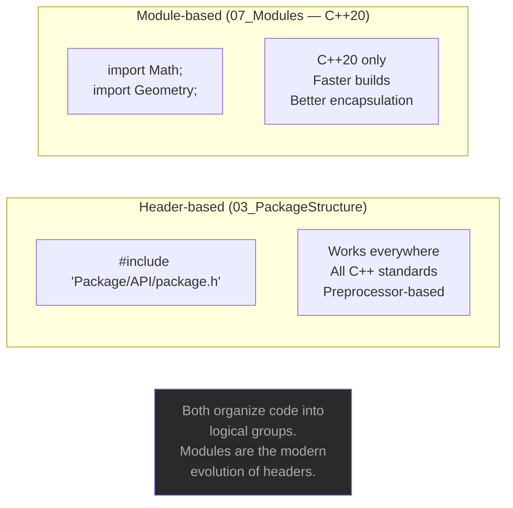

# C++20 Modules

## What are Modules?

C++20 Modules are a **replacement for `#include`**. Instead of pasting
header file content everywhere via the preprocessor, modules are compiled
once and their interface is cached as a Binary Module Interface (BMI).

---

## #include vs import



---

## Module file structure



---

## export keyword — what gets exported



---

## Module dependency chain



`geometry.ixx` imports `Math` — it can use `Math::PI` internally.
`main.cpp` imports both independently.

---

## Compilation flow



---

## Key syntax

### Declaring a module

```cpp
// math.ixx
export module Math;       // this file IS module "Math"

export int add(int a, int b) { return a + b; }  // exported
int helper() { return 0; }                       // NOT exported
```

### Importing a module

```cpp
// main.cpp
import Math;              // replaces: #include "math.h"

Math::add(3, 4);          // use exported symbols
```

### Module partitions (splitting a large module)

```cpp
// math-core.ixx
export module Math:core;     // partition "core" of module "Math"
export int add(int a, int b) { return a + b; }

// math-trig.ixx
export module Math:trig;     // partition "trig" of module "Math"
import <cmath>;
export double sin(double x) { return std::sin(x); }

// math.ixx — assembles the partitions
export module Math;
export import :core;    // re-export core partition
export import :trig;    // re-export trig partition
```

---

## #include vs import — full comparison

| | `#include` | `import` (C++20) |
|--|:----------:|:----------------:|
| Mechanism | Preprocessor text paste | Compiled BMI |
| Parsed per file | ✅ Every time | ❌ Once, then cached |
| Macro leakage | ✅ Yes — macros escape | ❌ No — hard boundary |
| Include guards | Required (`#pragma once`) | Not needed |
| Build speed | Slower (O(n×m)) | Faster (O(n+m)) |
| Encapsulation | None — all visible | Explicit `export` |
| Tooling | Universal | CMake 3.28+, GCC 14+ |
| Availability | All C++ | C++20 only |

---

## Compiler support

| Compiler | Modules support | Version needed |
|----------|:--------------:|:--------------:|
| GCC | ✅ Experimental | 14+ (`-fmodules-ts`) |
| Clang | ✅ Experimental | 16+ |
| MSVC | ✅ Best support | VS 2019 16.8+ |
| CMake | ✅ | 3.28+ |

---

## Terminal compile (GCC 14)

```bash
# Compile modules first
g++ -std=c++23 -fmodules-ts -c math.ixx     -o math.o
g++ -std=c++23 -fmodules-ts -c geometry.ixx -o geometry.o

# Compile main
g++ -std=c++23 -fmodules-ts main.cpp math.o geometry.o -lstdc++exp -o modules_demo

# Run
./modules_demo
```

> **Important:** Module files must be compiled **before** any file that
> imports them. CMake 3.28+ handles this dependency ordering automatically.

---

## When to use Modules

✅ New C++20 projects from scratch
✅ Large projects with slow build times (`#include` bottleneck)
✅ Library authors — clean encapsulation, no macro leakage
✅ When MSVC is the primary compiler (best support)

❌ Legacy codebases — mixing headers and modules is complex
❌ If your team's toolchain doesn't support C++20 modules yet
❌ Small projects — `#include` is fine, overhead is minimal

---

## Relationship to Package Structure


