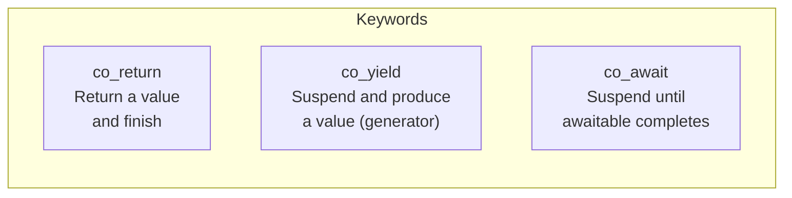
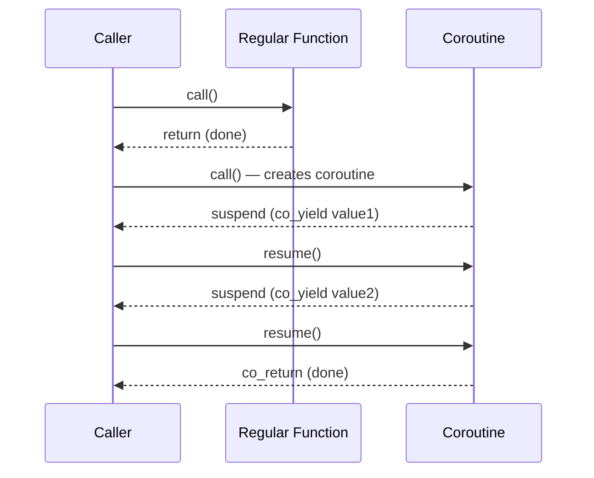
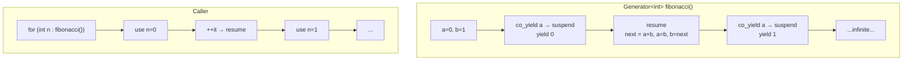
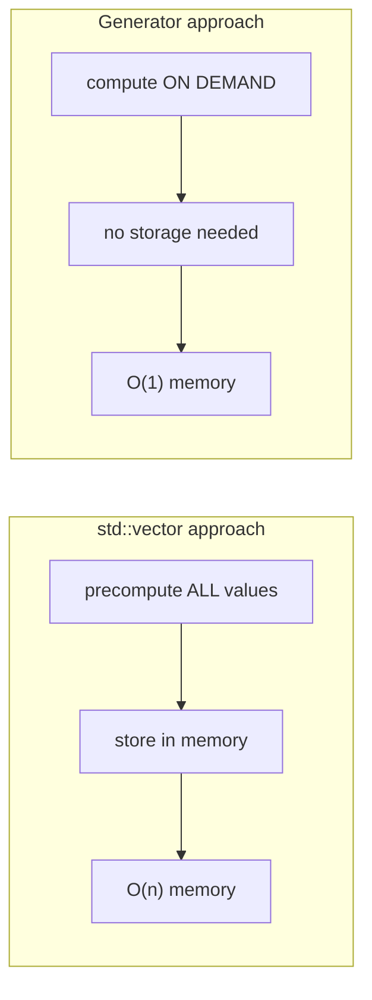
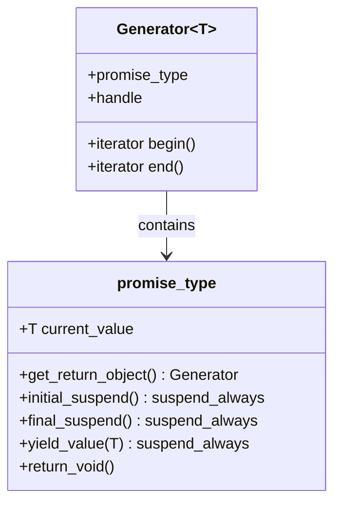
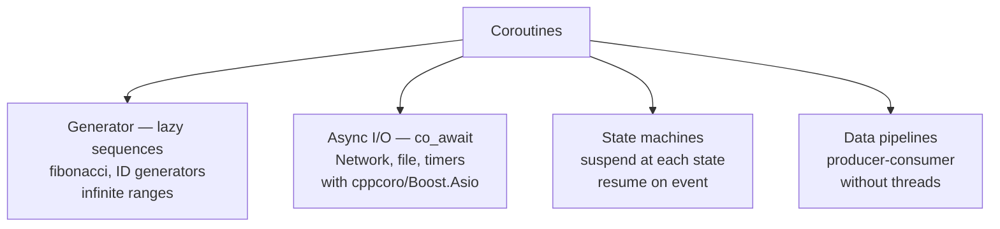

# C++20 Coroutines

## What are Coroutines?

A coroutine is a function that can **suspend** its execution and **resume** later,
preserving its state across suspensions.

---

## Three keywords



---

## Coroutine vs regular function



---

## Generator pattern — co_yield



```cpp
Generator<int> fibonacci() {
    int a = 0, b = 1;
    while (true) {
        co_yield a;          // suspend here, produce a
        int next = a + b;
        a = b;
        b = next;
    }
}

// Usage — take first 10
int count = 0;
for (int n : fibonacci()) {
    std::cout << n << ' ';
    if (++count >= 10) break;
}
// 0 1 1 2 3 5 8 13 21 34
```

---

## Generator vs vector



---

## co_await — async tasks

```cpp
// co_await suspends until the awaitable is ready
Task<std::string> fetchData(const std::string& url) {
    auto response = co_await httpGet(url);   // suspends here
    co_return response.body;                  // resumes here
}

// Reads like synchronous code — no callbacks!
Task<void> processAll() {
    auto data1 = co_await fetchData("url1");
    auto data2 = co_await fetchData("url2");
    std::cout << data1 << data2;
    co_return;
}
```

---

## Coroutine infrastructure (required boilerplate)



> In C++23 `std::generator<T>` is standardized — no boilerplate needed.
> On GCC 14: use the custom `Generator<T>` from this file or install `cppcoro`.

---

## Coroutine vs Thread vs Callback

| | Callback | Thread | Coroutine |
|--|:--------:|:------:|:---------:|
| Memory | Low | High (MB stack) | Low (KB stack) |
| OS involvement | No | Yes | No |
| Code style | Fragmented | Sequential | Sequential |
| Switching | Function call | OS scheduler | Explicit suspend |
| Parallelism | No | Yes | No (cooperative) |

---

## Practical use cases



---

## Async frameworks for co_await

```bash
# cppcoro — C++ coroutine library
# https://github.com/lewissbaker/cppcoro

# Boost.Asio — network + coroutines
sudo apt install libboost-all-dev

# QCoro — Qt coroutines
# https://github.com/danvratil/qcoro
```

---

## When to use Coroutines

✅ Lazy infinite sequences — `co_yield` generators
✅ Async I/O without callbacks — `co_await`
✅ Complex state machines — suspend at each state
✅ Producer-consumer pipelines without threads

❌ Simple synchronous code — unnecessary complexity
❌ CPU-bound parallel work — use threads instead
❌ When framework support is needed but not available
