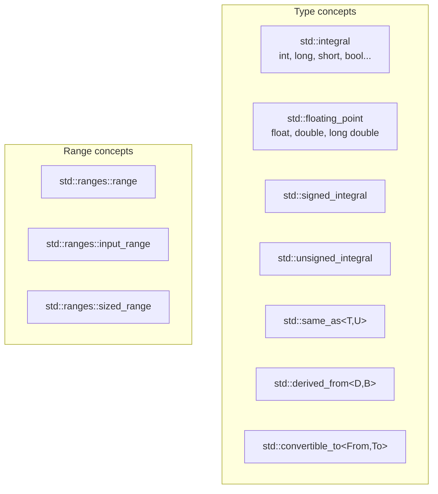
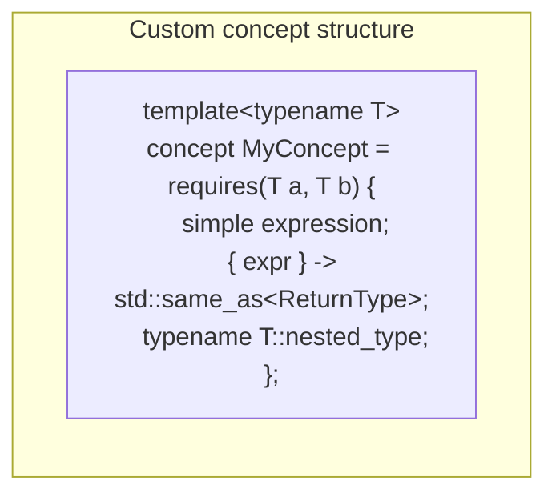
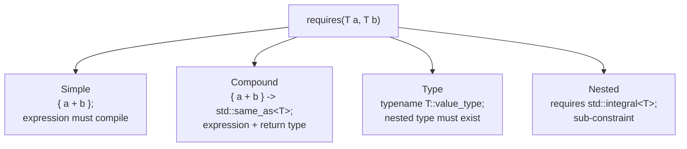
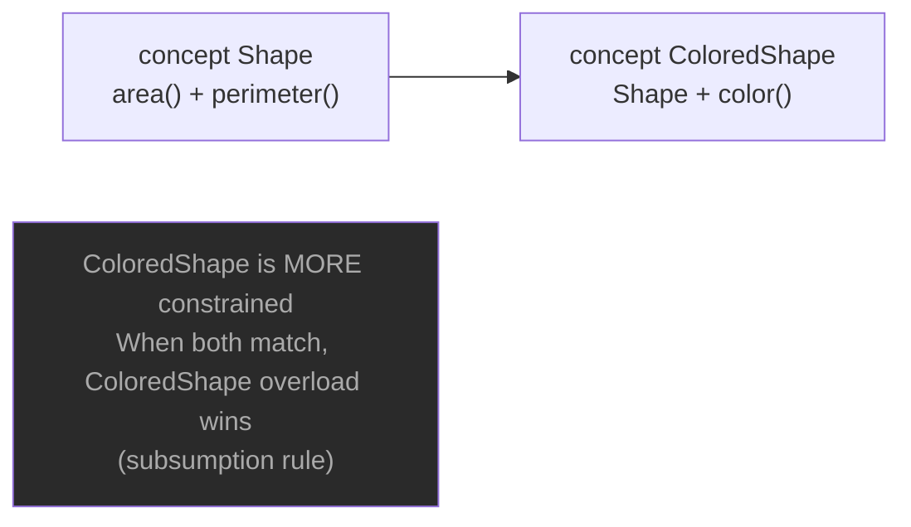

# C++20 Concepts

## What are Concepts?

Concepts are **compile-time constraints** on template type parameters.
They replace SFINAE with readable, expressive requirements.

---

## Built-in concepts (`<concepts>`)



---

## 4 syntaxes for constrained functions

```cpp
// Syntax 1: requires clause after template
template<typename T>
requires std::integral<T>
T doubled(T x) { return x * 2; }

// Syntax 2: concept in template parameter (recommended)
template<std::integral T>
T doubled(T x) { return x * 2; }

// Syntax 3: constrained auto
auto doubled(std::integral auto x) { return x * 2; }

// Syntax 4: requires clause at end
template<typename T>
T doubled(T x) requires std::integral<T> { return x * 2; }
```

---

## Custom concepts



```cpp
template<typename T>
concept Arithmetic = requires(T a, T b) {
    { a + b } -> std::same_as<T>;
    { a - b } -> std::same_as<T>;
    { a * b } -> std::same_as<T>;
    { a / b } -> std::same_as<T>;
};

template<typename T>
concept Container = requires(T c) {
    typename T::value_type;
    { c.begin() } -> std::input_or_output_iterator;
    { c.end()   } -> std::input_or_output_iterator;
    { c.size()  } -> std::convertible_to<std::size_t>;
};
```

---

## requires expression types



---

## Concepts vs SFINAE

```cpp
// SFINAE — hard to read, terrible error messages
template<typename T,
         typename = std::enable_if_t<std::is_integral_v<T>>>
T old_way(T x) { return x * 2; }

// Concepts — clean, clear error messages
template<std::integral T>
T new_way(T x) { return x * 2; }

// Error message with SFINAE:
// "candidate template ignored: substitution failure"
// Error message with Concepts:
// "'double' does not satisfy 'std::integral'"
```

---

## Subsumption — more specific concept wins



---

## MCX Codec concept

```cpp
template<typename T>
concept McxCodec = requires(T codec, const std::string& data) {
    { codec.name()       } -> std::convertible_to<std::string>;
    { codec.bitrate()    } -> std::convertible_to<int>;
    { codec.encode(data) } -> std::convertible_to<std::string>;
    { codec.decode(data) } -> std::convertible_to<std::string>;
};

// Works with any type satisfying McxCodec
template<McxCodec T>
void processAudio(const T& codec, const std::string& audio) {
    auto encoded = codec.encode(audio);
}

// AmrWbCodec satisfies McxCodec ✅
// OpusCodec satisfies McxCodec  ✅
// int does not satisfy McxCodec ❌ — compile error
```

---

## When to use Concepts

✅ Template functions that only work for certain types
✅ Replacing SFINAE — clearer error messages
✅ Overload resolution based on type properties
✅ Interface contracts (like McxCodec above)
✅ Constrained auto in lambdas and parameters
