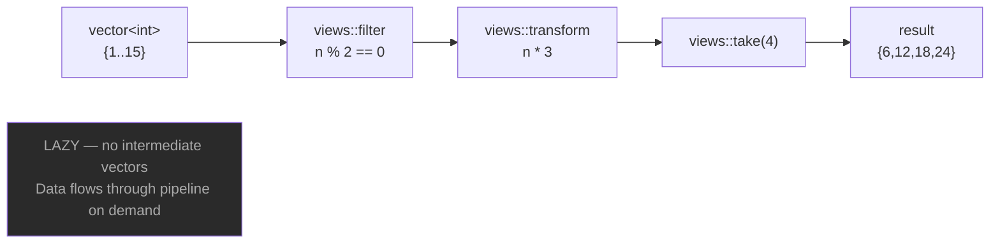
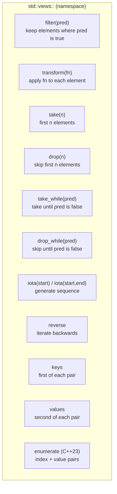
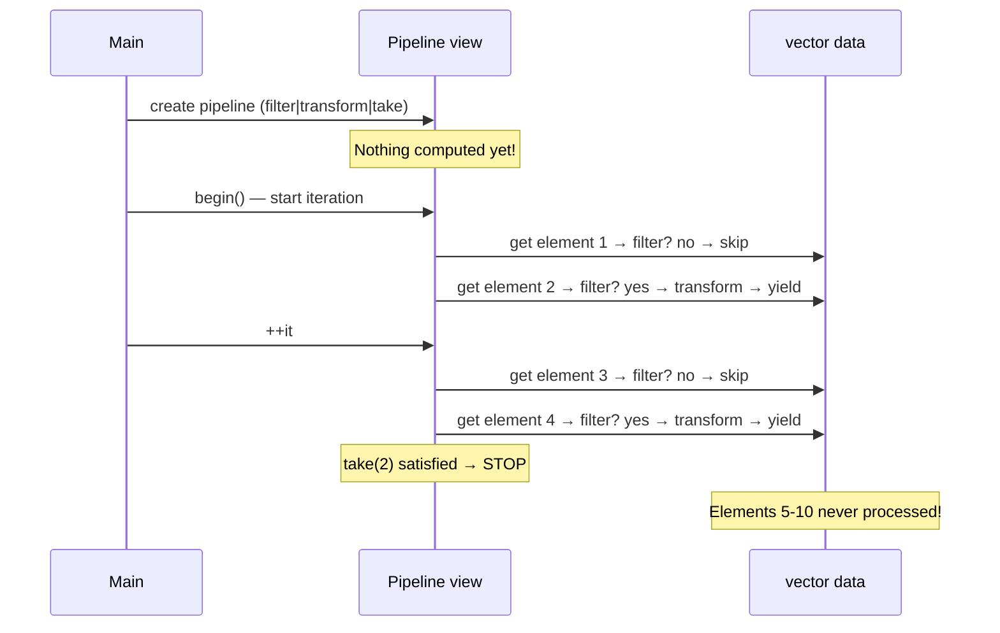
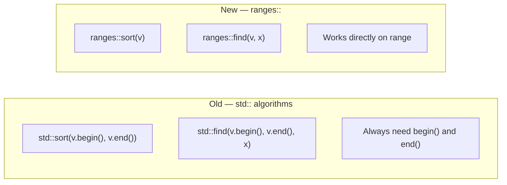

# C++20/23 Ranges

## What are Ranges?

Ranges generalize iterators — any type with `begin()` and `end()` is a range.
**Views** are lazy, composable transformations over ranges using the `|` pipe operator.

---

## Pipeline concept



---

## Key views



---

## Common patterns

```cpp
namespace views = std::views;

std::vector<int> v = {1,2,3,4,5,6,7,8,9,10};

// Filter
v | views::filter([](int n){ return n % 2 == 0; })
// → 2 4 6 8 10

// Transform
v | views::transform([](int n){ return n * n; })
// → 1 4 9 16 25 36 49 64 81 100

// Chain
v | views::filter([](int n){ return n % 2 == 0; })
  | views::transform([](int n){ return n * 3; })
  | views::take(3)
// → 6 12 18

// Generate
views::iota(1) | views::take(5)
// → 1 2 3 4 5

views::iota(1, 6)
// → 1 2 3 4 5
```

---

## Lazy evaluation



---

## Range algorithms

```cpp
namespace ranges = std::ranges;

std::vector<int> v = {5,2,8,1,9,3};

ranges::sort(v);                          // sort in place
ranges::find(v, 8);                       // find iterator
ranges::count_if(v, [](int n){ return n%2==0; });
ranges::min_element(v);
ranges::max_element(v);
ranges::all_of(v,  [](int n){ return n > 0; });
ranges::any_of(v,  [](int n){ return n > 8; });
ranges::none_of(v, [](int n){ return n < 0; });
ranges::contains(v, 7);                   // C++23
```

---

## views vs std:: algorithms



---

## MCX session filtering example

```cpp
// Active GRP-ALPHA sessions sorted by priority
std::vector<McxSession> alpha;
for (const auto& s : sessions
    | views::filter([](const McxSession& s){
        return s.active && s.group == "GRP-ALPHA";
      }))
    alpha.push_back(s);
ranges::sort(alpha, {}, &McxSession::priority);

// All active session IDs
for (const auto& id : sessions
    | views::filter([](const auto& s){ return s.active; })
    | views::transform([](const auto& s){ return s.id; }))
    std::cout << id << '\n';
```

---

## When to use Ranges

✅ Complex filtering and transformation pipelines
✅ Replacing nested loops with readable pipelines
✅ Lazy evaluation — avoid intermediate containers
✅ Infinite sequences — `views::iota` + `views::take`
✅ Functional programming style in C++

❌ Simple single-step operations — a plain loop is clearer
❌ Performance-critical code needing manual SIMD
