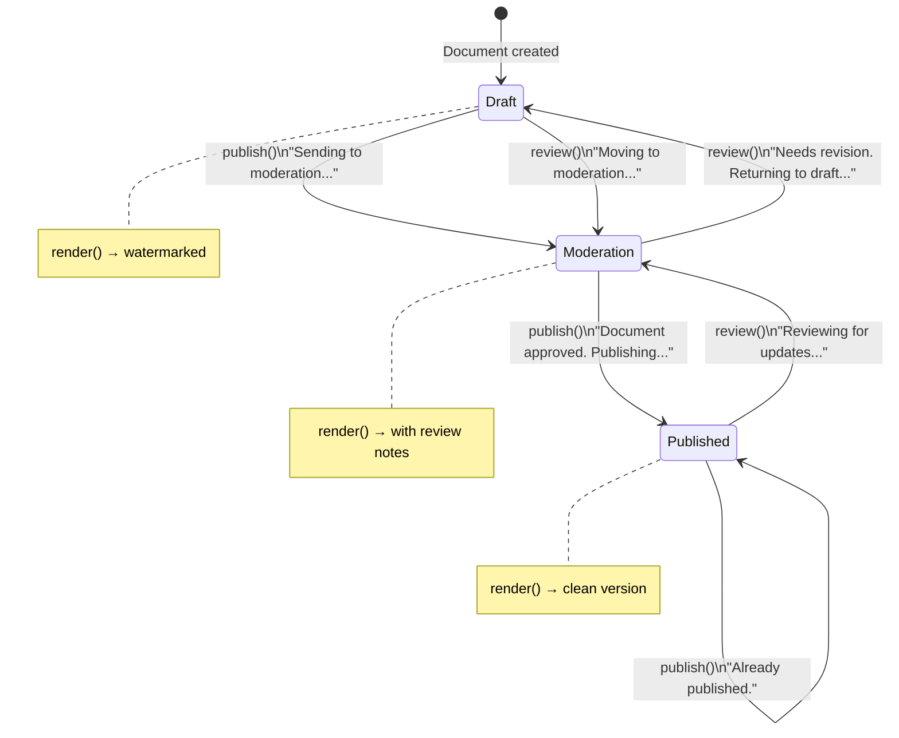
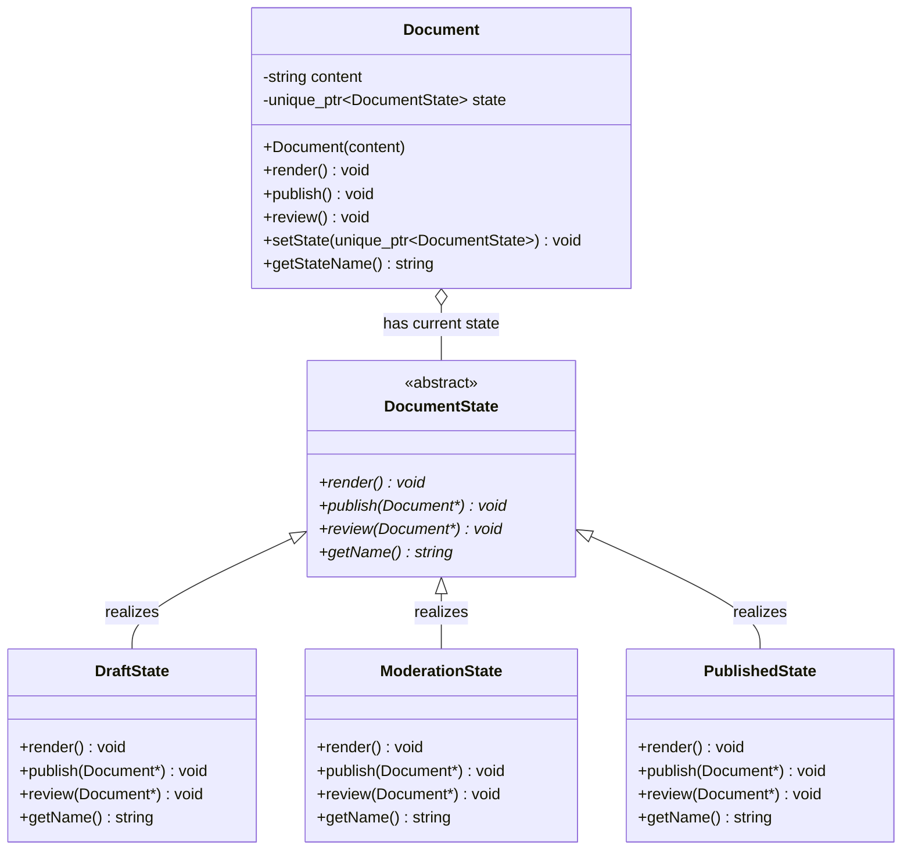
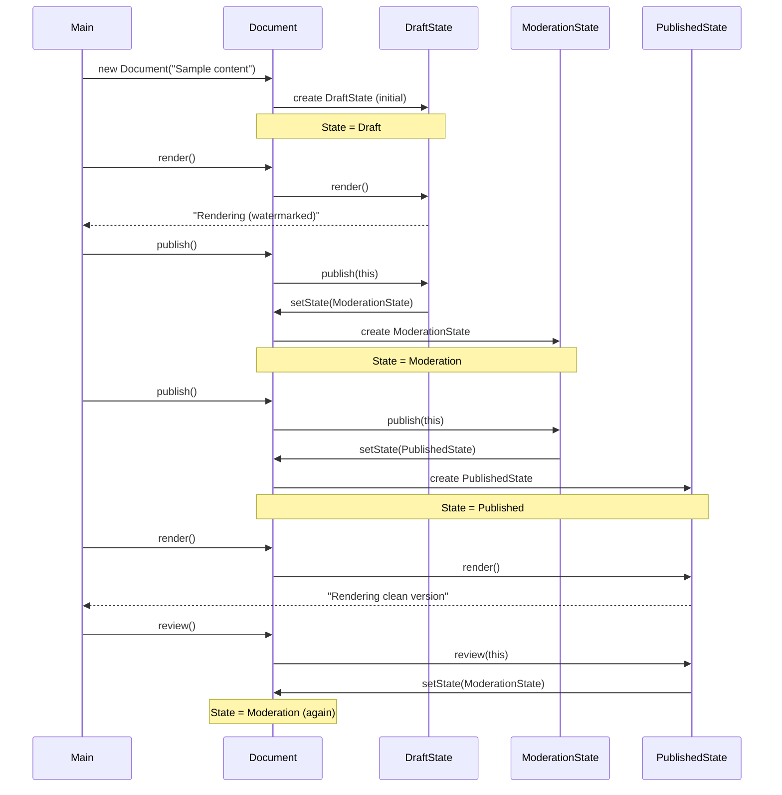
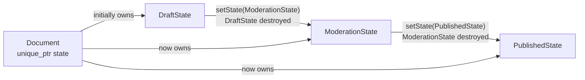

# State Pattern — Document Workflow

## Intent

Allow an object to **alter its behaviour when its internal state changes**.
The object will appear to change its class — each state encapsulates its
own rules for what happens when actions are triggered.

---

## Project structure

```
StatePatternExample/
├── DocumentState.h       ← abstract state interface
├── ConcreteStates.h      ← DraftState, ModerationState, PublishedState
├── ConcreteStates.cpp    ← implementations of all three states
├── Document.h            ← context class — holds the current state
├── Document.cpp          ← delegates actions to current state
└── main.cpp              ← client code
```

---

## State machine diagram



---

## Class diagram



---

## Sequence diagram — main() walkthrough



---

## State transition table

| Current State | Action | Next State | Output |
|--------------|--------|------------|--------|
| Draft | `publish()` | Moderation | "Can't publish directly. Sending to moderation..." |
| Draft | `review()` | Moderation | "Draft is being reviewed. Moving to moderation..." |
| Draft | `render()` | Draft | "Rendering document in draft state (watermarked)" |
| Moderation | `publish()` | Published | "Document approved. Publishing..." |
| Moderation | `review()` | Draft | "Needs further revision. Returning to draft..." |
| Moderation | `render()` | Moderation | "Rendering document in moderation state (with review notes)" |
| Published | `publish()` | Published | "Document is already published." |
| Published | `review()` | Moderation | "Published document being reviewed for updates..." |
| Published | `render()` | Published | "Rendering published document (clean version)" |

---

## Key code

### DocumentState — abstract interface

```cpp
// DocumentState.h
class DocumentState {
public:
    virtual ~DocumentState() = default;
    virtual void render()  const = 0;
    virtual void publish(Document* document) = 0;
    virtual void review (Document* document) = 0;
    virtual std::string getName() const = 0;
};
```

### Document — the context

```cpp
// Document.h
class Document {
    std::string                     content;
    std::unique_ptr<DocumentState>  state;   // current state — owned

public:
    void publish() { state->publish(this); }  // delegate to state
    void review()  { state->review(this);  }  // delegate to state
    void render()  const { state->render(); } // delegate to state

    void setState(std::unique_ptr<DocumentState> newState) {
        state = std::move(newState);           // transition
    }
};
```

### State transition — inside a concrete state

```cpp
// DraftState — publish() transitions to ModerationState
void DraftState::publish(Document* document) {
    std::cout << "Can't publish directly. Sending to moderation...\n";
    document->setState(std::make_unique<ModerationState>());
}

// ModerationState — publish() transitions to PublishedState
void ModerationState::publish(Document* document) {
    std::cout << "Document approved. Publishing...\n";
    document->setState(std::make_unique<PublishedState>());
}

// ModerationState — review() transitions BACK to DraftState
void ModerationState::review(Document* document) {
    std::cout << "Needs revision. Returning to draft...\n";
    document->setState(std::make_unique<DraftState>());
}
```

---

## How state ownership works



`unique_ptr` ensures the **old state is automatically destroyed** when
`setState()` is called — no manual memory management needed.

---

## Four participants

| Role | Class | Responsibility |
|------|-------|---------------|
| Context | `Document` | Holds current state, delegates actions |
| State interface | `DocumentState` | Defines what actions all states support |
| Concrete states | `DraftState`, `ModerationState`, `PublishedState` | Implement behaviour + trigger transitions |
| Client | `main.cpp` | Calls actions on Document — unaware of state details |

---

## Adding a new state

To add an `ArchivedState` — only two files change:

```cpp
// 1. Add to ConcreteStates.h
class ArchivedState : public DocumentState {
public:
    void render()  const override;
    void publish(Document* doc) override;
    void review (Document* doc) override;
    std::string getName() const override;
};

// 2. Implement in ConcreteStates.cpp
void ArchivedState::render() const {
    std::cout << "Rendering archived document (read-only)\n";
}
void ArchivedState::publish(Document* doc) {
    std::cout << "Cannot publish archived document\n";
}
void ArchivedState::review(Document* doc) {
    std::cout << "Unarchiving — moving to draft\n";
    doc->setState(std::make_unique<DraftState>());
}
```

`Document.cpp` and `main.cpp` need **no changes** — Open/Closed Principle.

---

## State Pattern vs switch/case

```cpp
// WITHOUT State pattern — switch/case spaghetti
void Document::publish() {
    switch (currentState) {
        case DRAFT:      sendToModeration(); currentState = MODERATION; break;
        case MODERATION: doPublish();        currentState = PUBLISHED;  break;
        case PUBLISHED:  std::cout << "Already published\n";            break;
        // Adding new state = modify this switch everywhere
    }
}

// WITH State pattern — each state knows its own rules
void Document::publish() {
    state->publish(this);   // one line — state decides everything
}
```

---

## CMakeLists.txt

```cmake
cmake_minimum_required(VERSION 3.14)
project(StatePatternExample1 LANGUAGES CXX)

set(CMAKE_CXX_STANDARD 23)
set(CMAKE_CXX_STANDARD_REQUIRED ON)

find_package(QT NAMES Qt6 Qt5 REQUIRED COMPONENTS Core)
find_package(Qt${QT_VERSION_MAJOR} REQUIRED COMPONENTS Core)

add_executable(StatePatternExample1
    main.cpp
    Document.cpp
    ConcreteStates.cpp
)

target_link_libraries(StatePatternExample1
    Qt${QT_VERSION_MAJOR}::Core
    stdc++exp
)
```

---

## Expected output

```
Initial state: Draft
Document content: Sample content for state pattern demonstration
Rendering document in draft state (watermarked)

Attempting to publish:
Can't publish directly from draft. Sending to moderation...
Current state: Moderation

Approving for publication:
Document approved. Publishing...
Current state: Published
Document content: Sample content for state pattern demonstration
Rendering published document (clean version)

Starting a revision:
Published document is being reviewed for updates. Moving to moderation.
Current state: Moderation
```

---

## When to use State Pattern

✅ Object behaviour depends on its state and must change at runtime
✅ Many conditional statements based on the object's state
✅ States and transitions need to be extended without changing the context
✅ Each state has its own rules — not just flags

❌ Only a few states that rarely change → simple enum + switch is enough
❌ Stateless objects → no need for this pattern
