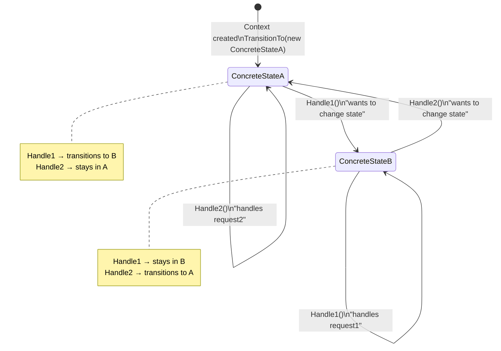
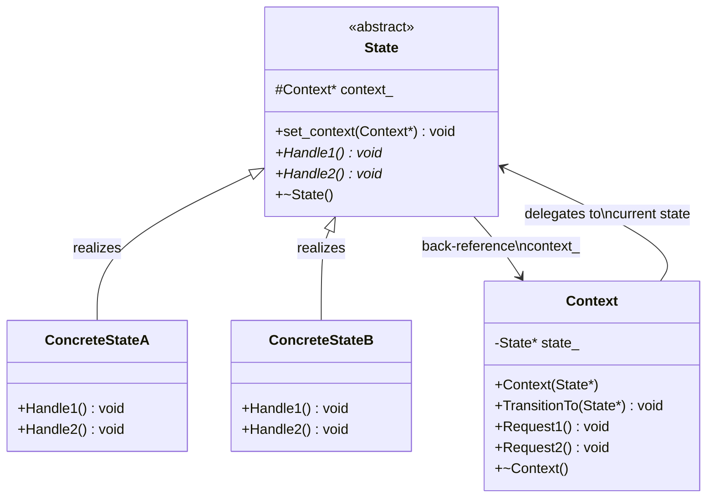
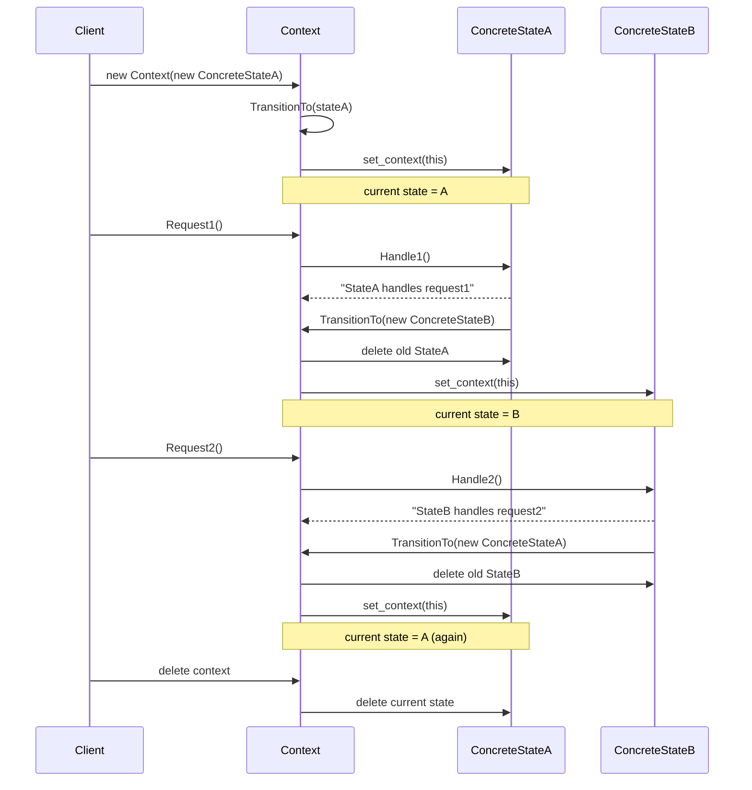
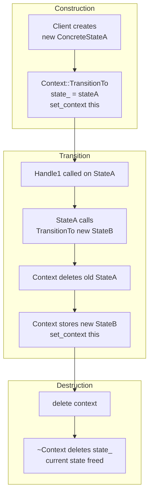

# State Pattern — GoF Basic Example

## Intent

Allow an object (Context) to **change its behaviour** when its internal
state changes. The state logic is encapsulated in separate state classes
rather than in a single large if/else or switch block.

---

## State machine diagram



---

## Class diagram



---

## Sequence diagram — ClientCode() walkthrough



---

## State transition table

| Current State | Request | Action | Next State |
|--------------|---------|--------|------------|
| ConcreteStateA | `Request1()` → `Handle1()` | Transitions | ConcreteStateB |
| ConcreteStateA | `Request2()` → `Handle2()` | Stays | ConcreteStateA |
| ConcreteStateB | `Request1()` → `Handle1()` | Stays | ConcreteStateB |
| ConcreteStateB | `Request2()` → `Handle2()` | Transitions | ConcreteStateA |

---

## Key code

### State — abstract base with back-reference

```cpp
class State {
protected:
    Context* context_;   // back-reference — lets state trigger transitions

public:
    void set_context(Context* context) {
        this->context_ = context;
    }

    virtual void Handle1() = 0;
    virtual void Handle2() = 0;
};
```

The back-reference `context_` is what allows a **state to trigger its own
transition** — it calls `context_->TransitionTo(new OtherState)` from inside
its own `Handle` method.

---

### Context — holds and delegates to current state

```cpp
class Context {
    State* state_;

public:
    void TransitionTo(State* state) {
        std::cout << "Transition to " << typeid(*state).name() << "\n";
        if (state_ != nullptr) delete state_;   // destroy old state
        state_ = state;
        state_->set_context(this);              // give new state the back-ref
    }

    void Request1() { state_->Handle1(); }   // delegate to current state
    void Request2() { state_->Handle2(); }   // delegate to current state
};
```

---

### ConcreteStateA — Handle1 triggers transition

```cpp
void ConcreteStateA::Handle1() {
    std::cout << "ConcreteStateA handles request1.\n";
    std::cout << "ConcreteStateA wants to change state.\n";
    this->context_->TransitionTo(new ConcreteStateB);   // ← transition
}

void ConcreteStateA::Handle2() {
    std::cout << "ConcreteStateA handles request2.\n";
    // no transition — stays in StateA
}
```

---

### ConcreteStateB — Handle2 triggers transition

```cpp
void ConcreteStateB::Handle1() {
    std::cout << "ConcreteStateB handles request1.\n";
    // no transition — stays in StateB
}

void ConcreteStateB::Handle2() {
    std::cout << "ConcreteStateB handles request2.\n";
    std::cout << "ConcreteStateB wants to change state.\n";
    this->context_->TransitionTo(new ConcreteStateA);   // ← transition back
}
```

---

## Memory management flow



---

## Raw pointer vs unique_ptr

This example uses **raw pointers** (`State*`) — the original GoF style.
The previous Document example used `unique_ptr`. Comparison:

| | Raw pointer (this file) | `unique_ptr` (Document example) |
|--|------------------------|----------------------------------|
| Transition | `delete old; state_ = new X` | `state_ = make_unique<X>()` |
| Destructor | `delete state_` explicitly | Automatic |
| Back-reference | `Context*` raw ptr | `Context*` raw ptr (same) |
| Memory safety | Manual — error-prone | RAII — automatic |
| Style | Classic GoF / C++98 | Modern C++11 |

**Modern recommendation:** use `unique_ptr` — automatic cleanup, no leaks.

```cpp
// Modern equivalent of TransitionTo
void TransitionTo(std::unique_ptr<State> newState) {
    state_ = std::move(newState);   // old state auto-deleted
    state_->set_context(this);
}
```

---

## Four participants

| Role | Class | Responsibility |
|------|-------|---------------|
| Context | `Context` | Holds `state_`, delegates `Request1/2` to it |
| State interface | `State` | Declares `Handle1/2`, holds `context_` back-ref |
| Concrete states | `ConcreteStateA`, `ConcreteStateB` | Implement handles, trigger transitions |
| Client | `ClientCode()` | Creates Context + initial state, calls Requests |

---

## Expected output

```
Context: Transition to 14ConcreteStateA.
ConcreteStateA handles request1.
ConcreteStateA wants to change the state of the context.
Context: Transition to 14ConcreteStateB.
ConcreteStateB handles request2.
ConcreteStateB wants to change the state of the context.
Context: Transition to 14ConcreteStateA.
```

> The `14ConcreteStateA` prefix is GCC's mangled type name from `typeid(*state).name()`.
> Use `c++filt -t` or `abi::__cxa_demangle()` to get a clean name.

---

## Difference from Document example

| | This file (GoF basic) | Document example |
|--|----------------------|-----------------|
| Files | Single `.cpp` | 5 files (header separation) |
| Pointer style | Raw `State*` | `unique_ptr<DocumentState>` |
| States | ConcreteStateA, B | Draft, Moderation, Published |
| Actions | Handle1, Handle2 | render, publish, review |
| Transitions | States trigger themselves | States trigger themselves |
| Complexity | Minimal — learn the pattern | Realistic — domain workflow |

Both use the **same GoF State Pattern** — same structure, different complexity.

---

## When to use State Pattern

✅ Object behaviour changes based on its state at runtime
✅ Many `if/else` or `switch` branches checking the same state variable
✅ States and transitions need to be added without changing the context
✅ Each state has distinct rules for every action

❌ Only 2–3 states with trivial logic → a simple enum + switch is fine
❌ States never change at runtime → use strategy or template method instead
