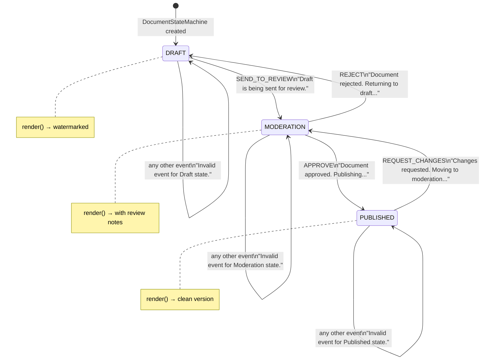
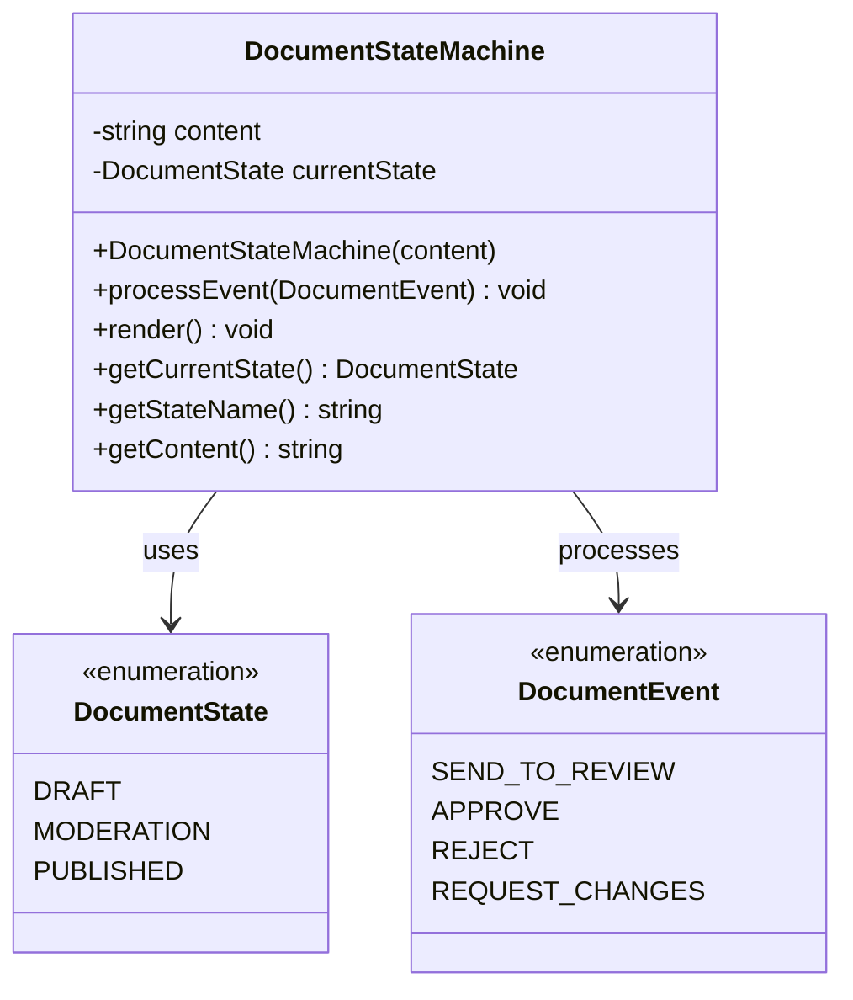
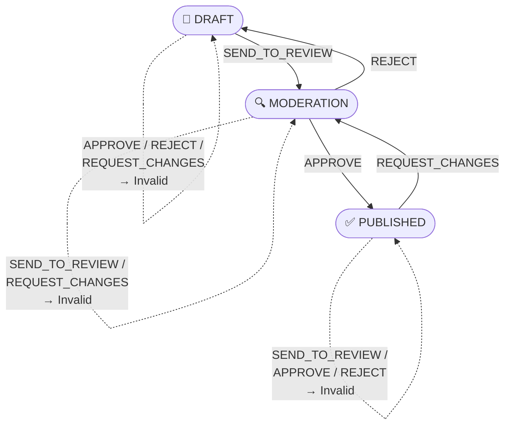
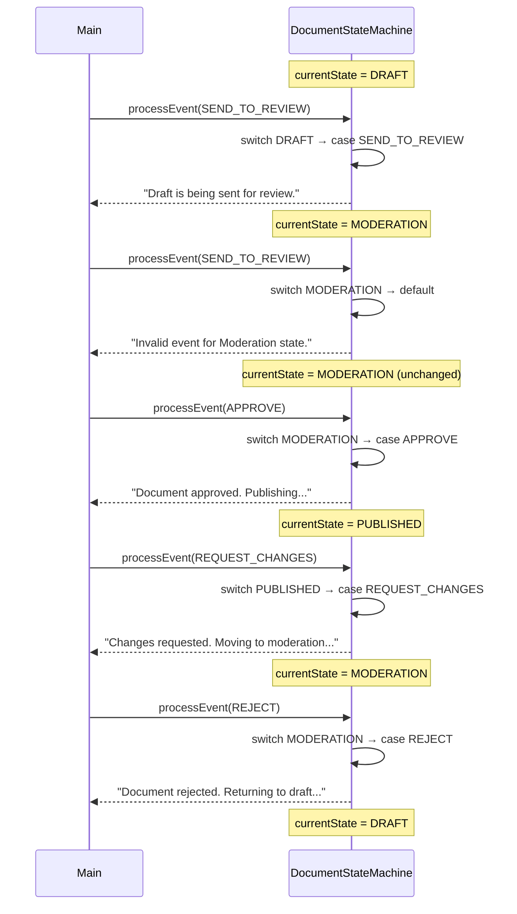
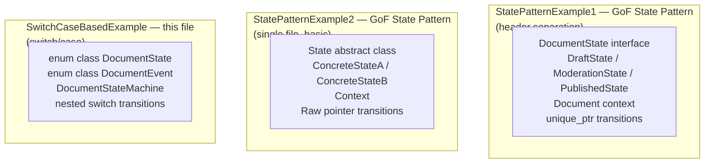

# State Machine — Switch/Case Based Implementation

## What is this approach?

A **switch/case state machine** is the simplest way to implement state
behaviour — using `enum class` for states and events, and nested `switch`
statements to define every valid transition.

This is **not** the GoF State Pattern — there are no state classes.
All logic lives inside one class (`DocumentStateMachine`) in a single
`processEvent()` method.

---

## Project structure

```
SwitchCaseBasedExample/
├── DocumentStateMachine.h    ← enums + class declaration
├── DocumentStateMachine.cpp  ← all state/transition logic
└── main.cpp                  ← client code
```

---

## State machine diagram



---

## Class diagram



---

## Transition table — complete



---

## Sequence diagram — main() walkthrough



---

## State + Event matrix

| State \ Event | `SEND_TO_REVIEW` | `APPROVE` | `REJECT` | `REQUEST_CHANGES` |
|--------------|:----------------:|:---------:|:--------:|:-----------------:|
| **DRAFT** | → MODERATION ✅ | ❌ Invalid | ❌ Invalid | ❌ Invalid |
| **MODERATION** | ❌ Invalid | → PUBLISHED ✅ | → DRAFT ✅ | ❌ Invalid |
| **PUBLISHED** | ❌ Invalid | ❌ Invalid | ❌ Invalid | → MODERATION ✅ |

---

## Key code

### Enums — states and events

```cpp
enum class DocumentState {
    DRAFT,
    MODERATION,
    PUBLISHED
};

enum class DocumentEvent {
    SEND_TO_REVIEW,
    APPROVE,
    REJECT,
    REQUEST_CHANGES
};
```

`enum class` (scoped enum) prevents name collisions — you must write
`DocumentState::DRAFT` not just `DRAFT`.

---

### processEvent — nested switch

```cpp
void DocumentStateMachine::processEvent(DocumentEvent event) {
    switch (currentState) {

        case DocumentState::DRAFT:
            switch (event) {
                case DocumentEvent::SEND_TO_REVIEW:
                    currentState = DocumentState::MODERATION;
                    break;
                default:
                    std::cout << "Invalid event for Draft state.\n";
            }
            break;

        case DocumentState::MODERATION:
            switch (event) {
                case DocumentEvent::APPROVE:
                    currentState = DocumentState::PUBLISHED;
                    break;
                case DocumentEvent::REJECT:
                    currentState = DocumentState::DRAFT;
                    break;
                default:
                    std::cout << "Invalid event for Moderation state.\n";
            }
            break;

        case DocumentState::PUBLISHED:
            switch (event) {
                case DocumentEvent::REQUEST_CHANGES:
                    currentState = DocumentState::MODERATION;
                    break;
                default:
                    std::cout << "Invalid event for Published state.\n";
            }
            break;
    }
}
```

The outer `switch` selects the **current state**.
The inner `switch` selects the **event** — only valid transitions proceed,
everything else hits `default` and prints "Invalid event".

---

## CMakeLists.txt

```cmake
cmake_minimum_required(VERSION 3.14)
project(SwitchCaseBasedExample LANGUAGES CXX)

set(CMAKE_CXX_STANDARD 23)
set(CMAKE_CXX_STANDARD_REQUIRED ON)

find_package(QT NAMES Qt6 Qt5 REQUIRED COMPONENTS Core)
find_package(Qt${QT_VERSION_MAJOR} REQUIRED COMPONENTS Core)

add_executable(SwitchCaseBasedExample
    main.cpp
    DocumentStateMachine.cpp
)

target_link_libraries(SwitchCaseBasedExample
    Qt${QT_VERSION_MAJOR}::Core
    stdc++exp
)
```

---

## Expected output

```
Initial state: Draft
Document content: Sample content for switch-case state machine demonstration
Rendering document in draft state (watermarked)

Sending document for review:
Draft is being sent for review.
Current state: Moderation
Document content: Sample content for switch-case state machine demonstration
Rendering document in moderation state (with review notes)

Attempting invalid transition (sending to review again):
Invalid event for Moderation state.
Current state: Moderation (unchanged)

Approving document:
Document approved. Publishing...
Current state: Published
Document content: Sample content for switch-case state machine demonstration
Rendering published document (clean version)

Requesting changes:
Changes requested for published document. Moving to moderation...
Current state: Moderation

Rejecting the document:
Document rejected. Returning to draft...
Current state: Draft
```

---

## Three approaches — comparison

All three examples in this `StateMachines/` folder implement the
**same document workflow** using different techniques:



| | GoF State Pattern | Switch/Case (this file) |
|--|:-----------------:|:-----------------------:|
| State logic | Separate class per state | Single `switch` block |
| Adding a state | New class, no `switch` changes | Add `case` everywhere |
| Adding an event | New virtual method in all | Add `case` per state |
| Code volume | More files, more classes | One class, compact |
| Open/Closed | ✅ New states = new class | ❌ Must edit `switch` |
| Readability | Distributed across files | All in one place |
| Best for | Many states, frequent changes | Few states, stable logic |

---

## When to use switch/case state machine

✅ 3–5 states maximum — beyond that, switch becomes unmaintainable
✅ Logic is stable — transitions rarely change
✅ Quick prototype or embedded systems with simple FSM
✅ No polymorphism needed — just data + transitions

❌ Many states → switch grows unmanageable → use GoF State Pattern
❌ Need to add states at runtime → use GoF State Pattern
❌ Each state has complex logic → extract into state classes
