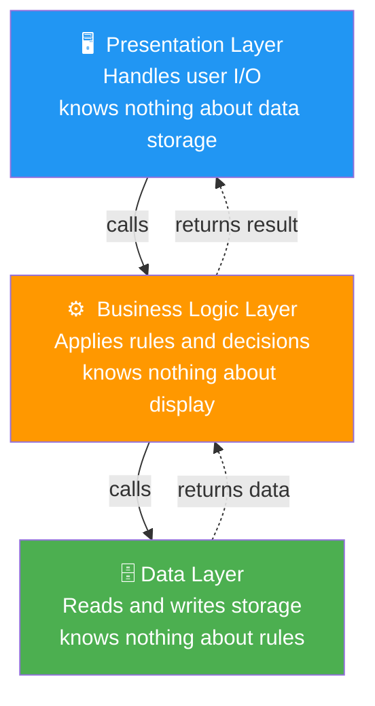
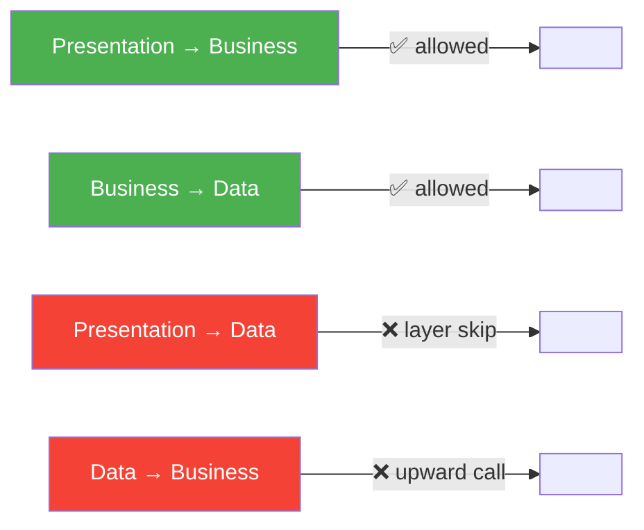
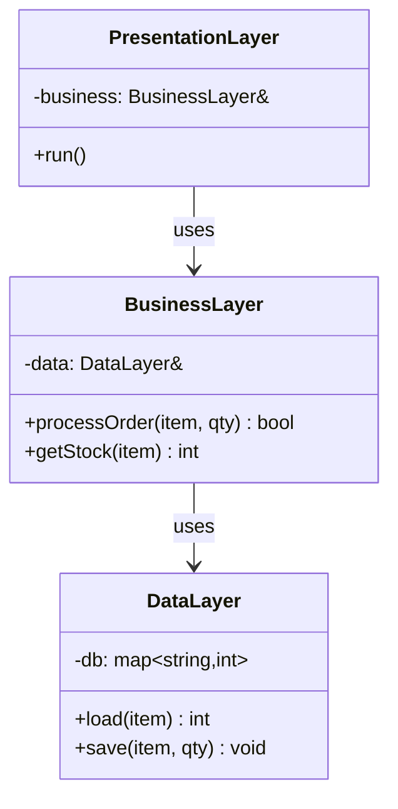

# 01 · Layered Architecture

> Each layer has one responsibility.  
> A layer only communicates with the layer **directly below** it.  
> No layer skips layers.

---

## Structure

---

## The Rule

---

## C++ Class Map

---

## When to Use

✅ Enterprise applications, web backends, OS design  
✅ When you want to swap the database without touching the UI  
✅ When teams own separate layers  
❌ Not good for real-time systems where call overhead matters  
❌ Not good when layers would be artificially thin  

---

## Key Insight

The dependency arrows point **downward only**.  
If you ever find yourself calling upward (Data calling Business), you've broken the pattern.  
In C++ this manifests as: lower layers must **never** `#include` higher layer headers.
