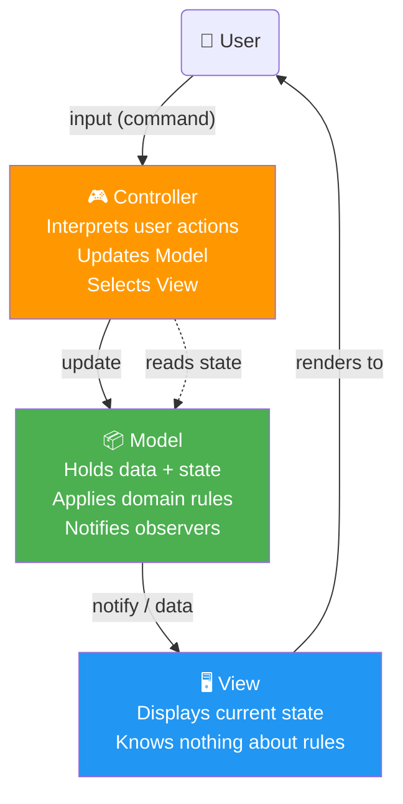
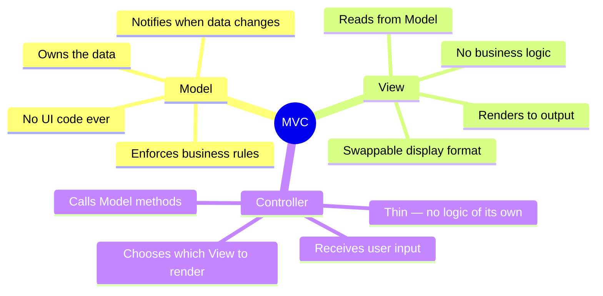
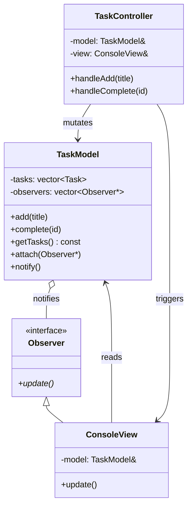

# 02 · MVC — Model · View · Controller

> The data knows nothing about the screen.  
> The screen knows nothing about the rules.  
> The controller is the only one who knows both.

---

## Structure

---

## Responsibility Split

---

## C++ Class Map

---

## MVC vs Layered

| | Layered | MVC |
|---|---|---|
| Focus | Separating technical tiers | Separating UI concerns |
| Direction | Top-down strict | Triangular (M↔V↔C) |
| Use case | Backend systems | GUI / interactive apps |
| C++ example | API server | Qt application |

---

## When to Use

✅ Any application with a UI that changes independently of data  
✅ When you want to swap views (console → GUI → web) without touching model  
✅ Qt is fundamentally MVC — signals/slots are the notification mechanism  
❌ Overkill for simple scripts with no real UI  
❌ Can be over-engineered if the model is trivial  
