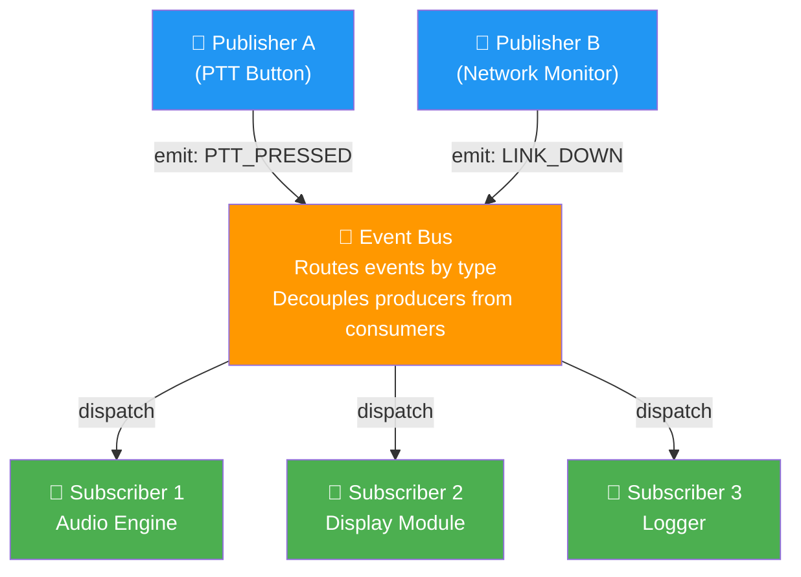
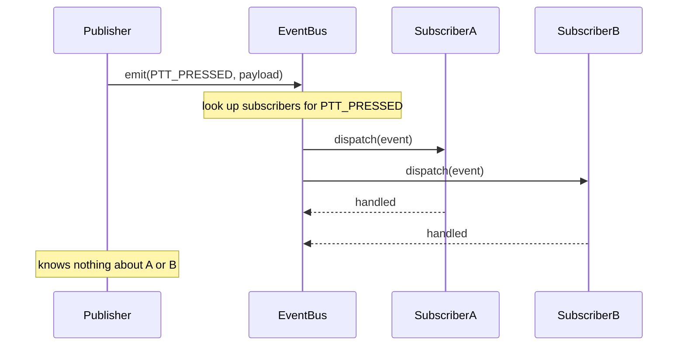
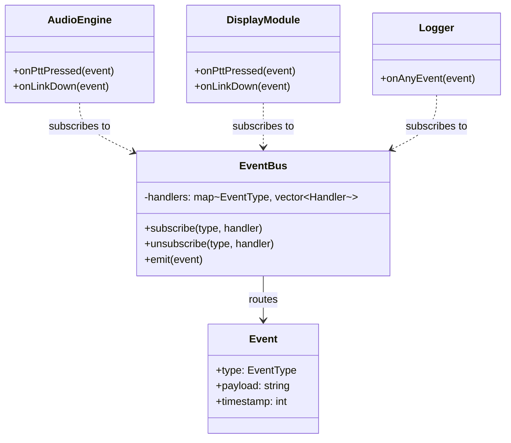
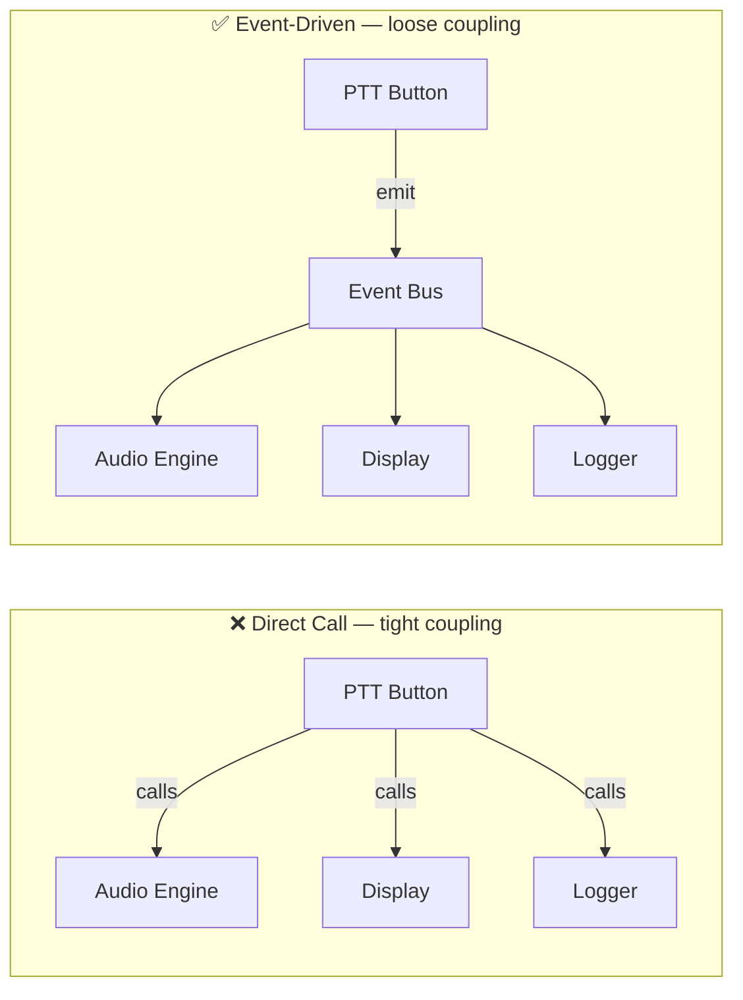

# 03 · Event-Driven Architecture

> Components don't call each other.  
> They emit events. Others listen.  
> The emitter doesn't know who's listening — and doesn't care.

---

## Structure

---

## Event Lifecycle

---

## C++ Class Map

---

## Event-Driven vs Direct Call

---

## When to Use

✅ MCX/MCPTT dispatch — PTT events, call state changes, link status  
✅ Qt applications — signals/slots are event-driven  
✅ Any system where producers and consumers must be independent  
✅ Adding new subscribers without changing existing code (Open/Closed Principle)  
❌ When you need guaranteed synchronous call order  
❌ When debugging — event chains can be hard to trace  
