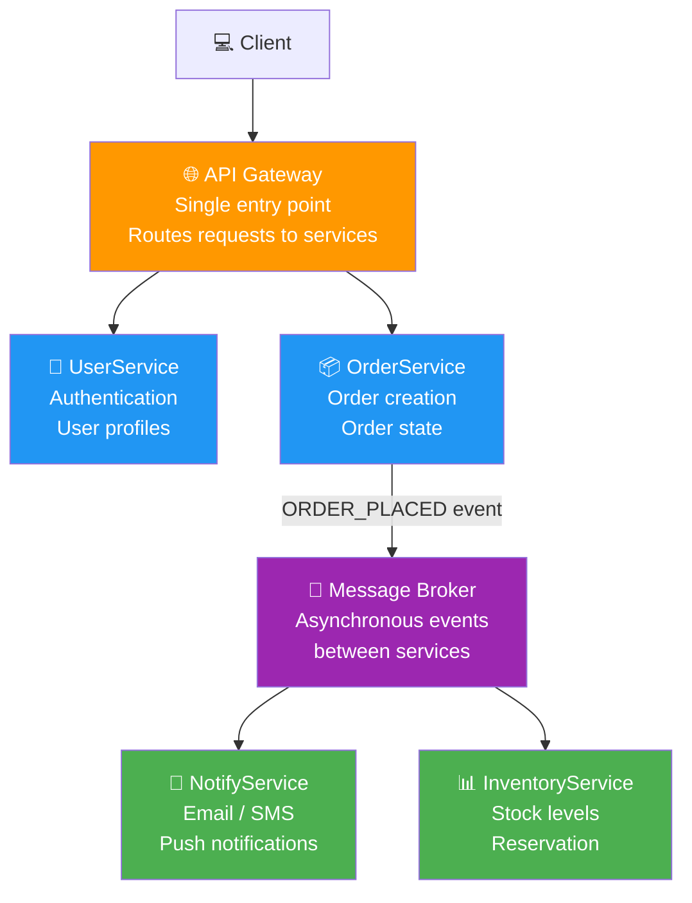
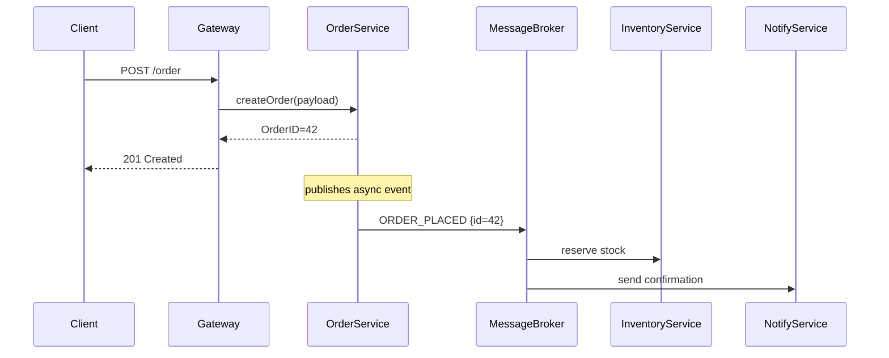
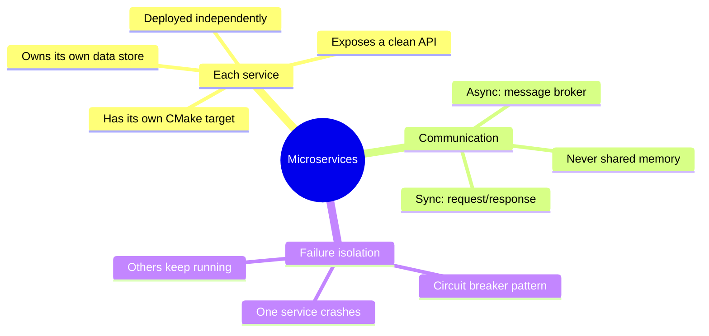

# 04 · Microservices Architecture

> Each service owns one capability.  
> Services communicate via messages — not function calls.  
> A service can fail, restart, or be replaced without touching others.

---

## Structure

---

## Synchronous vs Asynchronous Communication

---

## Service Boundaries

---

## When to Use

✅ Large teams — each team owns one service  
✅ When services scale independently (OrderService needs 10x NotifyService)  
✅ When you need to deploy parts independently  
❌ Small teams — monolith first, extract services when needed  
❌ High-frequency inter-service calls — latency adds up  
❌ Transactions spanning services — distributed transactions are painful  

---

## In This Example

Simulated in-process using a **MessageBroker** class (queue + dispatch).  
Each `Service` class runs in its own method scope — simulating independent deployment.  
In production: replace `MessageBroker` with RabbitMQ, Kafka, or MCX message queue.
