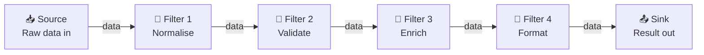
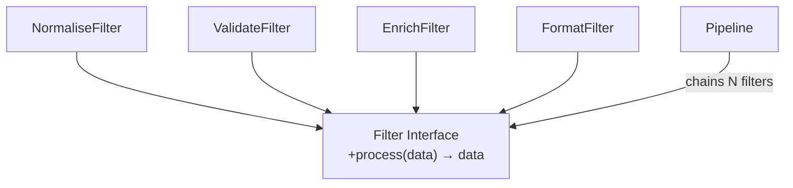
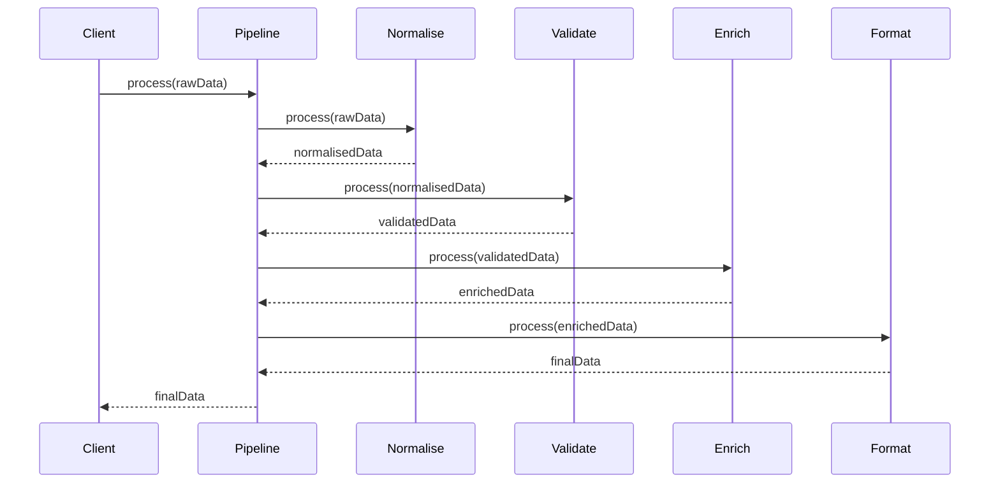

# 05 · Pipe and Filter Architecture

> Data enters one end.  
> Each filter transforms it and passes it on.  
> Filters know nothing about each other.  
> This is how Unix pipes work. This is how FFmpeg works.

---

## Structure

---

## Each Filter Is Independent

---

## Pipeline Composition

---

## Real-World Mappings

| Domain | Source | Filters | Sink |
|---|---|---|---|
| Unix shell | `cat file` | `grep` → `awk` → `sort` | `> output.txt` |
| FFmpeg | video file | decode → scale → encode | output file |
| Compiler | source code | lex → parse → optimise → codegen | binary |
| MCX audio | mic input | resample → encode → encrypt → packetise | network |
| This example | raw sensor strings | normalise → validate → enrich → format | report |

---

## When to Use

✅ Data transformation pipelines  
✅ Compilers, codecs, signal processing  
✅ When you want to add/remove/reorder processing steps easily  
✅ Testable — each filter tested independently  
❌ When steps are tightly coupled and must share complex state  
❌ When the overhead of passing data between stages matters  
