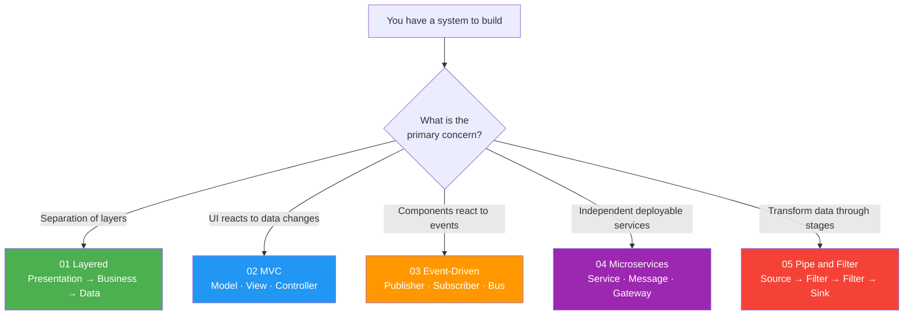
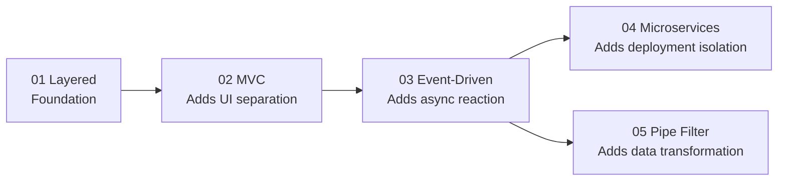

# Architectural Patterns

> How to structure a system at the highest level.  
> These patterns decide how your components talk to each other — before you write a single class.

---

## What Is an Architectural Pattern?

A design pattern solves a problem inside a class or a few classes.  
An architectural pattern solves a problem across an **entire system**.

---

## Patterns at a Glance

| # | Pattern | Key idea | Real-world example |
|---|---|---|---|
| 01 | Layered | Each layer only talks to the layer below | OS kernel, web backend |
| 02 | MVC | Data, display, and logic are separate objects | GUI apps, web frameworks |
| 03 | Event-Driven | Components communicate via events, not direct calls | MCX PTT dispatch, Qt signals |
| 04 | Microservices | Each function is an independent process | Cloud backends, APIs |
| 05 | Pipe & Filter | Data flows through a chain of transformations | FFmpeg, Unix pipes, compilers |

---

## Learning Path

