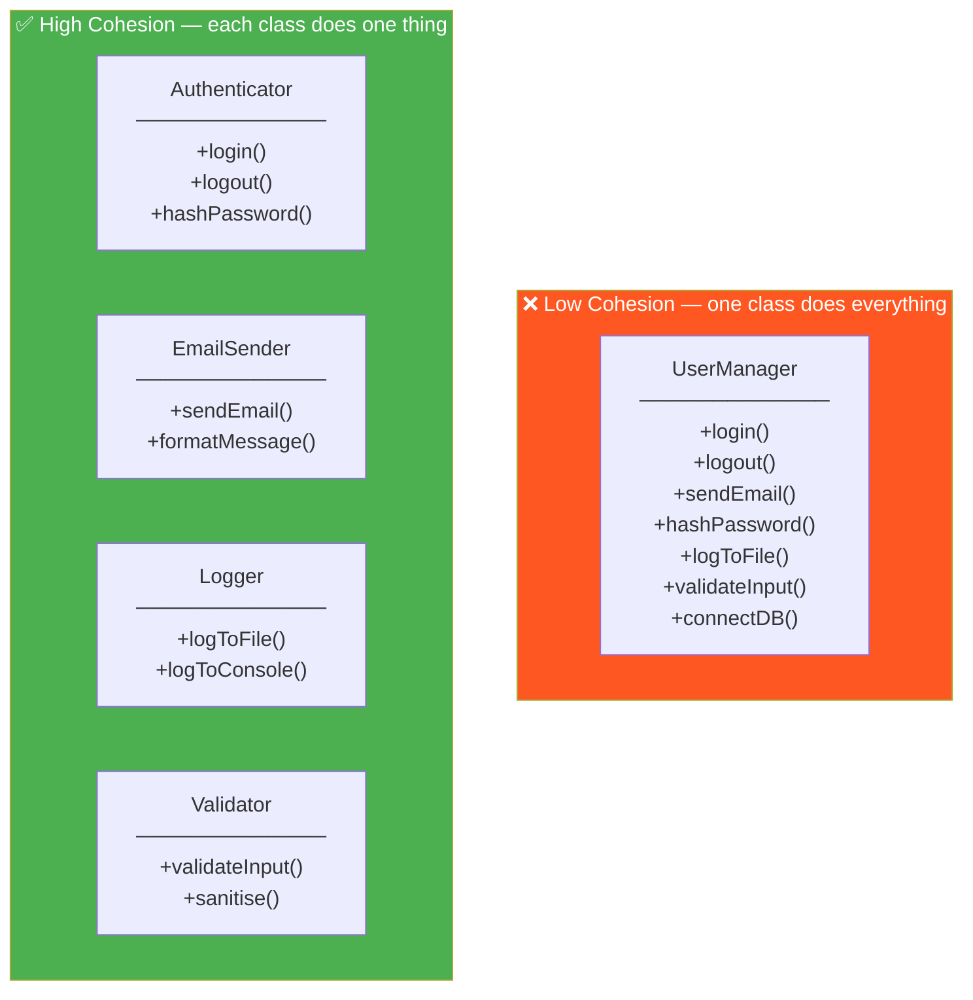
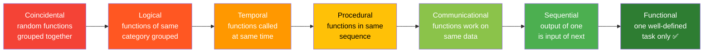
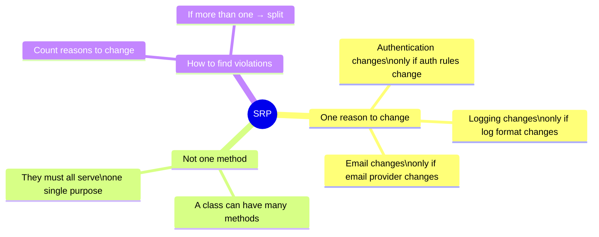

# 01 · Cohesion

> A class should have **one reason to change**.  
> If you can describe what a class does and the sentence needs the word "and" — it has low cohesion.

---

## High vs Low Cohesion

---

## Types of Cohesion (worst → best)

---

## The Single Responsibility Principle

Cohesion is the *metric*. SRP is the *rule*:

---

## When to Split a Class

| Signal | Action |
|---|---|
| Method uses only 2 of 10 fields | Extract those 2 fields + method into new class |
| You test half the class in one test file and half in another | Split the class |
| The class name contains "And", "Manager", "Handler", "Util" | Rename and split |
| Changing email logic risks breaking auth logic | Separate immediately |

---

## C++ Specific

In C++, low cohesion often shows up as:
- Massive header files with 30+ methods
- `#include` chains pulling in unrelated dependencies
- `namespace utils { ... }` with hundreds of unrelated free functions

The fix: small focused classes, each in its own header.
