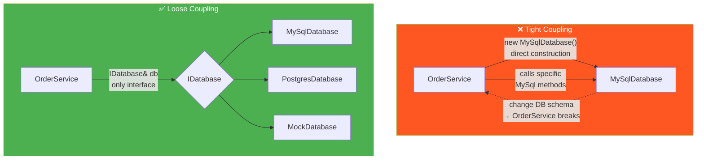
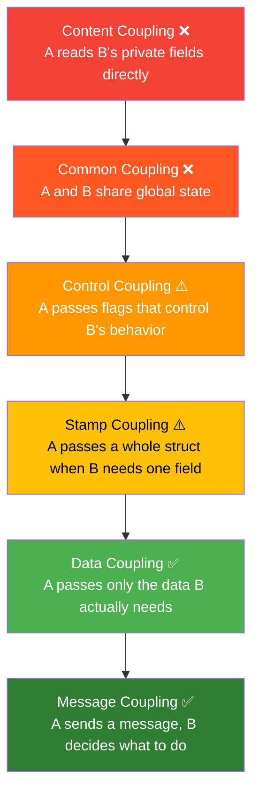
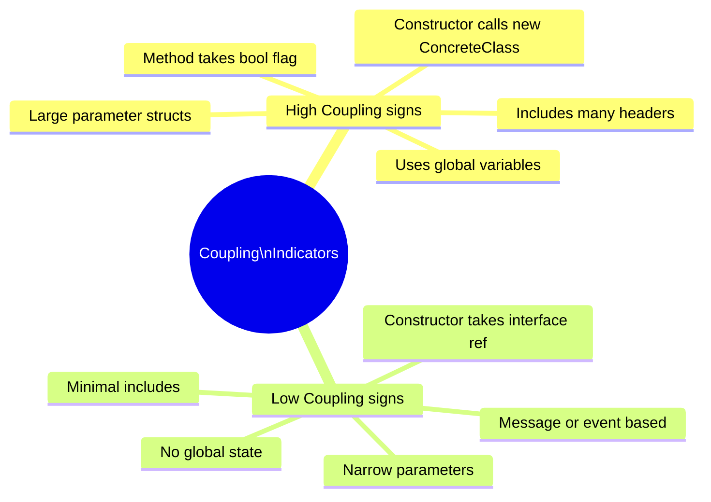
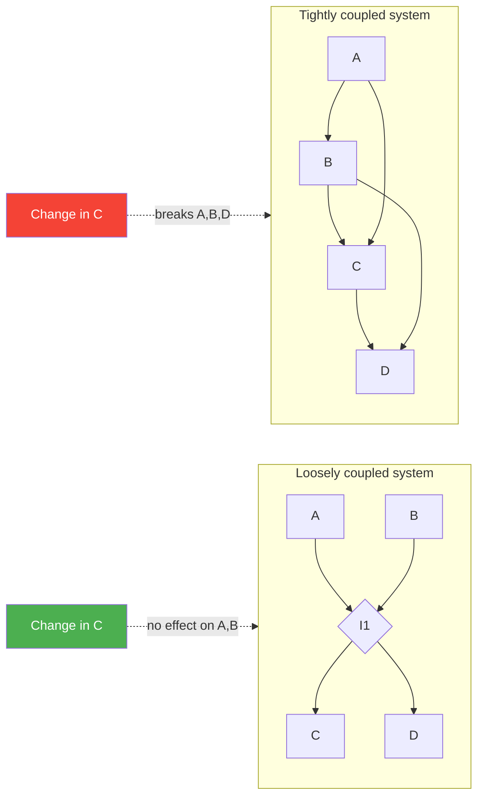

# 02 · Coupling

> Coupling measures how much one component **knows** about another.  
> The more it knows, the more it breaks when the other changes.  
> Low coupling = components that can evolve independently.

---

## Tight vs Loose Coupling

---

## Types of Coupling (worst → best)

---

## Coupling Metrics

---

## The Ripple Effect

---

## When Coupling Is Unavoidable

Some coupling is necessary and healthy:

| Type | Example | Verdict |
|---|---|---|
| Interface coupling | `ILogger& log` | ✅ Good — depend on abstraction |
| Data coupling | Pass `int id` not whole `User` struct | ✅ Good — minimal data |
| Concrete coupling | `std::vector`, `std::string` | ✅ OK — stable standard types |
| Framework coupling | Qt signals/slots | ⚠️ Acceptable — framework is stable |
| Concrete coupling | `MySqlDatabase db` | ❌ Bad — tight to one vendor |
