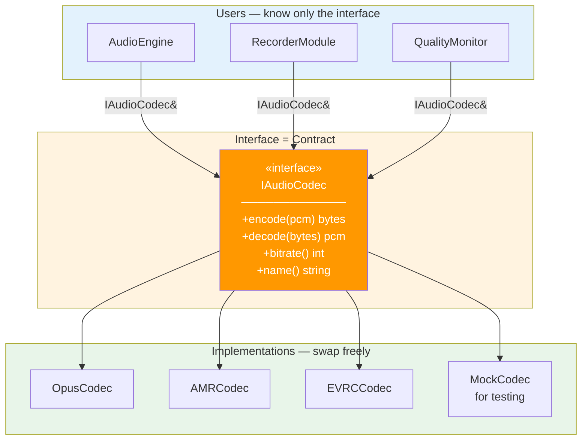
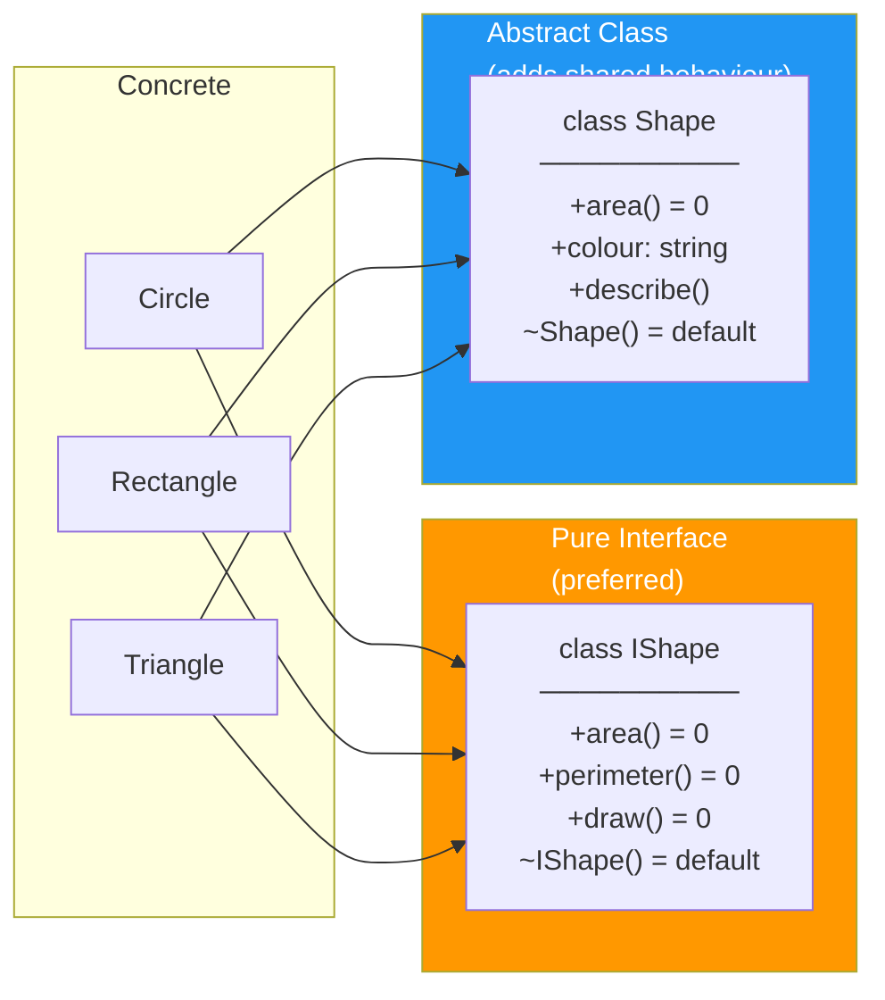
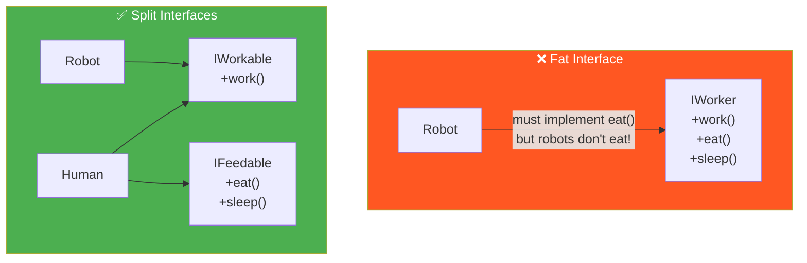

# 03 · Interfaces — Program to Abstractions

> Never depend on a concrete class when you can depend on a contract.  
> An interface defines **what** something does.  
> The implementation defines **how** it does it.  
> Callers only need to know *what*.

---

## Interface as Contract

---

## Interface vs Abstract Class in C++

| | Pure Interface | Abstract Class |
|---|---|---|
| Has data members | ❌ | ✅ |
| Has implemented methods | ❌ | ✅ |
| Multiple inheritance | ✅ safe | ⚠️ diamond risk |
| Use when | Contract only | Shared behaviour + contract |

---

## Interface Segregation (ISP)

Don't force classes to implement methods they don't need:

---

## When to Define an Interface

| Question | If yes → interface |
|---|---|
| Will this be mocked in tests? | ✅ |
| Could implementation swap later? | ✅ |
| Do multiple classes do the same thing differently? | ✅ |
| Is this a stable, well-understood contract? | ✅ |
| Is there only ever one implementation and it never changes? | ❌ skip it |
