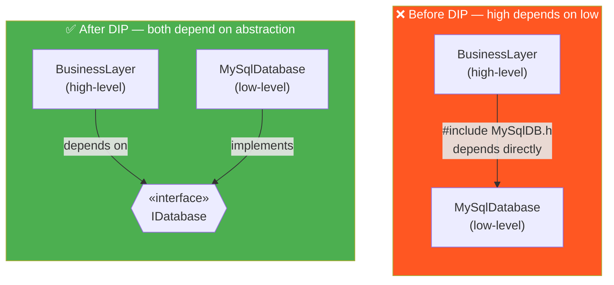
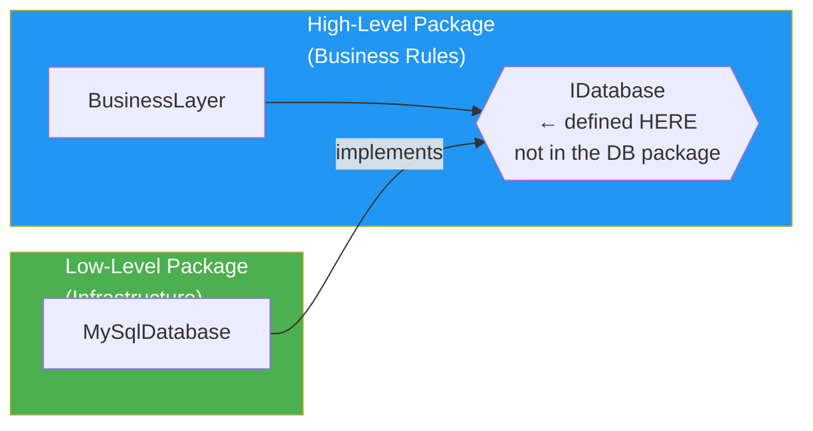
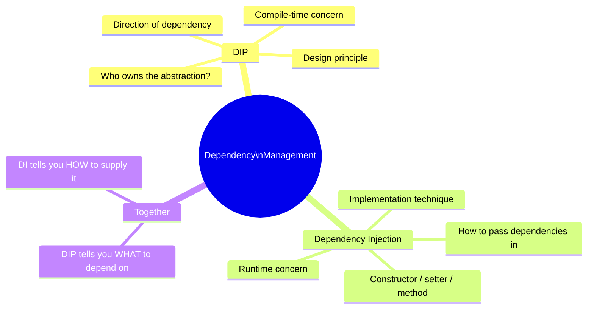
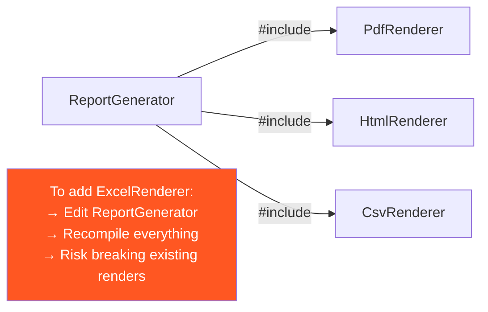
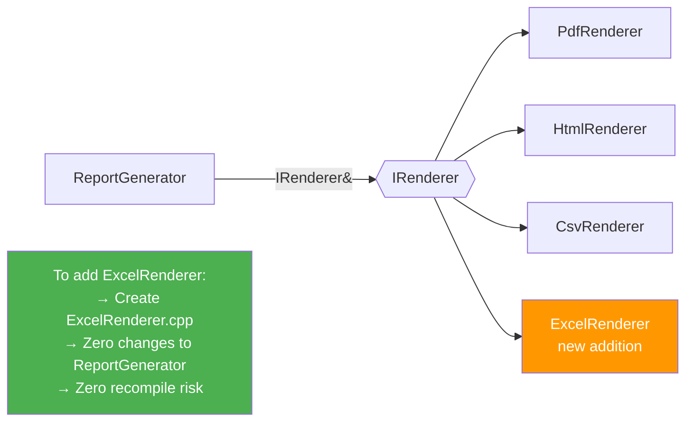

# 04 · Dependency Inversion Principle (DIP)

> **High-level modules should not depend on low-level modules.**  
> Both should depend on abstractions.  
> Abstractions should not depend on details.  
> Details should depend on abstractions.  
> — Robert C. Martin

---

## The Inversion

---

## Who Owns the Interface?

This is the key insight of DIP — the **high-level module owns the interface**.

The arrow of dependency now points **from low-level toward high-level** — it is *inverted* from the naive approach.

---

## DIP vs Dependency Injection

These are related but different:

---

## Without DIP — The Compile-Time Problem

---

## With DIP — The Open/Closed Result

---

## When to Apply DIP

✅ Any boundary between business logic and infrastructure  
✅ Anything that touches I/O: database, network, file system, hardware  
✅ Anything you want to mock in tests  
✅ Anything that might be swapped: cloud provider, codec, storage backend  
❌ Internal helpers that are stable and never tested in isolation  
❌ Standard library types — `std::vector`, `std::string` are stable enough  
