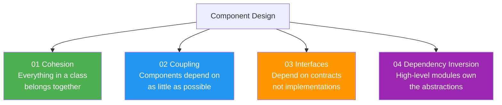

# Component Design

> Architectural patterns decide how systems are shaped.  
> Component design decides how each **piece** is built internally.  
> These are the rules that make individual components clean, testable, and replaceable.

---

## The Four Principles

---

## How They Relate

---

## Quick Reference

| Principle | Bad smell | Good sign |
|---|---|---|
| Cohesion | Class does 5 unrelated things | Class has one clear reason to change |
| Coupling | Changing A breaks B, C, D | Changing A has zero effect on B |
| Interfaces | `new ConcreteClass` everywhere | `IService* svc` everywhere |
| Dep. Inversion | Business layer imports DB layer | Both import a shared abstract layer |

---

## Learning Order

Start with **Cohesion** — it forces you to split large classes.  
Then **Coupling** — it forces you to reduce dependencies.  
Then **Interfaces** — the tool that makes low coupling possible.  
Then **Dependency Inversion** — the architectural rule that locks it all in.
