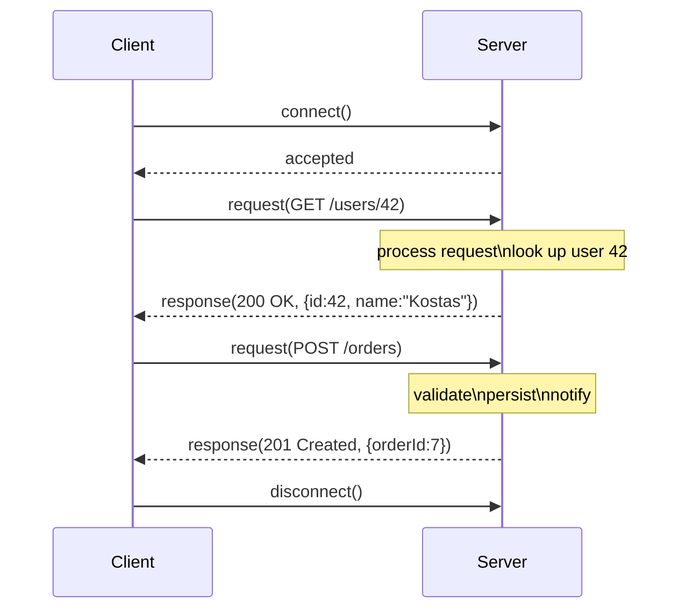
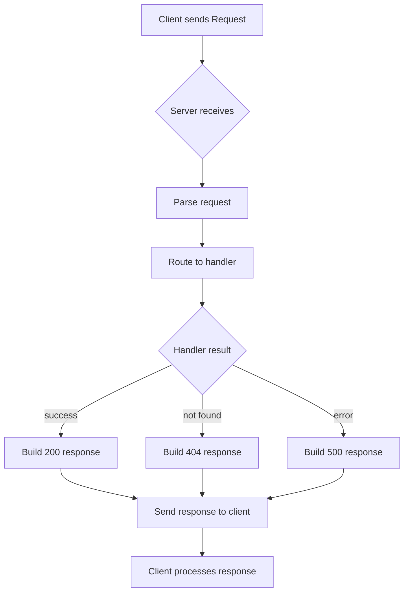
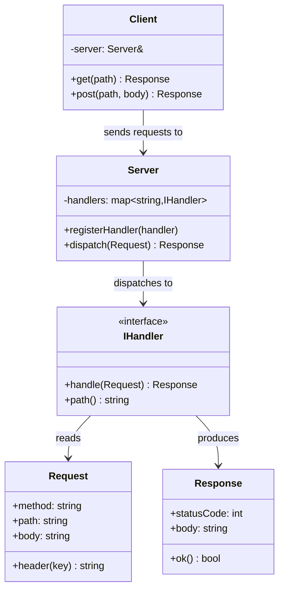
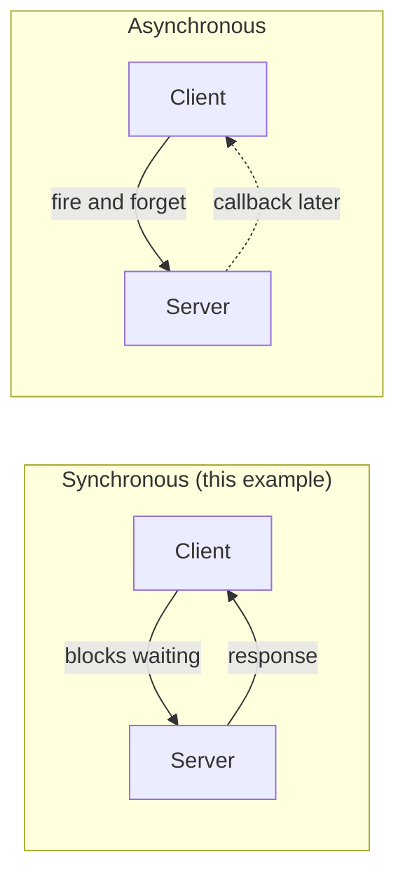

# 01 · Client-Server

> The client asks. The server answers.  
> The most fundamental distributed pattern — everything else builds on top of it.

---

## Structure

---

## Request-Response Lifecycle

---

## C++ Class Map

---

## Synchronous vs Asynchronous

---

## When to Use

✅ Simple request/response interactions  
✅ When the client needs the result before continuing  
✅ HTTP APIs, database queries, MCX SIP registration  
❌ When the server takes too long — client blocks  
❌ When you need broadcast (one → many) — use Pub-Sub instead
