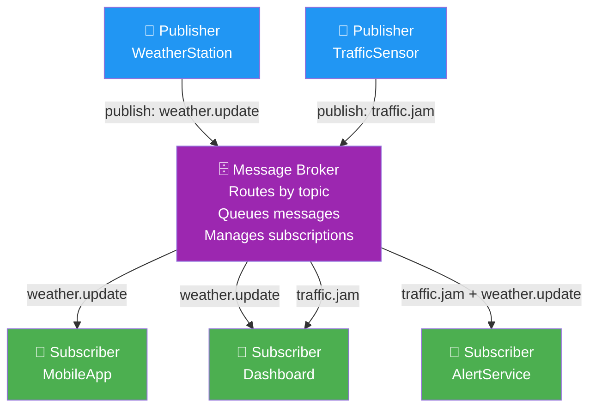
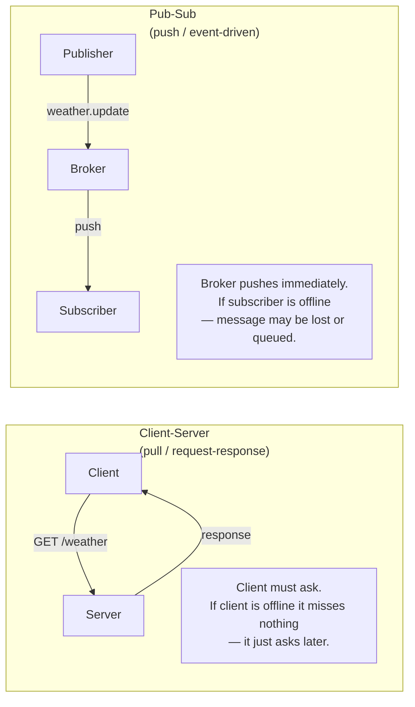
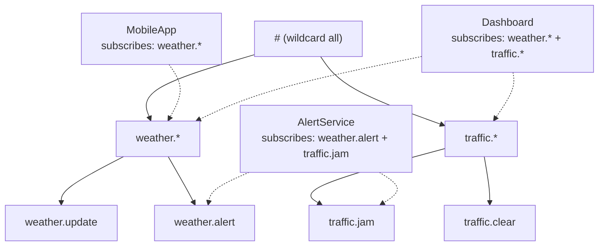

# 02 · Publish-Subscribe

> Publishers emit topics. Subscribers listen to topics.  
> They never know each other exist.  
> The broker is the only shared infrastructure.

---

## Structure

---

## Client-Server vs Pub-Sub

---

## Topic Hierarchy

---

## Message Delivery Guarantees

| Mode | Behaviour | Use case |
|---|---|---|
| At-most-once | May lose messages | Live telemetry, metrics |
| At-least-once | May duplicate | Orders, commands |
| Exactly-once | No loss, no duplication | Financial transactions |

*This example implements at-most-once (fire-and-forget).*

---

## When to Use

✅ One event → multiple independent consumers  
✅ MCX group call dispatch — one PTT event → audio + display + logger  
✅ IoT sensor data → multiple dashboards  
✅ When publishers and subscribers must be decoupled in time and space  
❌ When you need a guaranteed reply from a specific recipient — use Client-Server  
❌ When message order within a topic is critical and strict — use a queue
