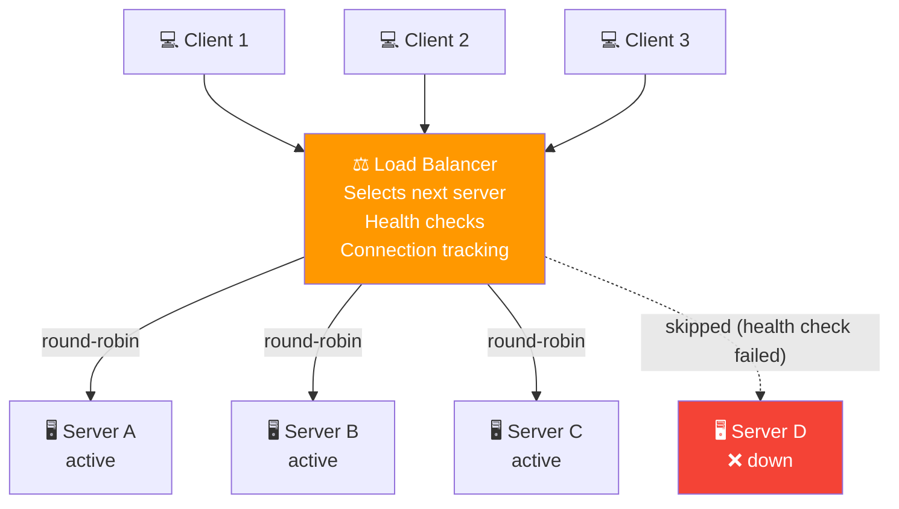
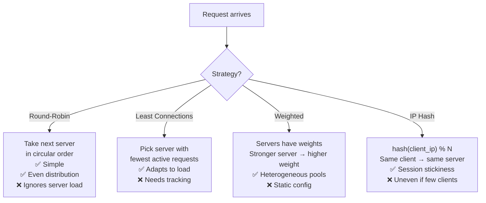
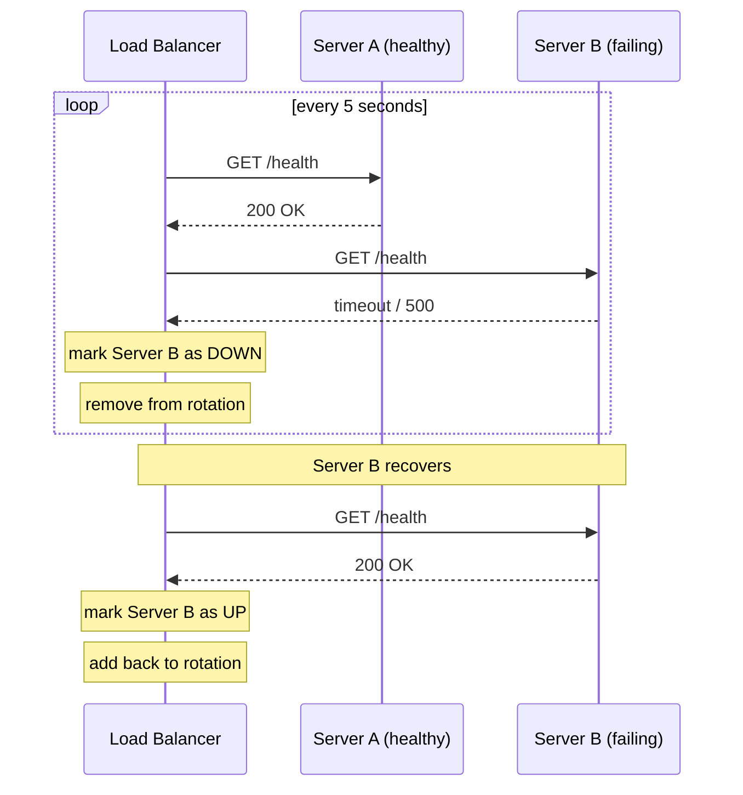

# 03 · Load Balancing

> One server cannot handle infinite load.  
> A load balancer distributes requests across a pool of servers.  
> When a server fails, the balancer routes around it automatically.

---

## Structure

---

## Balancing Algorithms

---

## Health Checks

---

## When to Use

✅ High-traffic services that need horizontal scaling  
✅ Zero-downtime deployments — remove one server, update, add back  
✅ Geographic distribution — route to nearest server  
✅ MCX: multiple dispatch servers handling call setup load  
❌ Single-server systems with no replication  
❌ When session state can't be shared across servers (solve with sticky sessions or shared cache)
