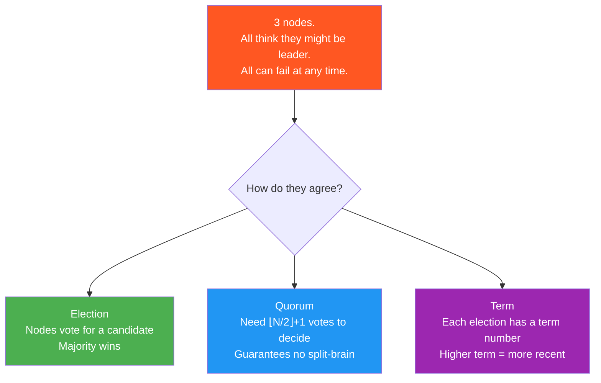
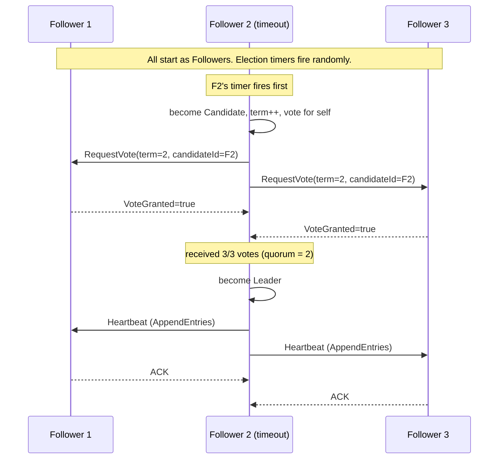
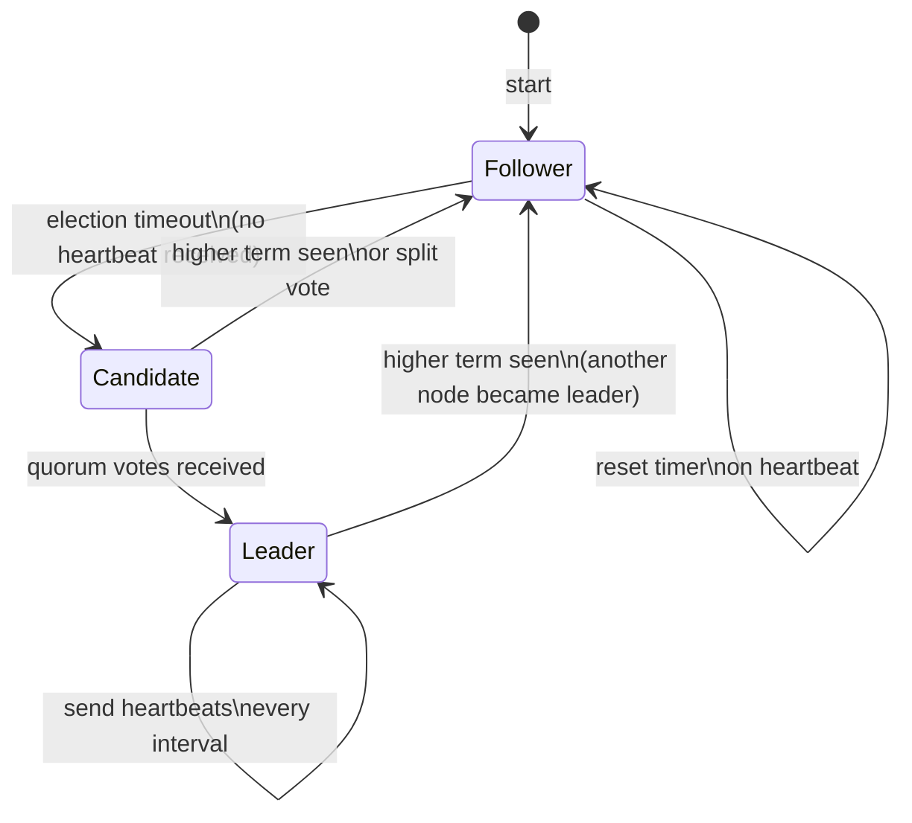
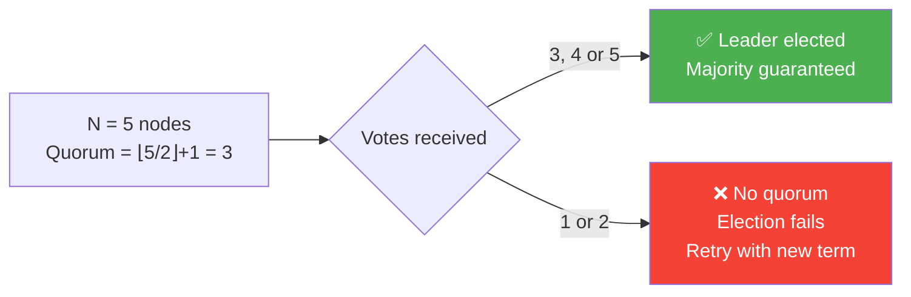

# 04 · Consensus Basics — Leader Election

> In a distributed system, nodes must sometimes **agree** on one thing.  
> Who is the leader? Which value is committed? Is this transaction valid?  
> Consensus is the mechanism by which they agree — even when some nodes fail.

---

## The Problem

---

## Raft Leader Election (simplified)

---

## State Machine

---

## Quorum Rule

---

## Why Quorum Prevents Split-Brain

If you need a majority to elect a leader:  
- At most **one** partition can have a majority  
- Two leaders cannot exist simultaneously  
- This is the core safety guarantee of Raft, Paxos, and ZooKeeper

---

## When to Use

✅ Distributed databases — who accepts writes?  
✅ Service registries — which node is the primary?  
✅ MCX MCPTT — which dispatch server is active in an HA cluster?  
✅ Any system where exactly one node must be authoritative  
❌ Single-node systems — no consensus needed  
❌ When eventual consistency is acceptable — use simpler gossip protocol
