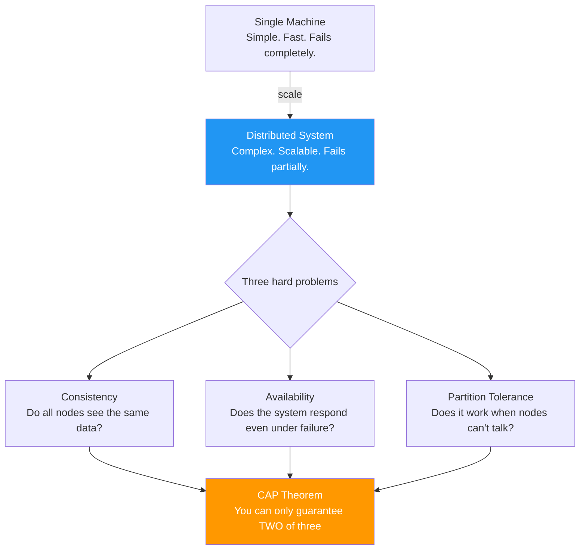
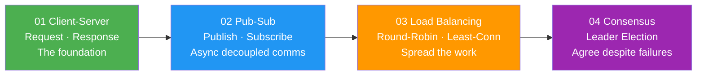

# Distributed Systems

> A single machine has limits — CPU, memory, bandwidth, uptime.  
> Distributed systems spread work across many machines.  
> The cost: you must now deal with **partial failures, network delays, and consistency**.

---

## The Core Challenge

---

## What Is in This Section

---

## Quick Reference

| Pattern | Sync/Async | Failure mode | Real examples |
|---|---|---|---|
| Client-Server | Synchronous | Server down → client blocked | HTTP, MCX SIP signalling |
| Pub-Sub | Asynchronous | Broker down → messages lost | MQTT, MCX group calls |
| Load Balancing | Transparent | Node down → traffic rerouted | Nginx, cloud ALB |
| Consensus | Negotiated | Split-brain → quorum decides | Raft, ETCD, ZooKeeper |

---

## All examples are simulated in-process

Real distributed systems use sockets, message queues, and separate processes.  
These examples isolate the **logic and pattern** in pure C++23, no networking required.  
The patterns are identical — only the transport layer changes in production.
