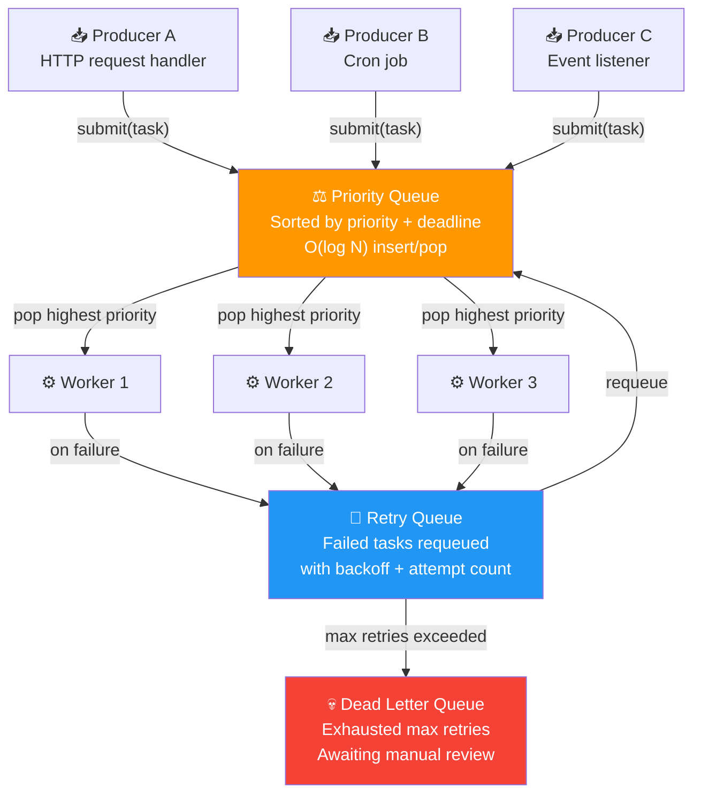
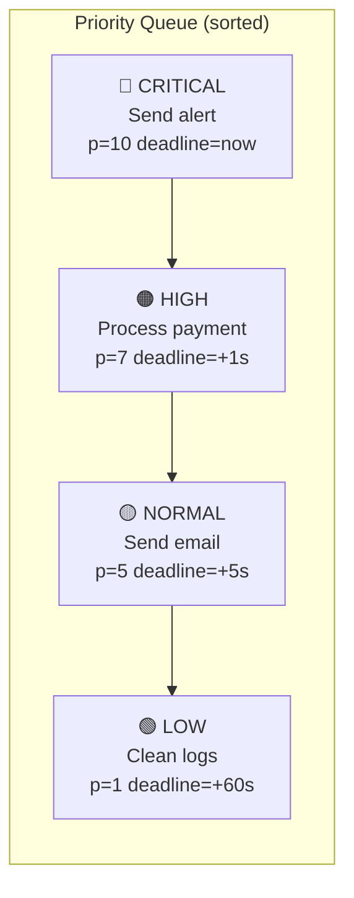
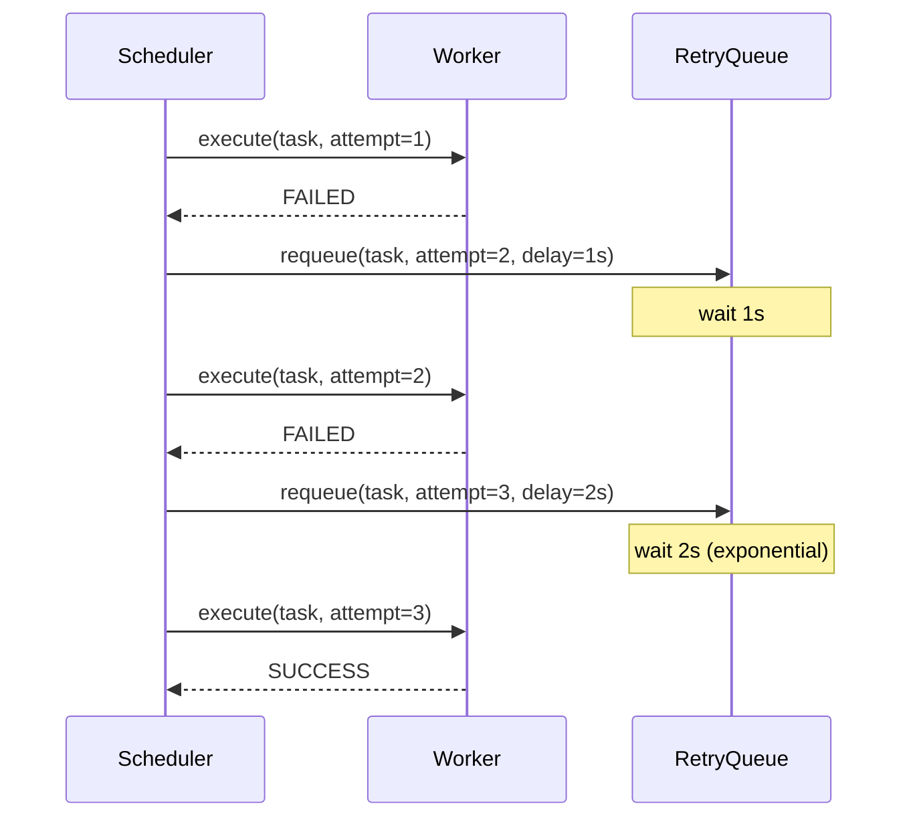
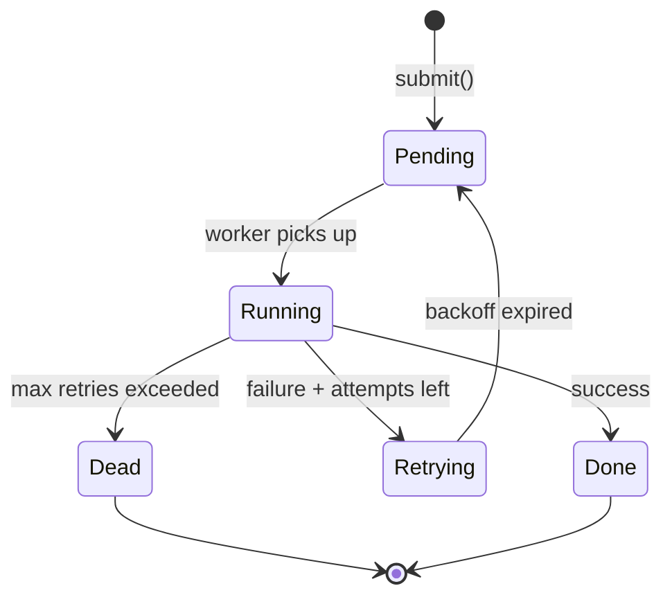

# 02 · Task Scheduler

> A real system always has more work than it can do right now.  
> A task scheduler decides **what runs next**, **when**, and **how many times to retry**.

---

## Architecture

---

## Priority + Deadline Ordering

---

## Retry with Exponential Backoff

---

## Task Lifecycle

---

## When to Use

✅ Background job processing — email, reports, notifications  
✅ Rate-limited external APIs — queue and throttle  
✅ MCX — queue call setup requests by group priority  
✅ Any system where tasks arrive faster than they can be processed  
❌ Real-time hard deadlines — use a RTOS scheduler instead  
❌ Simple sequential scripts with no concurrency
