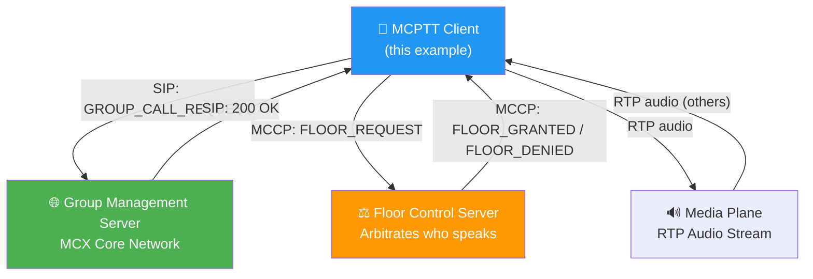
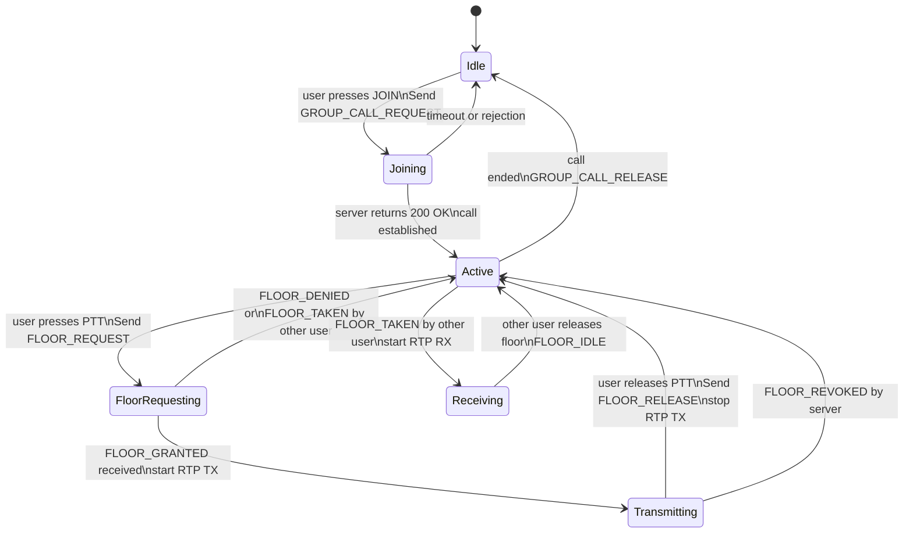
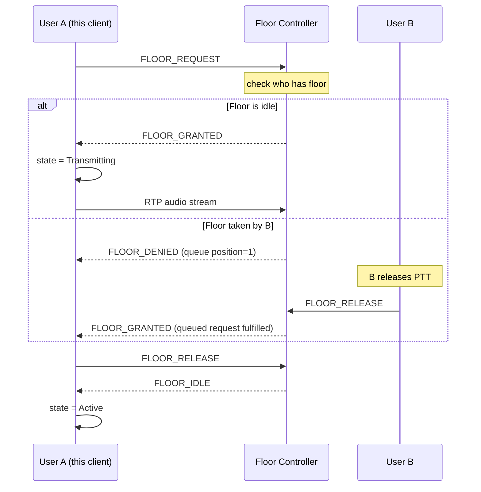

# 03 · PTT Simplified — Push-to-Talk State Machine

> A real MCX/MCPTT client manages a call state machine.  
> This is a simplified but architecturally faithful simulation of  
> how a MCPTT client handles a group call with PTT arbitration.

---

## MCX Group Call Architecture

---

## Call State Machine

---

## Floor Control Arbitration

---

## Patterns Used

| Pattern | Where |
|---|---|
| State Machine | `ClientState` enum + `transition()` |
| Event-Driven | `FloorController` emits events to client |
| Layered | Signalling layer / Floor layer / Media layer |
| Observer | Client subscribes to floor events |

---

## Real MCX Standards Reference

This example simplifies ETSI TS 124 380 (MCPTT floor control) and  
3GPP TS 23.280 (MCX common architecture).  
Real implementations use SIP/SDP for call setup and RTCP for floor control.
