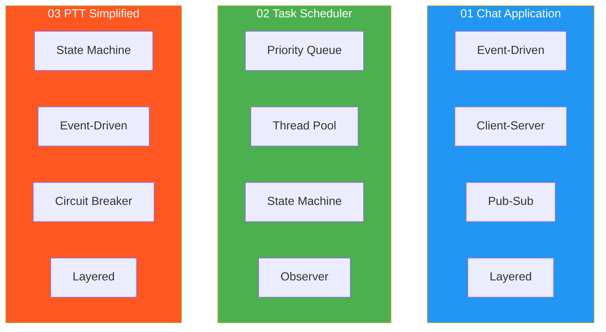

# Real-World Examples

> Theory applied to real systems.  
> Each example combines **multiple patterns** from previous sections  
> into one coherent, working program.

---

## Pattern Usage Map

---

## Why These Three

| Example | Why it matters to you |
|---|---|
| Chat Application | Classic distributed system — taught in every system design interview |
| Task Scheduler | Priority queues + threads — core of any real-time system |
| PTT Simplified | Your MCX domain — state machine driving a PTT floor control session |
