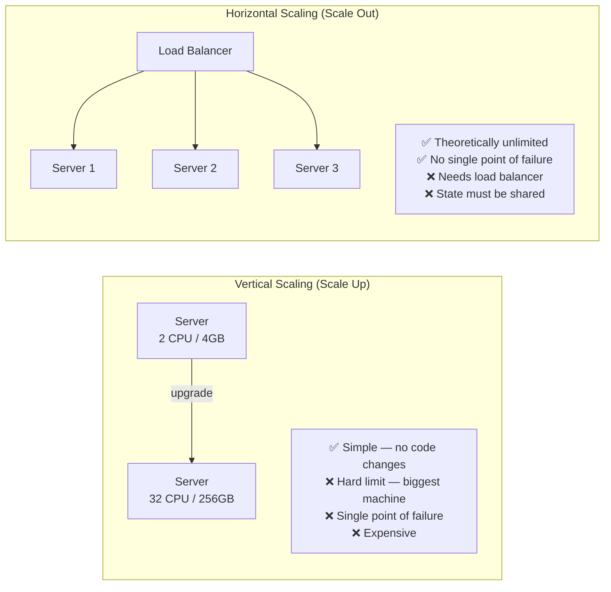
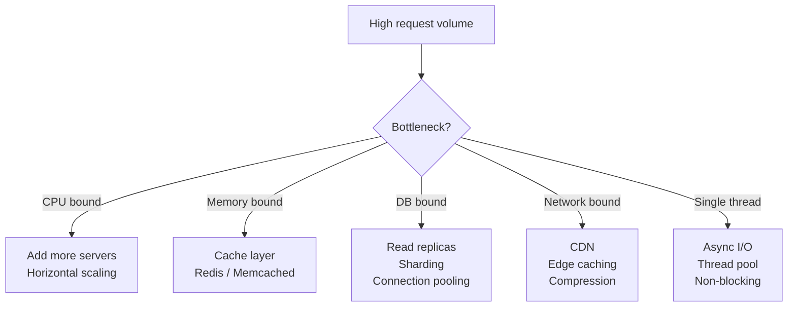
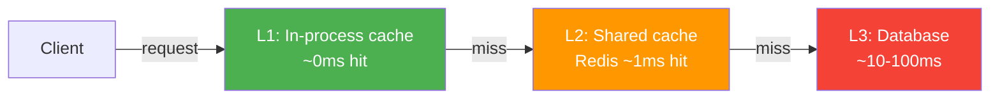
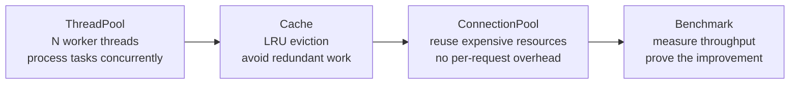

# 01 · Scalability

> Scalability is the ability to handle **growing load** without degrading performance.  
> The question isn't "does it work now?" — it's "does it work at 10x load?"

---

## Vertical vs Horizontal Scaling

---

## The Scalability Bottlenecks

---

## Caching Layers

---

## What This Example Shows

---

## When to Think About Scalability

✅ Before you hit the wall — add caching before latency degrades  
✅ When one component is clearly the bottleneck — profile first  
✅ When designing the data model — sharding later is painful  
❌ Premature optimisation — build simple first, scale when needed  
❌ Scaling what isn't measured — always profile before optimising
