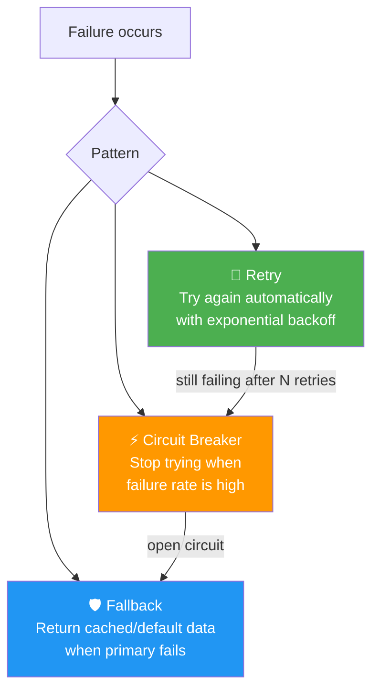
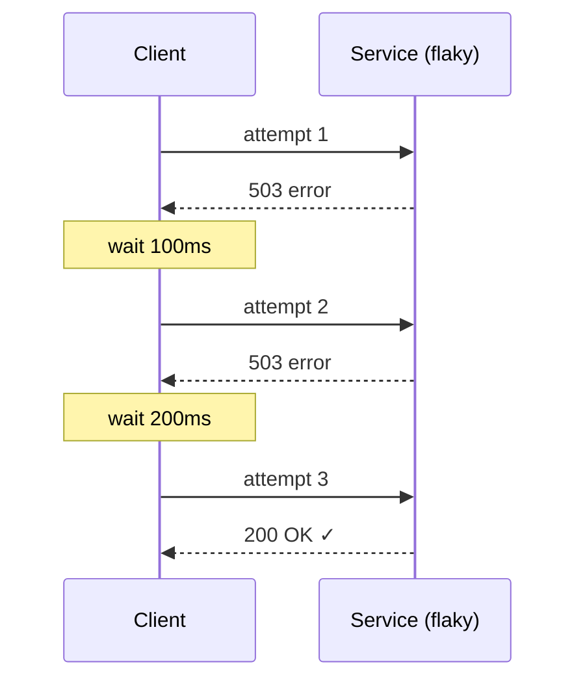
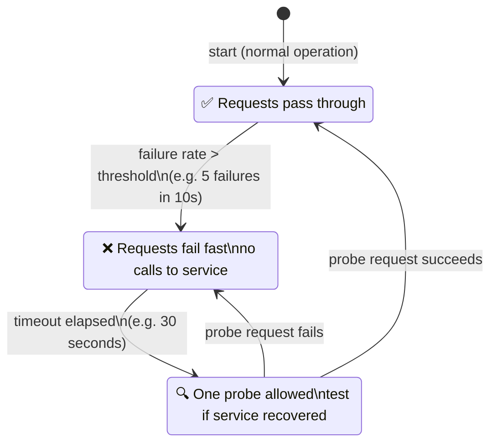
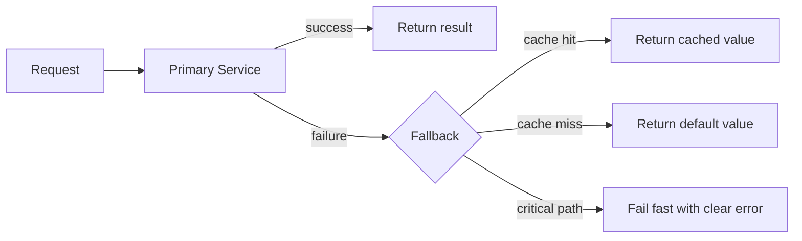

# 02 · Reliability

> A reliable system keeps working **when things go wrong**.  
> Not if — when. Networks fail. Services crash. Disks fill up.  
> Reliability patterns are your safety nets.

---

## The Three Patterns

---

## Retry with Exponential Backoff

---

## Circuit Breaker States

---

## Fallback Strategy

---

## When to Use Each

| Pattern | Use when | Don't use when |
|---|---|---|
| Retry | Transient failures (network blip) | Service is truly down (wastes resources) |
| Circuit Breaker | Known-flaky downstream service | The call is critical and has no alternative |
| Fallback | User-facing features with degraded mode | The result must be accurate (financial data) |
