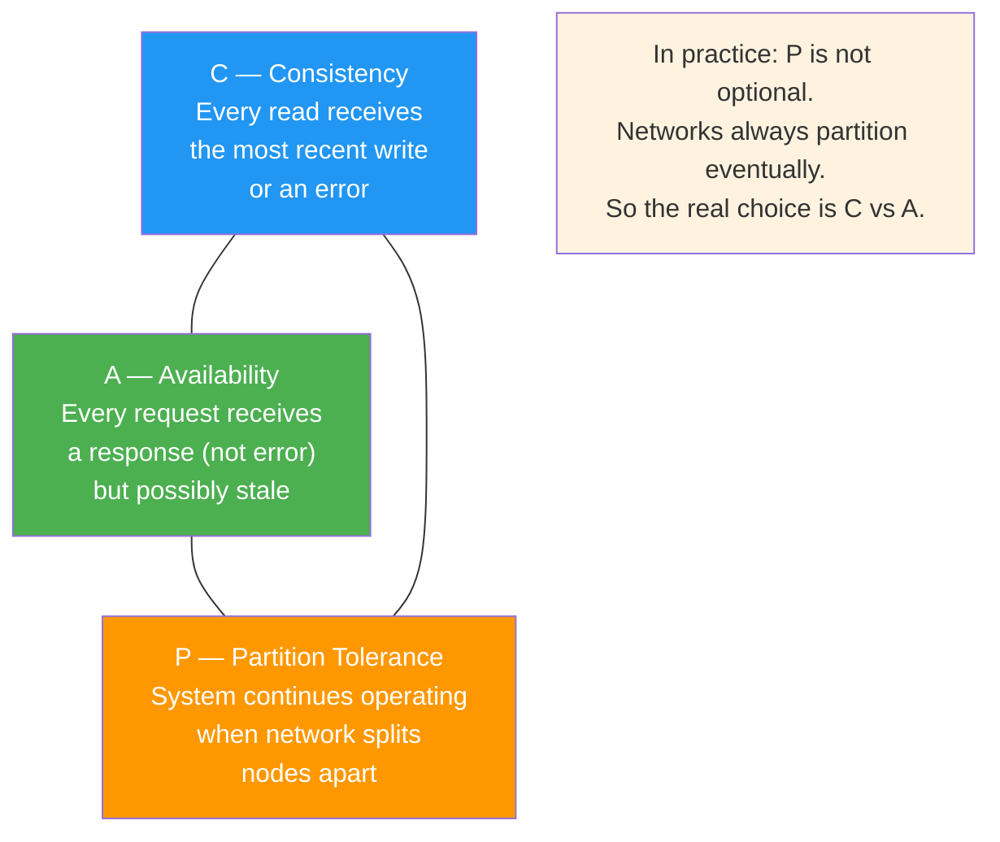
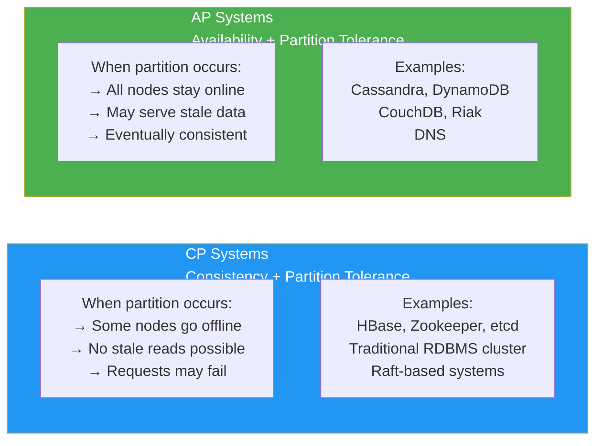
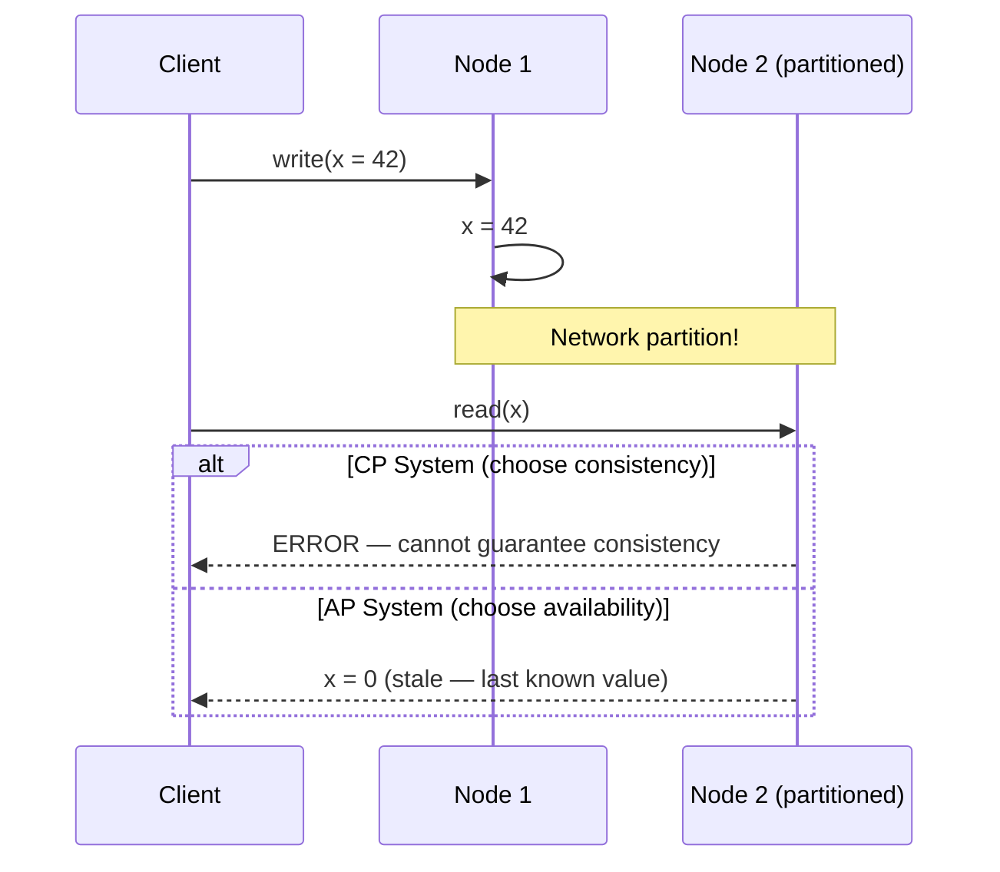
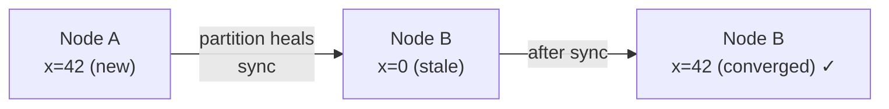

# 03 · CAP Theorem

> In a distributed system you can only **guarantee two** of three properties:  
> **C**onsistency · **A**vailability · **P**artition Tolerance  
> — Eric Brewer, 2000

---

## The Triangle

---

## CP vs AP Systems

---

## What Happens During a Partition

---

## Eventual Consistency

AP systems use eventual consistency — after a partition heals, all nodes converge:

---

## Real-World Choice Guide

| Use case | Choose | Reason |
|---|---|---|
| Bank account balance | CP | Wrong balance = fraud |
| Social media likes count | AP | Approximate is fine |
| MCX PTT floor control | CP | Two talkers = catastrophic |
| Product search results | AP | Slightly stale is fine |
| Distributed lock | CP | Must be exclusive |
| User profile display | AP | Eventually correct is OK |
