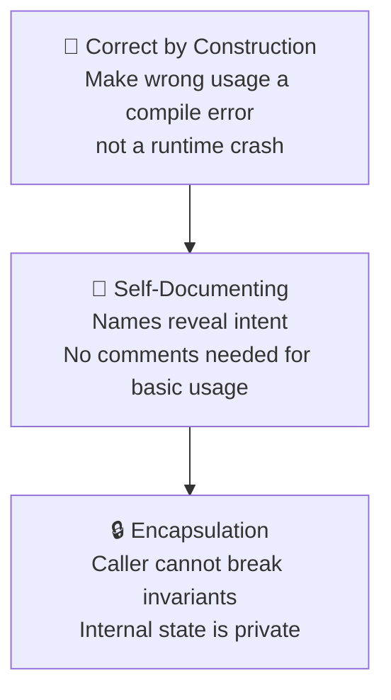
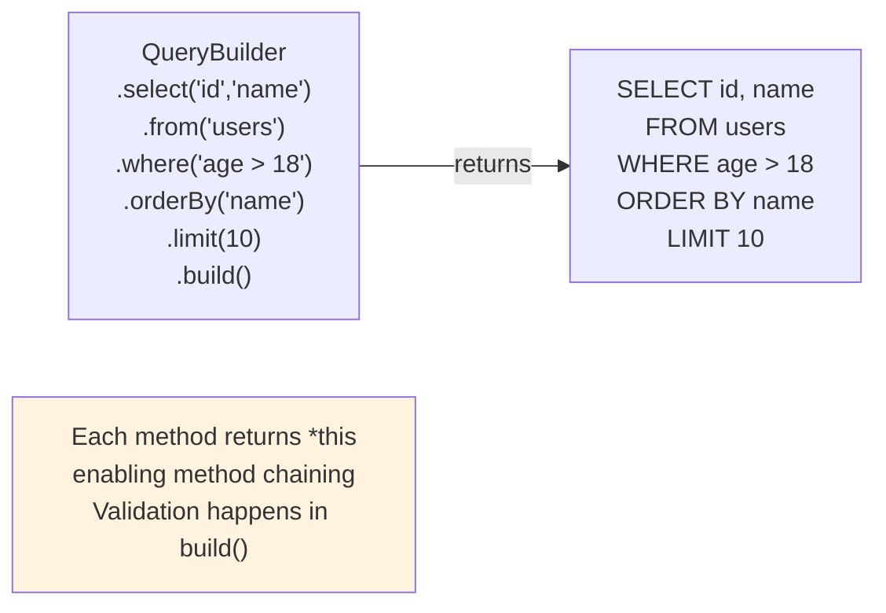
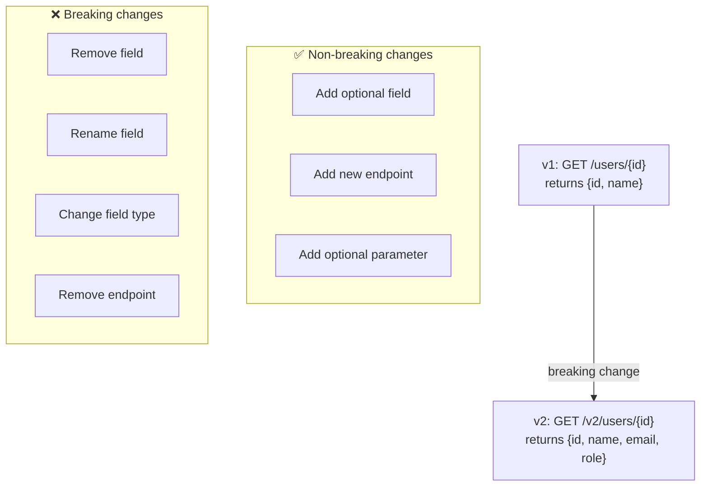
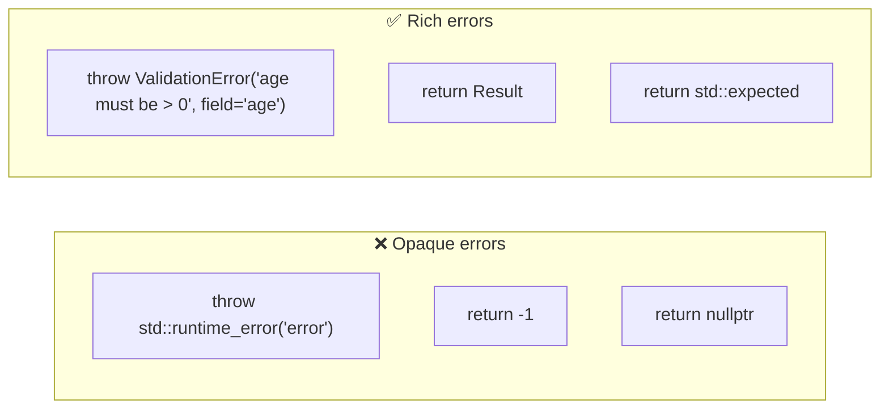

# 04 · API Design

> An API is a **promise** to your callers.  
> A bad API is a promise you'll regret keeping.  
> Good API design makes correct usage obvious and incorrect usage hard to compile.

---

## The Three Layers of a Good API

---

## Fluent Interface — Builder Pattern

---

## Versioning Strategy

---

## Error Design

---

## API Design Rules

| Rule | Bad | Good |
|---|---|---|
| Name reveals intent | `process()` | `validateAndSave()` |
| Fail loudly | Return -1 on error | Throw typed exception |
| Immutable returns | Return raw pointer | Return `const&` or value |
| Narrow inputs | Take `User` struct | Take only needed fields |
| No boolean params | `sort(true)` | `sort(Order::Ascending)` |
| Const-correct | `getName()` modifies state | `getName() const` |
