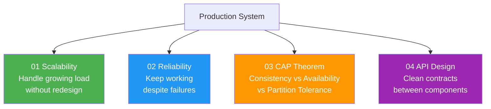

# System Design Principles

> Architectural patterns describe *shapes*.
> System design principles describe *properties* — qualities every production system must have.
> You build the shape first, then you verify it satisfies these properties.

---

## The Four Properties

---

## Quick Reference

| Principle | The question it answers | Key trade-off |
|---|---|---|
| Scalability | Can it handle 10x the load? | Cost vs capacity |
| Reliability | Does it recover from failure? | Complexity vs uptime |
| CAP Theorem | What breaks during a network split? | Consistency vs Availability |
| API Design | Is the contract clean and stable? | Flexibility vs rigidity |

---

## Learning Order

Start with **Scalability** → **Reliability** → **CAP** → **API Design**.
