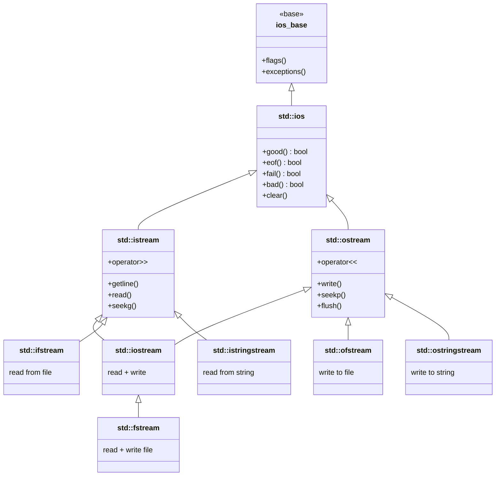
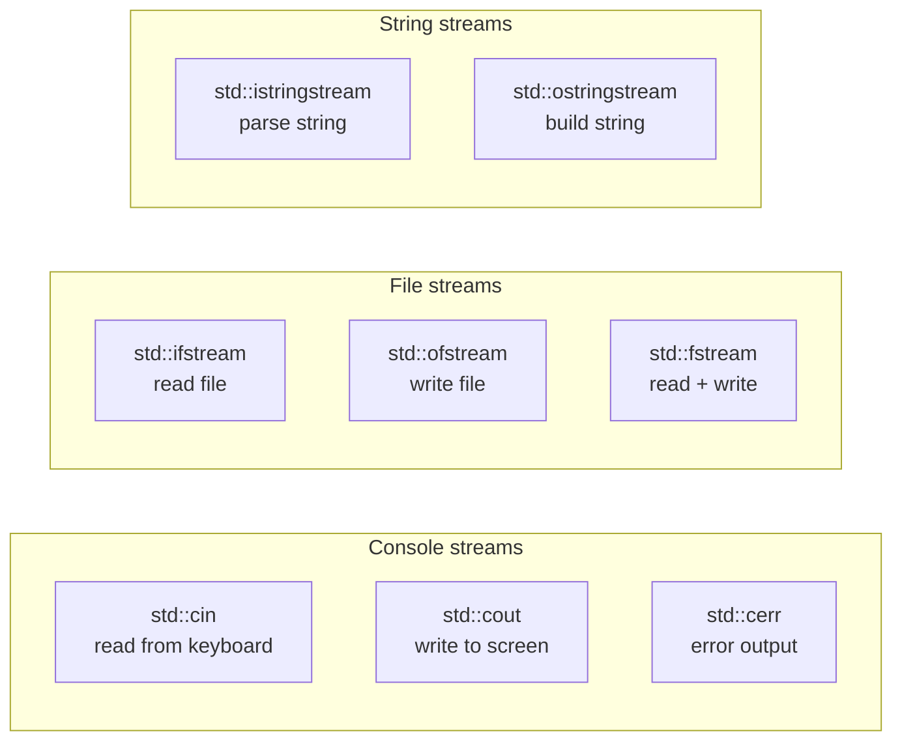
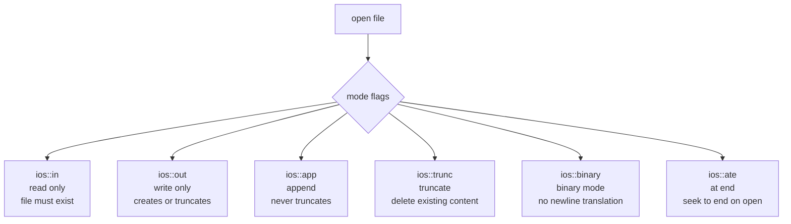
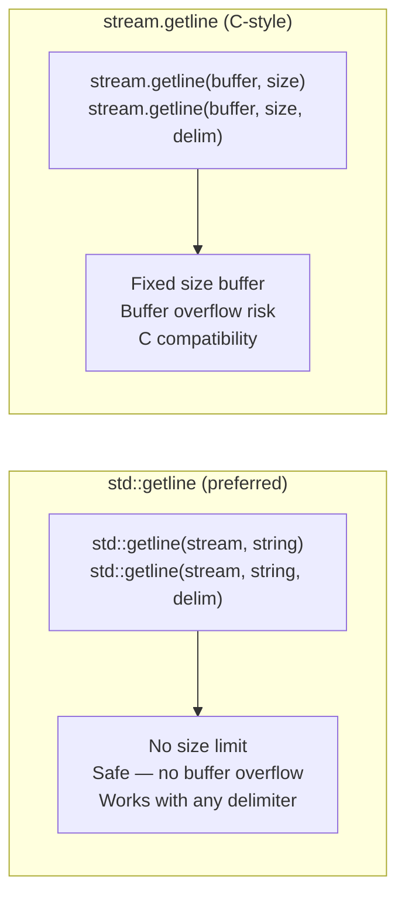
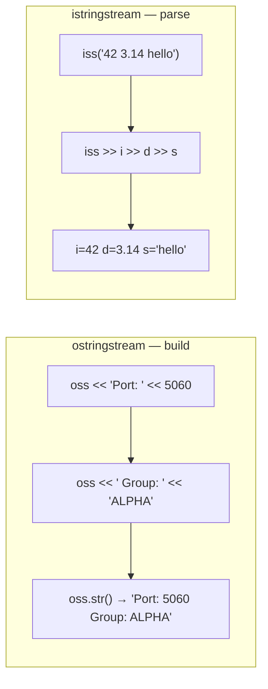
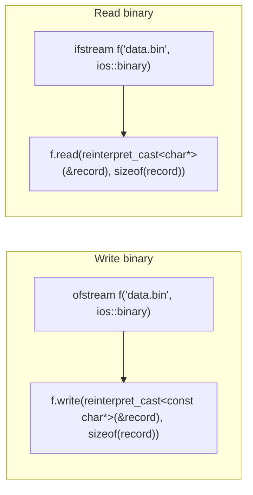
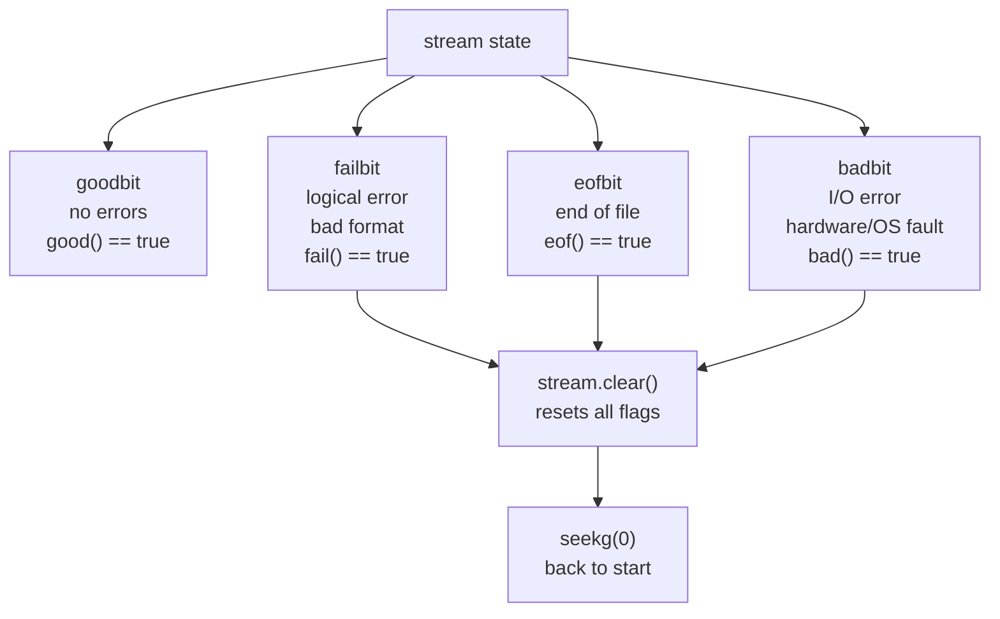
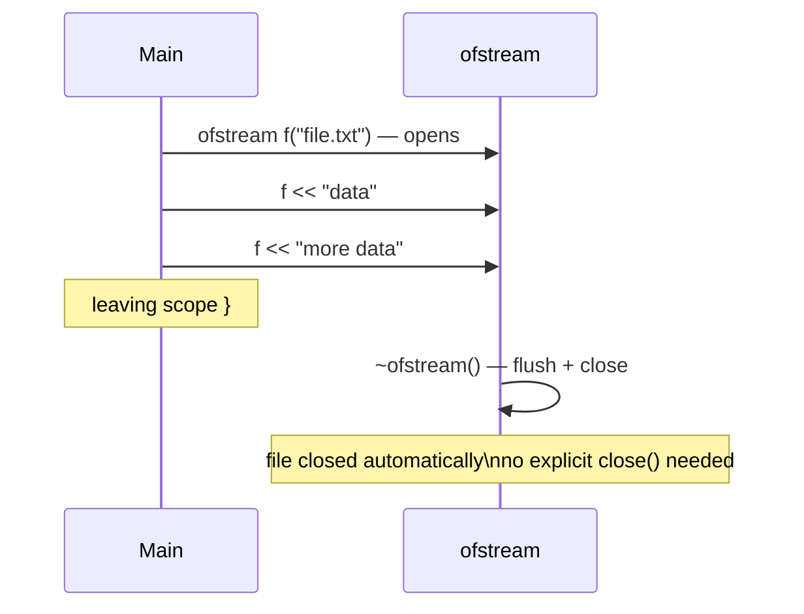

# File and Stream — C++23

## What are Streams?

A **stream** is an abstraction for sequential data flow — reading from or
writing to files, strings, or the console using the same `<<` / `>>` operators.

---

## Stream class hierarchy



---

## Stream types overview



---

## File open modes



| Mode | Effect |
|------|--------|
| `ios::in` | Read — file must exist |
| `ios::out` | Write — creates or truncates |
| `ios::app` | Append — never overwrites |
| `ios::trunc` | Delete existing content |
| `ios::binary` | Raw binary — no `\n` translation |
| `ios::ate` | Start at end of file |

---

## 1. ofstream — write to file

```cpp
std::ofstream outFile("testout.txt");   // creates or truncates

if (!outFile) { /* handle error */ }

outFile << "Line 1: Hello from C++23\n";
outFile << "Port: " << 5060 << "\n";
// file closed automatically when outFile goes out of scope (RAII)
```

---

## 2. ifstream — read from file

```cpp
std::ifstream inFile("testout.txt");

std::string line;
while (std::getline(inFile, line)) {
    std::cout << line << '\n';
}

// Read word by word
inFile.clear();
inFile.seekg(0);   // back to start
std::string word;
while (inFile >> word) { }
```

---

## 3. fstream — read and write

```cpp
std::fstream rwFile("data.txt",
    std::ios::in | std::ios::out | std::ios::trunc);

rwFile << "Alpha\nBeta\n";   // write
rwFile.seekg(0);              // back to start
std::string line;
while (std::getline(rwFile, line)) { }  // read
```

---

## 4. getline — string vs char array



```cpp
// Preferred — std::string, no size limit
std::string line;
std::getline(inFile, line);             // whole line
std::getline(inFile, token, ',');       // up to comma

// C-style — char array, fixed size
char buffer[64];
inFile.getline(buffer, sizeof(buffer)); // max 63 chars
```

---

## 5. String streams — build and parse strings



```cpp
// Build a string
std::ostringstream oss;
oss << "Session: " << "SES-001" << " Port: " << 5060;
std::string result = oss.str();

// Parse a string
std::istringstream iss("42 3.14 hello");
int i; double d; std::string s;
iss >> i >> d >> s;

// Parse CSV
std::istringstream csv("Alice,30,Engineer");
std::string token;
while (std::getline(csv, token, ','))
    std::cout << token << '\n';
```

---

## 6. Binary I/O



```cpp
struct Record { int id; double value; char label[16]; };

// Write
std::ofstream f("data.bin", std::ios::binary);
Record r { 1, 3.14, "alpha" };
f.write(reinterpret_cast<const char*>(&r), sizeof(r));

// Read
std::ifstream g("data.bin", std::ios::binary);
g.read(reinterpret_cast<char*>(&r), sizeof(r));
```

---

## 7. Appending — ios::app

```cpp
// First write
std::ofstream f("log.txt");
f << "[INFO] started\n";

// Later — append without truncating
std::ofstream f2("log.txt", std::ios::app);
f2 << "[WARN] buffer high\n";
f2 << "[ERROR] timeout\n";
// original content preserved
```

---

## 8. std::filesystem — file info

```cpp
namespace fs = std::filesystem;

fs::exists("file.txt")              // true/false
fs::is_regular_file("file.txt")     // not a directory
fs::file_size("file.txt")           // size in bytes
fs::absolute("file.txt")            // full path

// List directory
for (const auto& entry : fs::directory_iterator("."))
    if (entry.is_regular_file())
        std::cout << entry.path().filename() << '\n';
```

---

## 9. Stream state flags



```cpp
std::ifstream f("file.txt");

if (!f)          { /* open failed */ }
if (f.good())    { /* all ok */  }
if (f.eof())     { /* end reached */ }
if (f.fail())    { /* format error */ }
if (f.bad())     { /* I/O error */ }

// Reset after EOF to re-read
f.clear();
f.seekg(0);
```

---

## 10. RAII — streams close automatically



```cpp
{
    std::ofstream f("file.txt");   // opens
    f << "data\n";
}   // destructor closes — always, even on exception
// No f.close() needed
```

---

## Quick reference

| Task | Class | Key method |
|------|-------|-----------|
| Write file | `ofstream` | `<<` operator |
| Read file | `ifstream` | `getline()`, `>>` |
| Read + Write | `fstream` | `seekg()`, `seekp()` |
| Append file | `ofstream` + `ios::app` | `<<` operator |
| Binary write | `ofstream` + `ios::binary` | `write()` |
| Binary read | `ifstream` + `ios::binary` | `read()` |
| Build string | `ostringstream` | `str()` |
| Parse string | `istringstream` | `>>`, `getline()` |
| File info | `std::filesystem` | `exists()`, `file_size()` |
| Check errors | any stream | `good()`, `fail()`, `eof()` |
