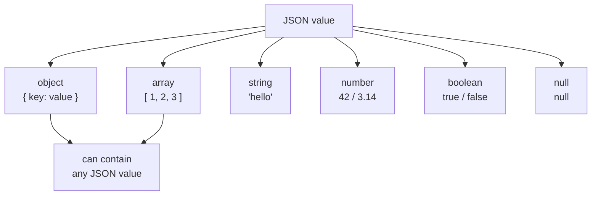
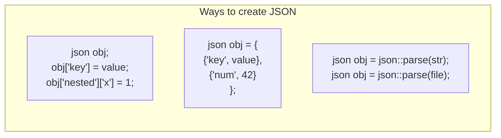
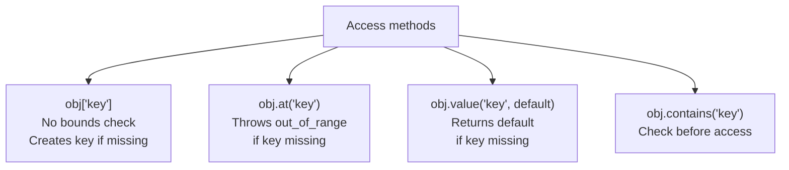
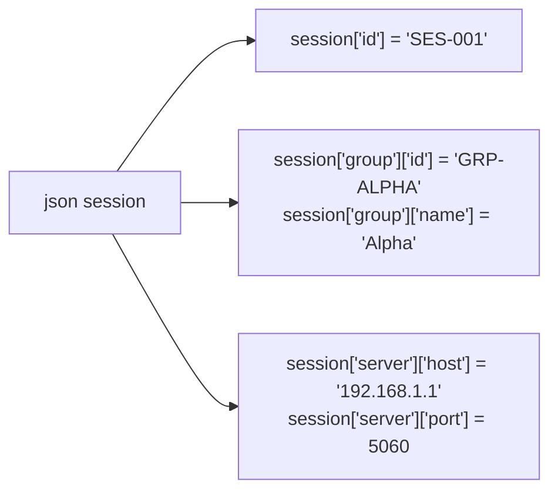
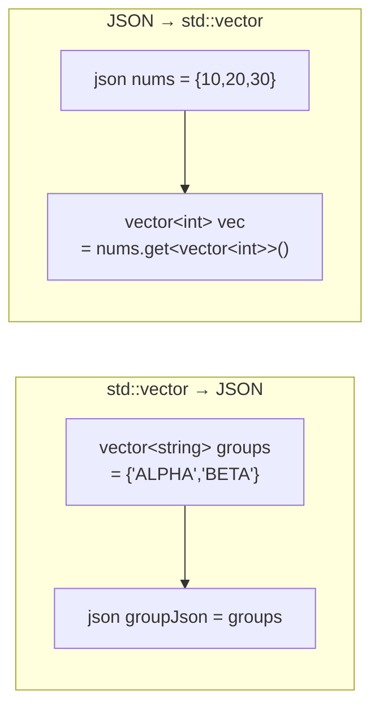
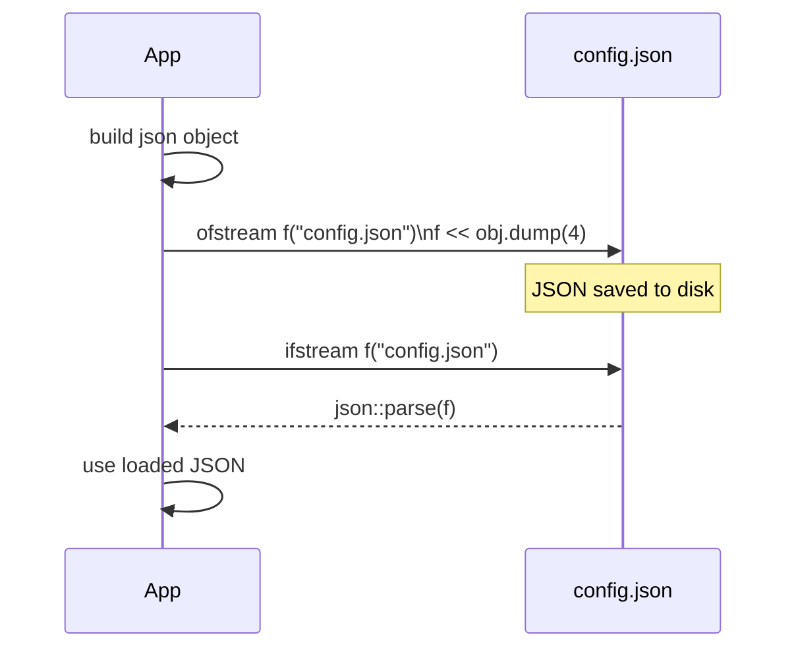
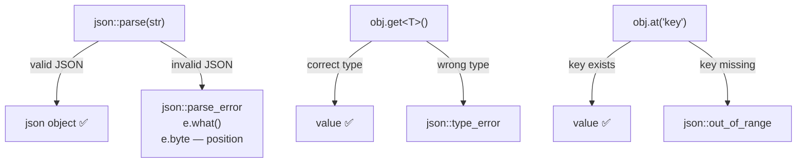

# JSON — C++23 with nlohmann/json

## What is JSON?

**JSON** (JavaScript Object Notation) is a lightweight text format for
data exchange. Despite the name it is language-independent and is the
standard format for config files, REST APIs, and inter-process data.

```json
{
  "name": "MCXApp",
  "port": 5060,
  "tls": true,
  "groups": ["ALPHA", "BETA"]
}
```

---

## Installation

```bash
sudo apt install nlohmann-json3-dev
```

```cmake
find_package(nlohmann_json REQUIRED)
target_link_libraries(MyApp nlohmann_json::nlohmann_json)
```

```cpp
#include <nlohmann/json.hpp>
using json = nlohmann::json;
```

---

## JSON value types



---

## Creating JSON



```cpp
// Method 1 — assign keys
json config;
config["app"]  = "MCXApp";
config["port"] = 5060;

// Method 2 — initializer list
json config = {{"app","MCXApp"}, {"port",5060}};

// Method 3 — parse string
json config = json::parse(R"({"app":"MCXApp","port":5060})");

// Method 4 — parse file
std::ifstream f("config.json");
json config = json::parse(f);
```

---

## Accessing values



```cpp
json data = {{"host","192.168.1.1"}, {"port",5060}};

// [] — no bounds check
std::string host = data["host"].get<std::string>();

// at() — throws if missing
int port = data.at("port").get<int>();

// value() — safe with default
int timeout = data.value("timeout", 30);   // 30 if not present

// contains() — check first
if (data.contains("tls")) { ... }
```

---

## Nested objects



```cpp
json session;
session["id"]             = "SES-001";
session["group"]["id"]    = "GRP-ALPHA";
session["server"]["host"] = "192.168.1.1";
session["server"]["port"] = 5060;

// Access nested
std::string groupId = session["group"]["id"].get<std::string>();

// Iterate nested object
for (auto& [key, val] : session["server"].items())
    std::cout << key << " = " << val.dump() << '\n';
```

---

## Arrays ↔ std::vector



```cpp
// vector → JSON
std::vector<std::string> groups = {"ALPHA", "BETA"};
json j = groups;

// JSON → vector
json nums = {10, 20, 30};
std::vector<int> vec = nums.get<std::vector<int>>();

// Array of objects
json users = json::array();
users.push_back({{"name","Alice"}, {"age",30}});
users.push_back({{"name","Bob"},   {"age",25}});

for (const auto& u : users)
    std::cout << u["name"] << '\n';
```

---

## Serialize — dump()

```cpp
json obj = {{"name","MCXApp"}, {"port",5060}};

obj.dump()    // compact: {"name":"MCXApp","port":5060}
obj.dump(2)   // pretty 2-space indent
obj.dump(4)   // pretty 4-space indent
```

---

## File I/O



```cpp
// Write
std::ofstream out("config.json");
out << config.dump(4);

// Read
std::ifstream in("config.json");
json loaded = json::parse(in);
```

---

## Error handling



```cpp
// Parse error
try {
    json bad = json::parse("{ invalid }");
} catch (const json::parse_error& e) {
    std::cout << e.what() << " at byte " << e.byte;
}

// Type error
try {
    json val = 42;
    std::string s = val.get<std::string>();  // fails
} catch (const json::type_error& e) { }

// Safe parse — no exception
json result = json::parse(str, nullptr, false);
if (result.is_discarded()) { /* invalid */ }
```

---

## Real use case — MCX config file

```json
{
  "session": {
    "id": "MCX-SES-001",
    "group": "GRP-BOS-Network-ALPHA",
    "priority": 1,
    "floor_timeout": 30
  },
  "network": {
    "host": "192.168.100.1",
    "port": 5060,
    "protocol": "UDP",
    "tls": true
  },
  "codec": {
    "name": "AMR-WB",
    "bitrate": 23850,
    "sample_rate": 16000
  },
  "participants": [
    {"id": "PTT-001", "role": "dispatcher"},
    {"id": "PTT-002", "role": "unit"},
    {"id": "PTT-003", "role": "unit"}
  ]
}
```

---

## Quick reference

| Task | Code |
|------|------|
| Create | `json obj; obj["key"] = val;` |
| Parse string | `json::parse(str)` |
| Parse file | `json::parse(ifstream)` |
| Get value | `obj["key"].get<T>()` |
| Safe get | `obj.value("key", default)` |
| Check key | `obj.contains("key")` |
| Array | `json::array()` + `push_back()` |
| Iterate object | `for (auto& [k,v] : obj.items())` |
| Serialize | `obj.dump()` / `obj.dump(4)` |
| Write file | `ofstream << obj.dump(4)` |
| Read file | `json::parse(ifstream)` |
| Parse error | `catch (json::parse_error& e)` |
| Type error | `catch (json::type_error& e)` |
| Safe parse | `json::parse(s, nullptr, false)` |

---

## When to use JSON

✅ Config files — settings, options, parameters
✅ REST API — send/receive data over HTTP
✅ Inter-process data exchange
✅ Logging structured data
✅ MCX/MCPTT session configuration

❌ Binary data — use binary formats (protobuf, msgpack)
❌ Very large datasets — JSON is verbose, use binary
❌ Real-time high-frequency data — parsing overhead
