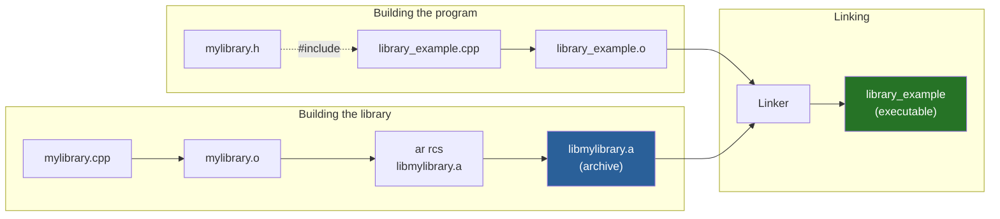
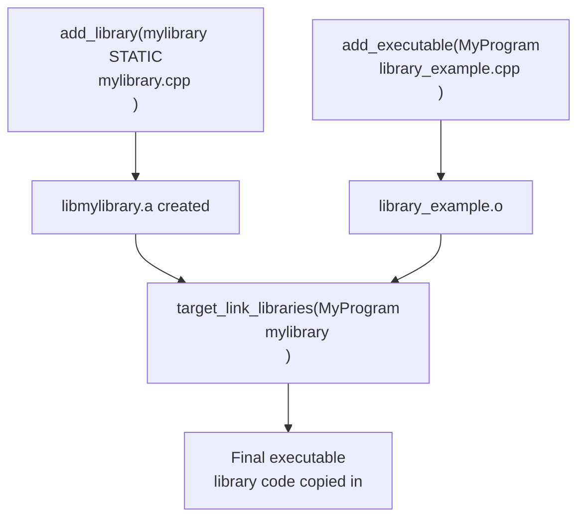
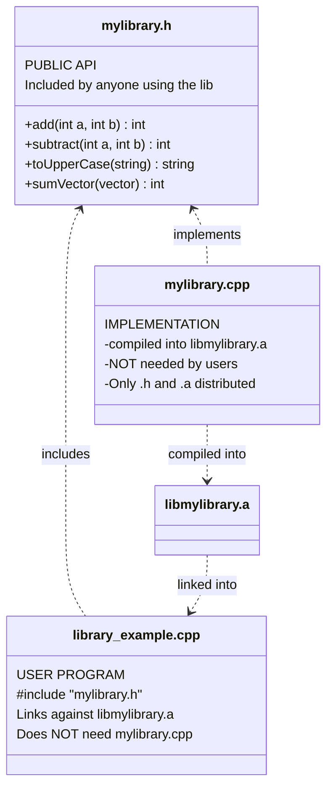
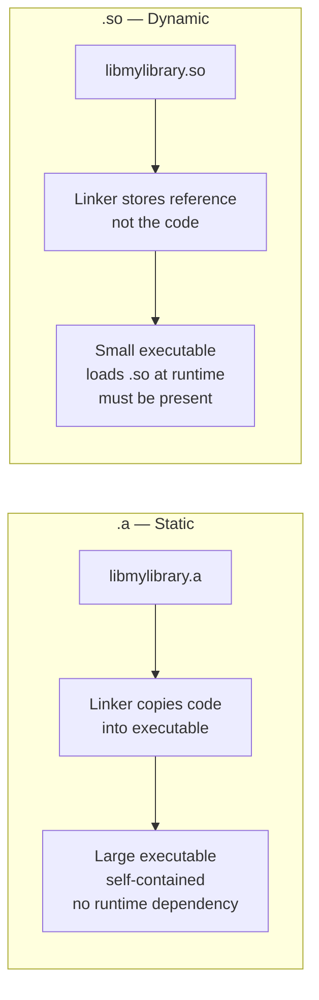

# Static Libraries — C++

## What is a Static Library?

A **static library** (`.a` on Linux, `.lib` on Windows) is a collection
of compiled object files bundled into a single archive. When you link
your program against a static library, the library code is **copied
directly into your executable** at link time.

---

## Build process diagram



---

## Project structure

```
01_StaticLibraries/
├── mylibrary.h          ← public API (what users include)
├── mylibrary.cpp        ← implementation (compiled into .a)
├── library_example.cpp  ← program that uses the library
└── CMakeLists.txt       ← builds lib + executable
```

---

## CMake flow diagram



---

## File roles



---

## What the user receives

```
Distribution package:
├── mylibrary.h       ← header — user includes this
└── libmylibrary.a   ← archive — user links against this

NOT distributed:
└── mylibrary.cpp    ← source stays private
```

The implementation (`mylibrary.cpp`) stays with you.
Users only get the header and the archive — they cannot see your source.

---

## Key code

### Declaring the library (mylibrary.h)

```cpp
#pragma once
#include <string>
#include <vector>

namespace MyLib {
    int    add(int a, int b);
    double divide(double a, double b);
    std::string toUpperCase(const std::string& s);
    int    sumVector(const std::vector<int>& v);
    std::string version();
}
```

### Implementing the library (mylibrary.cpp)

```cpp
#include "mylibrary.h"

namespace MyLib {
    int add(int a, int b) { return a + b; }

    double divide(double a, double b) {
        if (b == 0.0)
            throw std::invalid_argument("division by zero");
        return a / b;
    }
    // ...
}
```

### Using the library (library_example.cpp)

```cpp
#include "mylibrary.h"   // only the header needed

int main() {
    std::cout << MyLib::add(10, 5) << '\n';        // 15
    std::cout << MyLib::version() << '\n';          // 1.0.0
    std::cout << MyLib::toUpperCase("hello") << '\n'; // HELLO
}
```

---

## CMakeLists.txt explained

```cmake
# Step 1 — build the static library
add_library(mylibrary STATIC mylibrary.cpp)
# produces: libmylibrary.a

# Step 2 — build the executable
add_executable(MyProgram library_example.cpp)

# Step 3 — link executable against the library
target_link_libraries(MyProgram mylibrary)
# CMake finds libmylibrary.a automatically
```

---

## Terminal commands (without CMake)

```bash
# Step 1: compile library source to object file
g++ -std=c++23 -c mylibrary.cpp -o mylibrary.o

# Step 2: create the static archive
ar rcs libmylibrary.a mylibrary.o

# Step 3: compile and link the program
g++ -std=c++23 library_example.cpp -L. -lmylibrary -o library_example

# Run
./library_example
```

| Flag | Meaning |
|------|---------|
| `-c` | Compile only — produce `.o`, no linking |
| `ar rcs` | Create archive: r=insert, c=create, s=index |
| `-L.` | Look for libraries in current directory |
| `-lmylibrary` | Link against `libmylibrary.a` |

---

## Static vs Dynamic library



| | Static `.a` | Dynamic `.so` |
|--|:-----------:|:-------------:|
| Code location | Copied into exe | Loaded at runtime |
| Executable size | Larger | Smaller |
| Runtime dependency | None | `.so` must exist |
| Update library | Recompile app | Replace `.so` only |
| Deployment | Single file | App + library file |

---

## When to use static libraries

✅ Distributing a library without exposing source code
✅ Embedding reusable code across multiple projects
✅ Single-binary deployment — no runtime dependencies
✅ Faster startup — no dynamic loader overhead

❌ If multiple programs share the same library → use dynamic (saves RAM)
❌ If library needs to be updated independently → use dynamic
