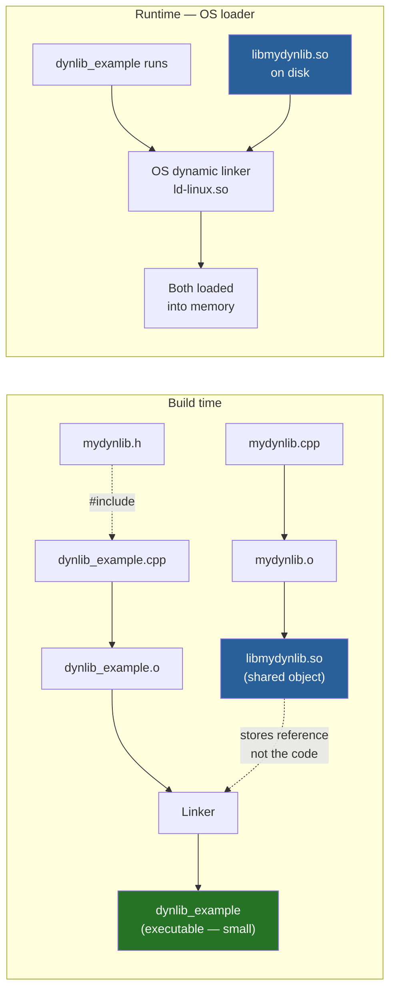
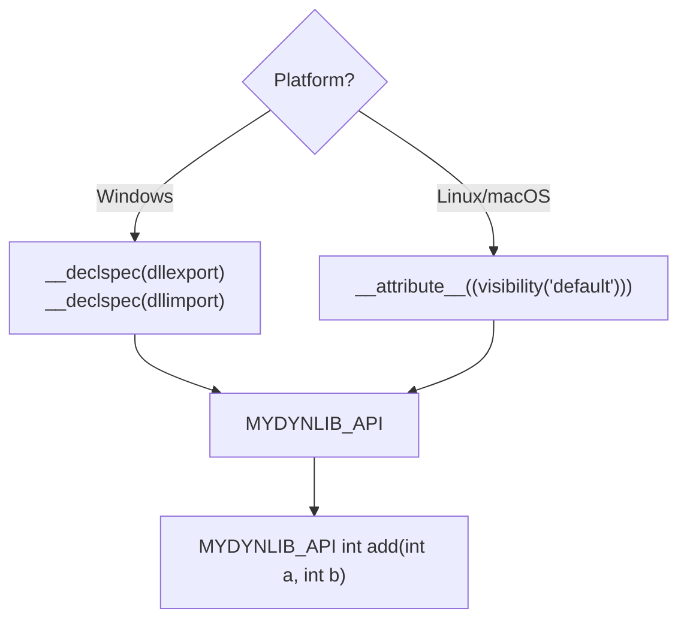
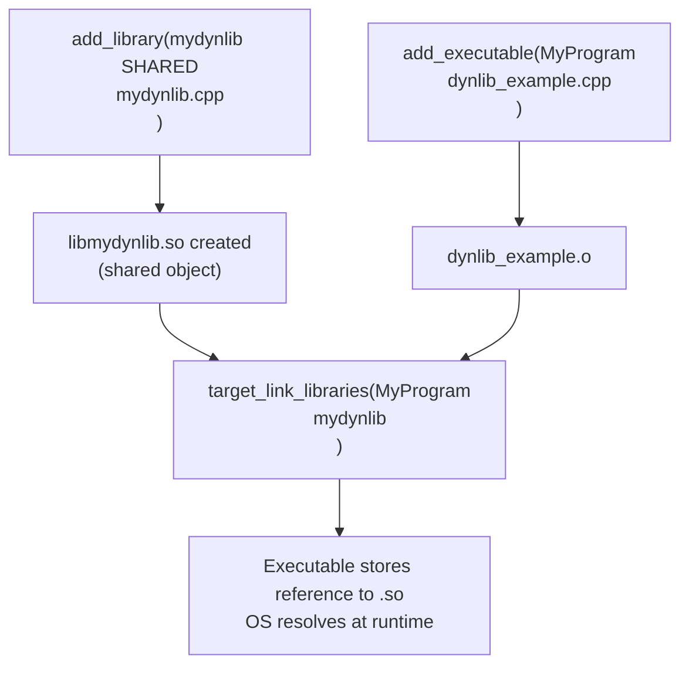
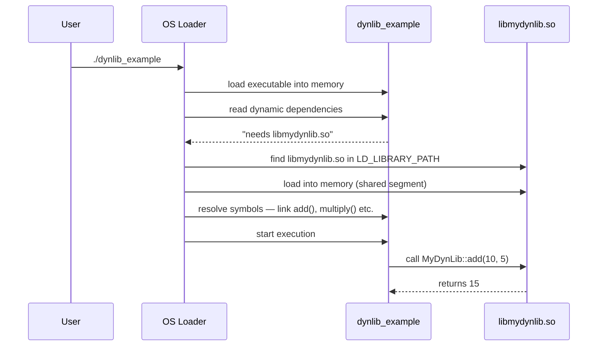
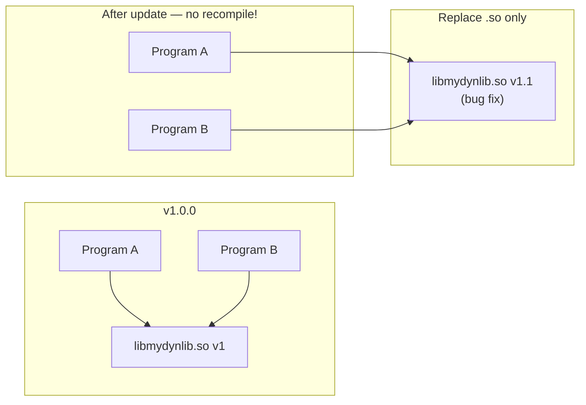

# Dynamic Libraries — C++

## What is a Dynamic Library?

A **dynamic (shared) library** (`.so` on Linux, `.dll` on Windows, `.dylib` on macOS)
is NOT copied into your executable at link time. Instead, the OS **loads it
at runtime** when the program starts. Multiple programs can share the same
`.so` file in memory simultaneously.

---

## Build and runtime diagram



---

## Project structure

```
02_DynamicLibraries/
├── mydynlib.h           ← public API + export macros
├── mydynlib.cpp         ← implementation
├── dynlib_example.cpp   ← program that uses the library
└── CMakeLists.txt       ← builds .so + executable
```

---

## Export macro — platform-specific visibility



```cpp
// In the header — cross-platform export macro
#if defined(_WIN32)
    #ifdef MYDYNLIB_EXPORTS          // defined when BUILDING the .dll
        #define MYDYNLIB_API __declspec(dllexport)
    #else                            // defined when USING the .dll
        #define MYDYNLIB_API __declspec(dllimport)
    #endif
#else
    #define MYDYNLIB_API __attribute__((visibility("default")))
#endif

// Applied to every public function
MYDYNLIB_API int add(int a, int b);
```

---

## CMake flow



---

## Terminal commands (without CMake)

```bash
# Step 1: compile library to position-independent object
g++ -std=c++23 -fPIC -c mydynlib.cpp -o mydynlib.o

# Step 2: create the shared library
g++ -shared -o libmydynlib.so mydynlib.o

# Step 3: compile and link the program
g++ -std=c++23 dynlib_example.cpp -L. -lmydynlib -o dynlib_example

# Step 4: tell OS where to find the .so at runtime
export LD_LIBRARY_PATH=.:$LD_LIBRARY_PATH

# Run
./dynlib_example
```

| Flag | Meaning |
|------|---------|
| `-fPIC` | Position Independent Code — required for shared libs |
| `-shared` | Produce a shared library (`.so`) |
| `-L.` | Look for libraries in current directory |
| `-lmydynlib` | Link against `libmydynlib.so` |
| `LD_LIBRARY_PATH` | Runtime search path for `.so` files |

---

## Runtime library loading



---

## Updating a dynamic library — no recompile needed



Just replace `libmydynlib.so` — all programs using it get the fix
**without recompilation**. This is the main advantage over static libraries.

---

## Static vs Dynamic — full comparison

| | Static `.a` | Dynamic `.so` |
|--|:-----------:|:-------------:|
| Code location | Copied into exe | Loaded at runtime |
| Executable size | Larger | Smaller |
| Runtime dependency | None — self contained | `.so` must exist on system |
| Update library | Must recompile app | Replace `.so` only |
| Memory sharing | Each app has own copy | All apps share one copy |
| Load time | Faster (already in exe) | Slight delay (dynamic linker) |
| Deployment | Single binary | Binary + library file(s) |
| Plugin system | Not possible | ✅ Load/unload at runtime (`dlopen`) |

---

## `ldd` — inspect dynamic dependencies

```bash
# Show which .so files an executable depends on
ldd ./dynlib_example

# Example output:
# libmydynlib.so => ./libmydynlib.so (0x00007f...)
# libstdc++.so.6 => /lib/x86_64-linux-gnu/libstdc++.so.6
# libc.so.6 => /lib/x86_64-linux-gnu/libc.so.6
```

---

## When to use dynamic libraries

✅ Multiple programs share the same library (saves RAM and disk)
✅ Plugin systems — load/unload at runtime with `dlopen()`
✅ OS system libraries (libc, libstdc++) — always dynamic
✅ Large libraries where update-without-recompile matters

❌ Single-binary deployment needed → use static
❌ Embedded systems with no OS loader → use static
❌ Library rarely changes → static is simpler
